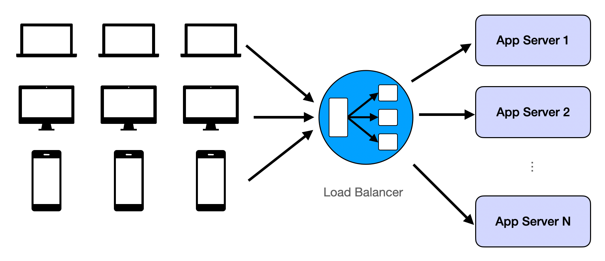
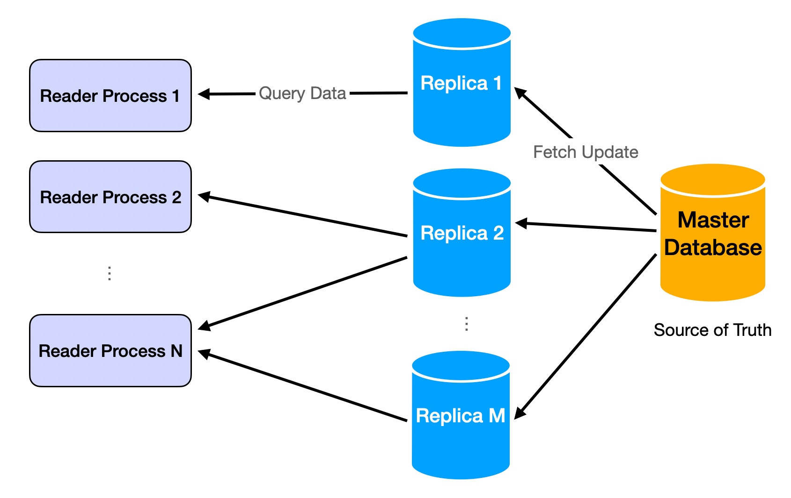
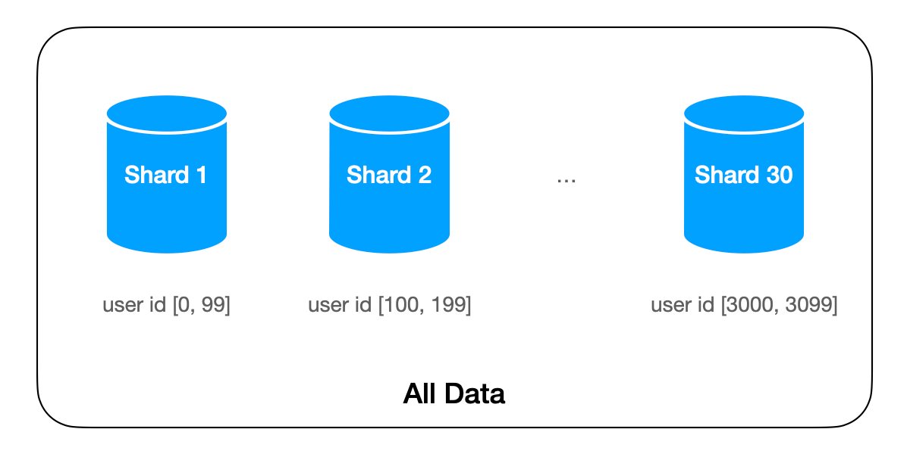
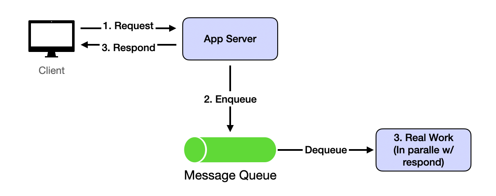
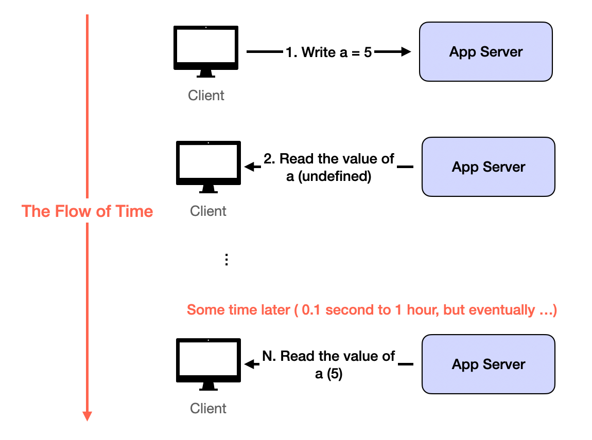

# Core Challenges in Web-scale System Design (and How to Tackle Them)

Before diving into the reusable building blocks of distributed system design, readers should have a fair understanding of what the common challenges are. They arise from serving the very large scale of user-base by adding more machines. Without a huge number of users, all system design problems scale back to coding problems. Like the solutions assembled from reusable building blocks, the challenges have several repeatable patterns. I hope to present the four challenges in a way that anyone who clears coding interviews can easily understand. Hopefully, the later jargon-rich content will make more sense after we understand what problems they are solving.

## Challenge 1: Too Many Concurrent Users

While a large user-base introduces many problems, the most common and intuitive one is that a single machine/database has a RPS/QPS limit. In all single-server demo apps you would see in a web dev tutorial, the server’s performance will degenerate fast once the limit is exceeded.

The solution is also intuitive: repetition. We just repeat the same assets of our app and assign the users randomly to each replication. When the replicated assets are server logic, it's called load balancing. When the replicated assets are data, it's usually called database replicas. More in load balancer and database replication.

## Challenge 2: Too Much Data to Move Around
The twin challenge of too many users is the issue of too much data. The data becomes 'big' when it's no longer possible to hold everything on one machine. Some common examples: Google index, all the tweets posted on Twitter, all movies on Netflix.

The solution is called sharding: partitioning the data by some logic. The sharding logic groups some data together, for instance, if we shard by user_id in Twitter, then all tweets from one user will be stored in the same machine.

## Challenge 3: The System Should be Fast and Responsive
Most user-facing apps must be quick. The response time should be less than 500ms. If it goes longer than 1 second, the user will have a poor experience.

Reading is usually fast after we have replication. Read requests are usually implemented as a query to an in-memory key-value dictionary beside HTTP protocols. Therefore, for many simple apps, the latency is mostly network round time.

Writing is where the challenge lies. Because most typical writing processes involve many data queries and updates, they last far longer than the 1-second limit. The solution is asynchrony: the write request is returned immediately after our server receives its data and puts the data in a queue. In the meantime, the actual processing continues in the back end. After receiving the response from the server, the client-side logic has the wiggle room for a speedy user experience. For example, it can show some UI before redirecting the user to read the result. This will usually take 1~2 seconds and is enough for the backend processing of the actual write request.

This is implemented by a message queue like Kafka.

## Challenge 4: Inconsistent (outdated) States
This challenge is a result of solving Challenge 1 and Challenge 3. With data replication and asynchronous data update, the read requests can easily see inconsistent data. Inconsistency usually means outdated: the user won't see any random wrong data, but old versions or deleted data.

The solution is more on the application level than on the system level. Because the outdated read resulted from replication and asynchronous updates will eventually disappear when the servers catch up, we build the user experience so that seeing outdated data for a short period of time is OK. This is called eventual consistency.

Most Apps tolerate eventual consistency well. Especially compared with the alternatives: Losing data forever or being very slow. The exceptions are banking or payment-related apps. Any inconsistency is unacceptable, so the apps must wait for all processing to finish before returning anything to the users. That’s why such apps feel much slower than, say, Google Search.

## Summary
In one sentence, to accommodate all humans as its DAU, hold hundreds of TB of data, and provide a fast user experience, web-scale distributed systems replicate their logic and data, shard their problem space, and process slow requests asynchronously. The result is an eventual consistent app that can serve all users on arbitrarily large data. The system can gradually add machines when the user base grows. This is the core philosophy in designing modern large-scale data-intensive systems

