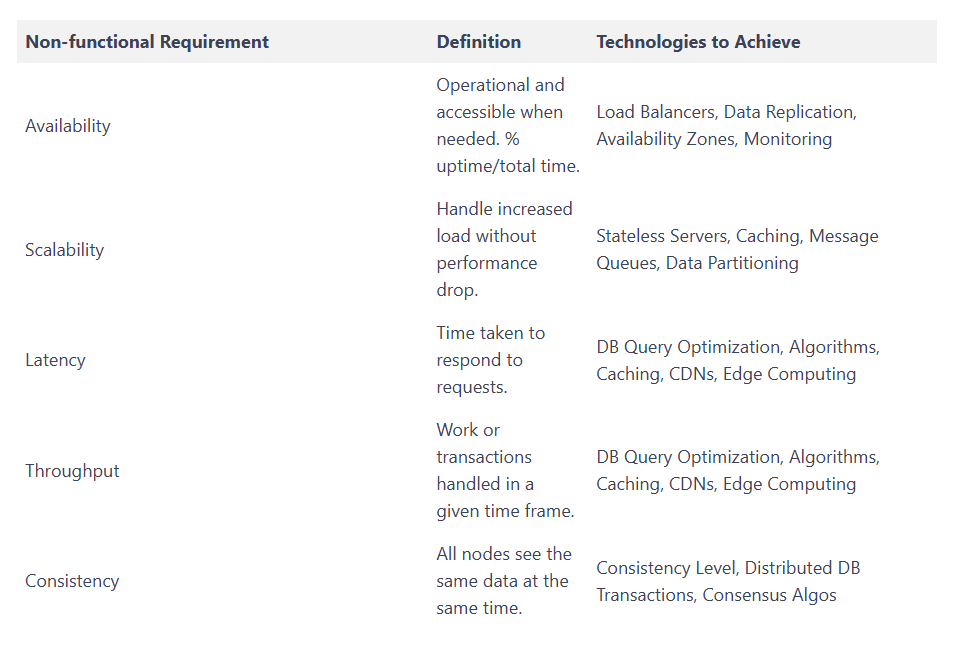
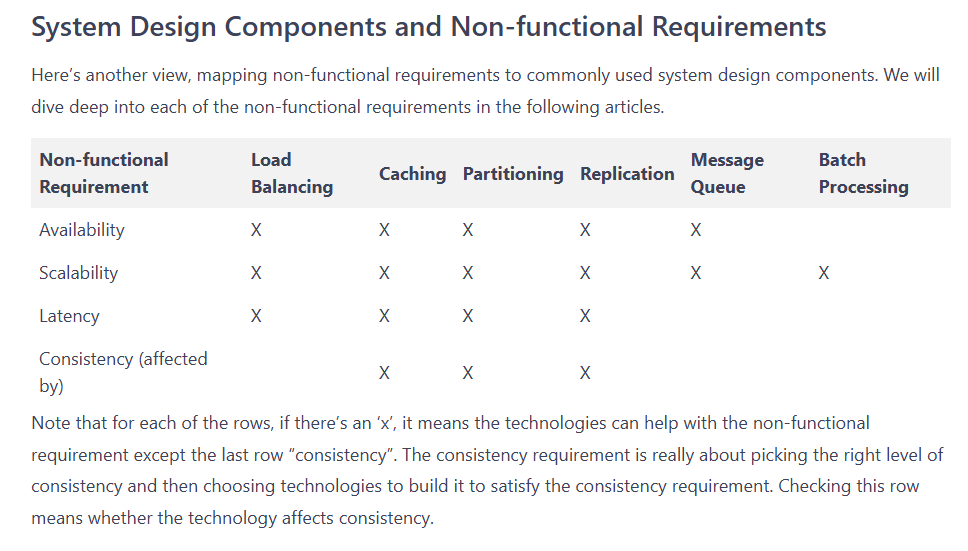
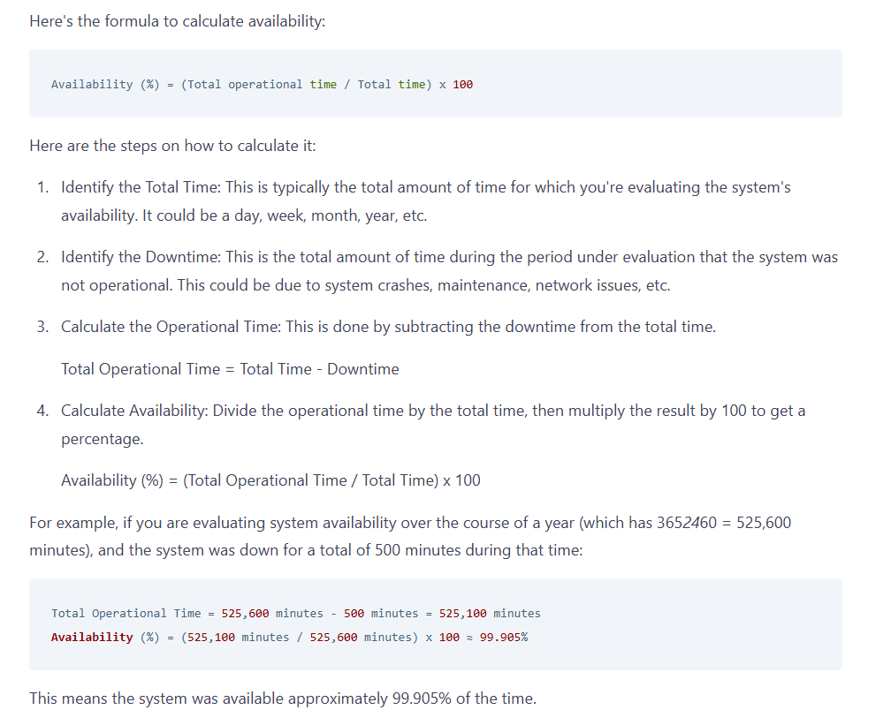
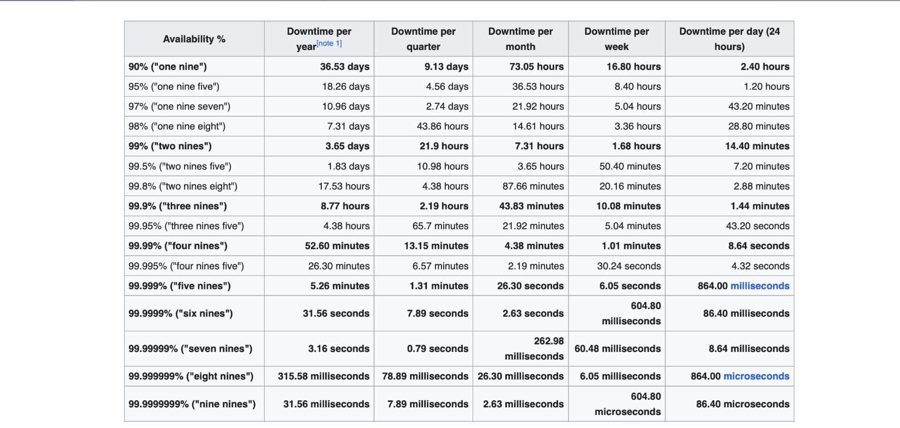

# Notes

Functional requirements tell us the features we need to implement. Non-functional requirements, on the other hand, describe how the system should behave and the constraints under which it must operate. Non-functional requirements are critical aspects that determine how well a system operates under specific conditions, such as a high number of users. Handling a smaller user base, like 100 users, would require a simpler design than managing a system used by a million users. For instance, the design of Twitter's timeline for 100 users might involve pulling data from a database each time it's needed. However, this approach can quickly create a bottleneck when scaled to a million users, necessitating pre-fetching of data into the cache before a user accesses their timeline.

The most common non-functional requirements are availability, scalability, performance (latency and throughput), and consistency.

## Availability
Definition: Availability refers to the degree to which a system is operational and accessible when needed. It's typically expressed as a percentage of uptime over the total time.

How to Achieve Availability:

- Use load balancers to distribute network traffic evenly across servers.
- Implement a health monitoring system to detect failures promptly, and set up automated processes for failover and recovery.
- Implement redundant hardware and software components, which can include multiple servers in different geographic locations, also known as availability zones or regions.
- Geographic distribution reduces blast radius-->Critical systems replicate across continents. When AWS's us-east-1 region experiences outages, services like Route 53 continue operating from other regions. This isolation prevents single-region failures from causing global outages.

Examples:

- Amazon S3 achieves high availability by using redundant storage and automatic failover mechanisms.
- Google Cloud Spanner uses replication and synchronous writes across multiple zones to ensure high availability.

## Scalability
Definition: Scalability is a system's ability to handle increased load without a significant drop in performance.

Scalability means maintaining performance as load increases. The key insight: scaling out with many small servers typically beats scaling up with larger machines. This approach enables elastic growth and reduces failure impact.

How to Achieve This in Design:

- Utilize stateless servers, allowing for the addition of more servers as demand increases (also known as auto-scaling and horizontal scaling).
- Optimize database performance and use caching to reduce load.
- Implement message queues for asynchronous processing, helping to manage the processing of tasks in the background and bridge the gap in processing speed between services.

Examples:

- Twitter uses a message queue system called Kestrel to help handle high volumes of tweets, showcasing effective scalability.
- Netflix uses a combination of caching, partitioning, and load balancing to handle the massive load of streaming requests.

## Latency
Definition: Latency is the delay before a data transfer begins after a request has been made.

Latency measures response time - the delay between request and response. Users expect sub-second responses for web pages and millisecond responses for API calls. High latency kills user engagement and business metrics.

How to Achieve This in Design:

- Optimize database queries and employ efficient algorithms and data structures.
- Use caching to store and quickly retrieve frequently accessed or recently accessed data.
- Implement Content Delivery Networks (CDNs) to serve static content closer to users, reducing the delay caused by the physical distance between the server and the client.
- Optimize network performance and employ edge computing where appropriate to reduce the round trip time of requests.

Examples:

- Cloudflare uses a global CDN to reduce latency for its users, delivering content faster by serving it from locations closer to the end-user.
- Google Search uses a variety of techniques including caching, efficient data structures, and algorithms to provide low latency results.

## Consistency
Definition: Consistency ensures that all nodes see the same data at the same time in a distributed system.

How to Achieve This in Design:

- Selecting the proper level of consistency. Depending on the system's needs, opt for a stronger or weaker consistency model. Strong consistency guarantees that all nodes see the same data at the same time, while eventual consistency allows for temporary inconsistencies between nodes.
- Use database transactions or consensus algorithms in distributed systems, ensuring all nodes agree on the state of the system. However, this comes at a cost of higher complexity.

Examples:

- Distributed databases like Apache Cassandra can be configured for strong or eventual consistency depending on the needs of the application. This flexibility enables applications to balance consistency needs with performance and availability considerations.
- Amazon DynamoDB uses eventual consistency by default but also offers strong consistency options depending on application requirements.

# Availability 

If your favorite pizza place is open 24/7 then it's 100% availability. 100% availability is virtually impossible in a computing environment.

### What is “High” Availability?
Now, how good is 99.905% availability? Is it considered “highly” available?

High availability is often talked about in terms of "nines". If something has "five nines" (99.999%) availability, it's like saying your pizza place is open 99.999% of the time. This means it's only closed about 5 minutes a year! That is a pretty highly available system.

But, how many nines are good enough for my system, or is it even necessary? To answer that we first have to discuss Service Level Agreement (SLA).

### Service Level Agreement (SLA)
A Service Level Agreement (SLA) is a formal, written agreement between a service provider and a customer that sets expectations regarding the level of service the provider will deliver. This often includes specific metrics and targets the service provider agrees to meet, such as system uptime, response time, and resolution time.

For example, an SLA might stipulate that a system will have an uptime of 99.9% (three nines), and any breach of this may result in penalties, often in the form of service credits to the customer.

SLAs are important because they clearly establish expectations for both the service provider and the customer, offer a standard to measure service performance, and set out remedies or penalties if the service levels aren't met.

Note that availability is not the only property that can be specified in an SLA. For example, durability might also be specified as part of the provider's commitments. For example, Amazon S3, the cloud storage service from Amazon Web Services (AWS), boasts an impressive data durability of 99.999999999% (eleven nines). This essentially means that if you store 10,000,000 objects in Amazon S3, you can on average expect to incur a loss of a single object once every 10,000 years. 

## How to Achieve High Availability?
Fundamentally, high availability is about continuing to operate without failures. There are two types of failures:

Expected failures can include:

- Hardware failures. Despite the best efforts, hardware components can and do fail unexpectedly. This can be due to various reasons such as manufacturing defects, wear and tear, or environmental conditions.
- Resource Exhaustion: If your server's disk space or memory may get filled up at a particular load, that's a predictable failure. These can be mitigated by monitoring resource usage and scaling or cleaning up resources as necessary.

Unexpected failures can include

- A misbehaving client. For example, a hacker who tries to exhaust our resources by sending a flood of requests to our API endpoint. A rate limiter is typically deployed in such cases to limit the number of calls a client can make.
- A failure in our service’s dependency: Our system has a dependency on another system if it needs to interact with an external system. A failure of the external system should not cause a failure in our system. For example, a hotel booking service may have to interact with 3rd party partner systems to complete a hotel booking. Our system should be able to handle failures in the 3rd party system.
### Handling Expected Systems Failures
Expected failures can be mitigated by establishing proper redundancy. This can be achieved by setting up your service across multiple regions, load balancing your stateless servers, and setting up automatic failover.

#### Redundancy
Redundancy is a critical part of achieving high availability in a system. It's all about having backup resources, like servers or databases, that are ready to take over if the primary resources fail. When dealing with cloud environments, there are two key concepts related to redundancy: availability zones and regions.

What is an availability zone?

An Availability Zone (AZ) is a distinct location within a cloud provider's region, insulated from failures in other availability zones. Each availability zone runs on its own physically separate, independent infrastructure, and is engineered to be highly reliable. In the event of a failure, services can be transitioned to a different zone within the same region.

A Region is a geographical area that consists of multiple, isolated availability zones. Deploying applications across multiple regions provides greater fault tolerance and latency reduction as each region operates independently. This means a problem in one region doesn't affect another region.

To achieve high availability, services are often deployed across multiple availability zones within a region, which protects from single points of failure. For an even higher level of redundancy, services can be deployed across multiple regions. This can protect against larger-scale issues like natural disasters that might affect an entire region.

## Load Balancing
Load balancing refers to the distribution of network traffic across multiple servers. It prevents any single server from becoming overworked (a bottleneck), which could lead to a system failure.

In cloud environments, load balancers can be deployed within a single availability zone or across multiple zones and regions, ensuring traffic is evenly distributed and providing an automatic failover mechanism. If a server or entire zone fails, the load balancer can redirect traffic to the remaining operational servers or zones.

## Data Replication
Data replication involves maintaining copies of your data on different databases or database servers. If your primary database fails, one of the replicated databases can take over, ensuring your system continues to have access to its data.

In a cloud environment, you can configure data replication across multiple servers within an availability zone, across multiple zones, or even across regions, providing an additional level of redundancy and high availability.

## Health Monitoring and Auto-Recovery Systems
Health monitoring and recovery systems automatically check the health of servers and other system components. If they detect a failure, they can automatically initiate recovery procedures, such as restarting a service or triggering a failover to a backup resource.

Cloud providers often offer services that monitor the health of your applications and automatically recover failed instances. For example, Amazon EC2 Auto Recovery automatically recovers instances when a system impairment is detected.

In practice, we often use services or products that are a combination of the above. Let’s take a look at the tech stacks commonly used for high availability.

## Availability vs Fault Tolerance
Fault tolerance and availability are two related concepts in system design, which together contribute to the reliability of a system. Here's how they relate:

### Availability:

Availability, as we discussed, is a measure of the system's uptime. It refers to the time a system or a service is up and running, or available for use. It’s usually defined as the percentage of time that a system is operational and able to provide service as expected.

### Fault Tolerance:

Fault tolerance refers to the ability of a system to continue operating correctly even in the event of partial system failures. This might involve hardware or software redundancy, error handling, retry mechanisms, or self-healing processes.

In essence, a fault-tolerant system is designed to eliminate single points of failure. So, even if one component of the system fails, the system can continue functioning without interruption. Fault-tolerant systems are able to detect and repair faults automatically without human intervention.

By this definition, you can consider fault tolerance to mean 100% available, which isn’t realistic.

### The Relationship between Availability and Fault Tolerance:
Fault tolerance directly contributes to the system's high availability. You can consider high availability as the result and making the system fault-tolerant as one way of achieving it. By ensuring the system continues to operate correctly even when some components fail, fault tolerance prevents system-wide downtime and therefore increases the overall availability of the system.

>Note:For the purpose of system design interviews, fault tolerance and high availability can almost be considered identical concepts. When the interviewer asks for fault tolerance, they probably just mean availability.

## Latency: The Basics
In the simplest terms, latency is a delay. In system design, it is a measure of the time it takes for a bit of data to travel from one place to another in a network. The units for measuring latency are usually milliseconds (ms) or microseconds (µs).

High latency leads to a slow and inefficient system, which can negatively impact user satisfaction, particularly in real-time applications like video streaming, online gaming, or high-frequency trading, where delays of even a few milliseconds can be detrimental.

### Managing Latency
Managing and reducing latency is crucial for maintaining an efficient and effective system. Here are some strategies system designers use:

- Use of CDN (Content Delivery Network): CDNs store copies of data at multiple locations worldwide to reduce the distance data must travel, thereby reducing latency.
- Load Balancing: By distributing network or application traffic across multiple servers, load balancers can help reduce congestion, improving response times and reducing latency.
- Caching: By storing frequently accessed data closer to the user, caches can significantly reduce the time it takes to retrieve that data.
- Choosing Appropriate Data Center Location: For cloud services, choosing a data center that's physically closer to the majority of users can help reduce latency. For example, if you are serving users in the US, you would want to pick your data center in San Francisco instead of Singapore.

# System design components

## Load Balancing
Load balancing distributes network or application traffic across a number of servers. This can improve availability by ensuring no single server becomes a bottleneck or point of failure. It also aids scalability by allowing systems to handle increased traffic by distributing the load. Furthermore, load balancing can improve latency by reducing the time it takes for a server to respond to a request because the load is eventually distributed. How This Affects Non-functional Requirements:

- Availability: Load balancing improves availability by distributing network traffic across multiple servers, eliminating single points of failure. If one server goes down, the load balancer redirects traffic to the remaining operational servers.
- Scalability: By evenly distributing load, load balancers allow more requests to be served simultaneously, supporting system scaling.
- Latency: Load balancing can reduce latency by ensuring that no individual server is overwhelmed with traffic, maintaining quick response times.

---

If a load balancer fails, it can become a single point of failure, potentially making the entire system unavailable or causing significant service disruption. To address this risk and maintain high availability, systems often implement redundancy and failover strategies for load balancers. Common approaches include:

Multiple Load Balancers (Active-Passive or Active-Active): Deploying more than one load balancer so that if one fails, another can take over traffic distribution.
Health Checks and Automatic Failover: Monitoring the health of load balancers and automatically rerouting traffic to a healthy load balancer if a failure is detected.
DNS-based Load Balancing: Using DNS to distribute traffic across multiple load balancers in different locations or data centers.
By implementing these strategies, the system can avoid a single point of failure at the load balancer level, further improving availability and reliability.

## Caching
Caching is the process of storing a copy of data in a temporary storage area (cache) so future requests for that data are served up faster. Caching contributes to scalability by reducing the load on the database or primary data source, thus allowing the system to serve more users. It can also improve latency by reducing the time it takes to fetch data. However, caching could pose challenges to maintaining consistency, especially in a distributed system, if not properly managed.

How This Affects Non-functional Requirements:

- Availability: Caching can indirectly enhance availability by reducing the load on the system, which can help prevent system overloads or crashes.
- Scalability: By storing frequently accessed data and serving it quickly, caching reduces load on the primary data source, which supports system scaling.
- Latency: By serving stored data much more quickly than the primary data source could, caching significantly reduces data retrieval times, thereby reducing latency.
- Consistency: Caching can lead to the issue of stale data. This occurs when the original data in the database is updated, but the cached version remains unchanged. As a result, users may receive outdated information, creating a discrepancy between what is stored in the cache and the current data in the database, leading to inconsistencies.

## artitioning
Partitioning (or sharding) is the process of dividing a database into smaller, more manageable pieces. It can significantly boost scalability by allowing a system to store and process more data than a single DBMS could handle. Partitioning can also help with latency by reducing the time it takes to query large databases. However, it can create challenges for consistency if different parts of the data need to be kept in sync across partitions.

How This Affects Non-functional Requirements:

- Availability: Partitioning improves availability by ensuring that even if a subset of the data is inaccessible due to failures in one partition, other partitions can still serve their data. In addition, if partitioning is combined with replication, even if one partition fails, a replica can continue to serve the data.
- Scalability: Partitioning enhances scalability as the data is divided among multiple nodes or servers, allowing the system to handle more requests concurrently. As the system grows, new partitions can be added to distribute the data further.
- Latency: By keeping related data in the same partition, partitioning can help reduce latency. This is because queries can be routed to the specific partition where the data resides, avoiding the need to search the entire dataset.
- Throughput: Partitioning improves throughput by allowing for parallel processing. Since data is distributed across multiple partitions, different queries can be executed on different partitions concurrently. This increases the total number of operations the system can handle per second.
- Consistency: Partitioning can make consistency more challenging to maintain, especially in a distributed system where data is partitioned across multiple nodes. However, with proper design and the use of protocols like two-phase commit, partitioning can be compatible with strong consistency. For example, data that needs to be consistently read and written can be kept in the same partition.

## Replication
Replication involves creating and maintaining multiple copies of data. It contributes to availability by providing backup data sources if the primary source fails. Replication also aids scalability by allowing read requests to be distributed across multiple copies, reducing the load on any one server. However, like caching and partitioning, replication can pose challenges for consistency, especially in cases of write operations.

How This Affects Non-functional Requirements:

- Availability: By creating backup copies of data, replication enhances availability. If the primary data source fails, the system can continue operation using the backup data sources.
- Scalability: By allowing read requests to be distributed across multiple copies of the data, replication can reduce the load on any one server, enhancing scalability.
- Consistency: When we have several copies of the same data, we need to make sure they all change together. But this can be tricky. If one copy gets updated and the others don't, then people might see different things when they look at the data. We use different rules, like strong consistency, eventual consistency, and causal consistency, to help make sure that all the copies stay the same, or at least get updated eventually.

## Message Queue
A message queue provides an asynchronous communications protocol, meaning that the sender and receiver of the message do not need to interact with the message queue at the same time. This can improve scalability by offloading tasks from the main application threads and handling them asynchronously. Message queues can help with availability and reliability, as they often persist messages until they are processed, ensuring that important tasks are not lost even if a component fails.

How This Affects Non-functional Requirements:

- Availability: Message queues often persist messages until they are processed, which means that important tasks are not lost even if a component fails, enhancing availability.
- Scalability: Message queues can offload tasks from the main application threads and handle them asynchronously, which can help in managing larger volumes of tasks, thus supporting system scaling.

## Batch Processing
Batch processing refers to the execution of a series of jobs all at once instead of individually. It improves throughput by allowing you to process large volumes of data at once, usually during off-peak times. This can be particularly useful for non-interactive jobs like data analysis or backups, where the time taken to complete the task is less critical. However, batch processing could increase latency for individual tasks within the batch, as they have to wait their turn for processing.

How This Affects Non-functional Requirements:

- Scalability: By grouping similar tasks together and processing them as a unit, batch processing can handle large volumes of data more efficiently than processing each task individually, enhancing scalability.