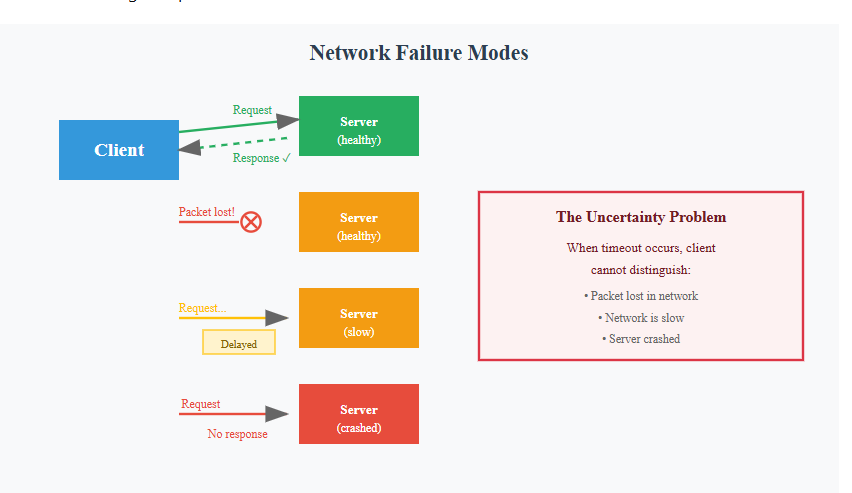
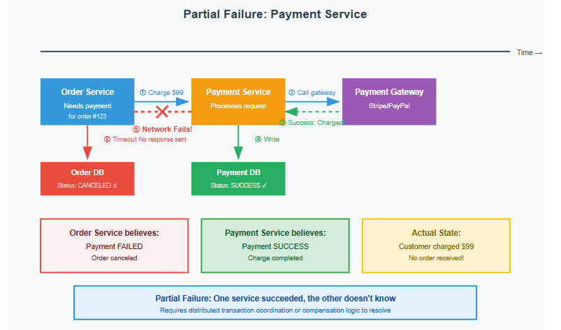
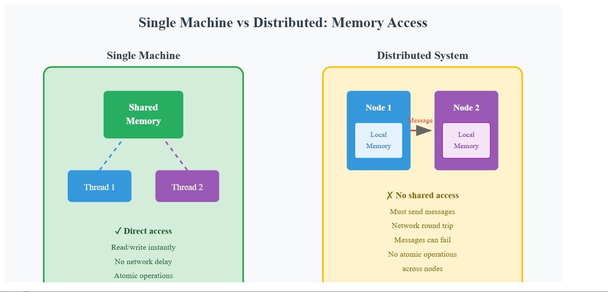
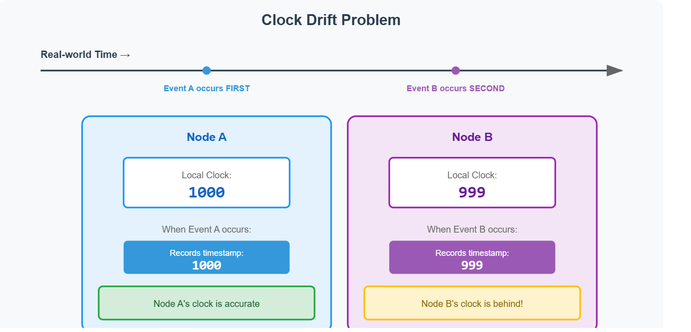
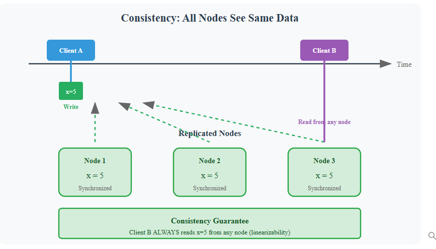
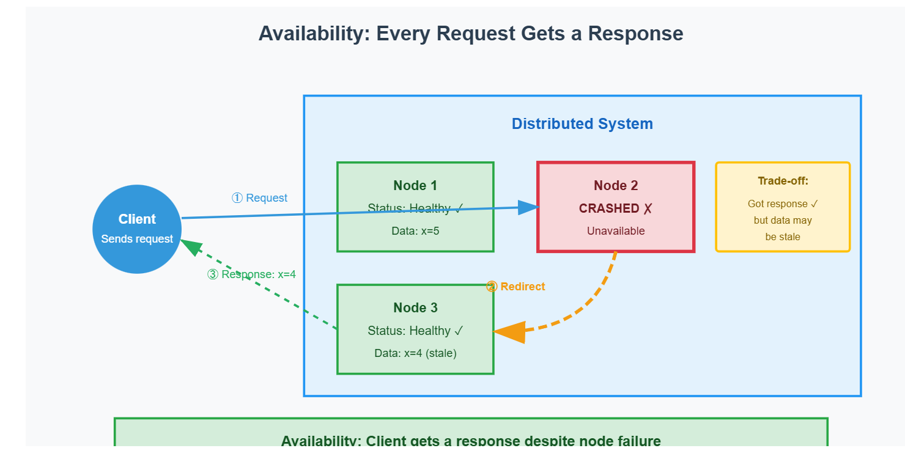

#  Distributed Systems Problems and CAP theorem

The payment service charges the customer's card. Before it responds, the network fails. The order service times out, assumes payment failed, and cancels the order. The customer was charged but has no order.

Two data centers process the same hotel booking simultaneously. Both check availability: 1 room left. Both confirm the booking. The customer arrives to find no room.

A user changes their password in the US region. They immediately try logging in, but the request hits the EU region. The password hasn't replicated yet. Login fails.

These are distributed systems problems. They don't happen when your application runs on one machine with one database. Partial failures occur—one component succeeds while another fails. Network delays mean you can't tell if operations completed. Multiple copies of data drift out of sync. Coordinating state across machines requires careful design that single-machine systems never need.

## Why Build Distributed Systems
We know how to scale web applications: load balancers distribute traffic, caching reduces database load, replication handles more reads. Each technique adds more machines to handle growth.

But adding machines creates new problems. Multiple servers must coordinate. They must agree on shared state. They must handle failures gracefully. These are distributed systems challenges.

You need distributed systems for three reasons:

- Scalability--> A single server has limits. Adding vertical capacity (bigger CPU, more RAM) hits physics and cost constraints. Distributing work across machines provides horizontal scalability with commodity hardware.

- Fault tolerance--> Hardware fails. Networks fail. Software crashes. A single-server system goes down entirely. Distributed systems continue operating when individual nodes fail.

- Geographic distribution--> Users are worldwide. A data center in Virginia serves Tokyo users poorly. Placing nodes near users reduces latency from hundreds of milliseconds to tens.

The price is complexity. Distributed systems are fundamentally harder to build than single-machine programs.

## What Makes Distributed Systems Hard
On a single machine, you know if an operation succeeded. Memory is shared. The clock is authoritative. Operations complete or they don't.

Distributed systems lose all these guarantees.

### Network Unreliability
Messages between nodes travel over networks. Networks lose packets. They delay packets. They deliver packets out of order. You send a request and wait for a response. If no response arrives, you cannot tell why. Did the packet get lost? Did the remote node crash? Is it just slow? You cannot distinguish these cases. This is unbounded delays—no way to know how long an operation will take.

### Partial Failures
On a single machine, if the process crashes, nothing commits. In a distributed system, some nodes succeed while others fail. Some nodes crash after writing to disk. Some lose network connectivity mid-operation.

The payment service receives a charge request. It calls the payment gateway. The gateway charges the card successfully. The payment service writes "payment succeeded" to its database. Then the network connection to the order service fails. The payment service cannot send the success response. The order service times out and assumes failure. It cancels the order.

The payment service succeeded. The order service thinks it failed. The customer was charged but has no order. This is a partial failure. The system is in an inconsistent state. Fixing this requires coordination between services, but coordination itself can fail due to network issues.

The payment service believes it succeeded. The order service doesn't know. Without distributed transaction coordination or compensation logic, the system cannot automatically recover.

### No Shared Memory

On a single machine, threads share memory. You write to a variable. Other threads see the new value immediately (with appropriate synchronization). In distributed systems, nodes communicate only through messages. Messages can be lost, delayed, or reordered.

You cannot check a value directly. You must send a message, wait for a response, and handle the case where no response arrives. Every read becomes a network round trip with all the uncertainty that entails.

### No Global Clock
On a single machine, `system.currentTimeMillis()` returns the authoritative time. In distributed systems, each node has its own clock. Clocks drift. They run at slightly different speeds due to temperature, manufacturing variance, and other factors.

Node A records an event at timestamp 1000. Node B records an event at timestamp 999. Which happened first? You cannot tell from timestamps alone. Node B's clock might be ahead.

This breaks assumptions you take for granted on a single machine. "Last write wins" doesn't work when you can't determine which write was last. Detecting causality requires specialized techniques like logical clocks.

### Why These Challenges Matter
Every distributed system must handle these challenges. When you add a cache server, requests can hit different caches with stale data. When you add database replicas, writes must propagate to all replicas. When you add geographic regions, network partitions split your system.
>Note: Race conditions can occur on single machines when multiple threads access shared data. However, distributed systems make concurrency problems worse because operations happen on different machines with network delays and no shared memory.

CAP theorem explains the fundamental trade-off when networks partition. Consistency models define what guarantees your system provides despite these challenges. Consensus algorithms show how nodes can agree despite failures. Failure handling patterns provide practical techniques to build reliable systems from unreliable parts. Distributed transactions coordinate operations across multiple services while handling failures gracefully.

 

## CAP Theorem

CAP stands for Consistency, Availability, and Partition Tolerance. The theorem states that a distributed system can guarantee at most two of these three properties simultaneously.

Partition tolerance means the system keeps functioning when the network splits, though possibly in a degraded mode. A CP system might stop accepting writes but continue serving reads from the majority partition. An AP system might serve requests from both sides with stale data. The key is that the system doesn't completely fail—it continues operating in some capacity despite nodes being unable to communicate.

  
 

 ## Network Partitions Are Inevitable
The previous article explained why distributed systems face network unreliability. Partitions happen. A switch fails. A fiber cable gets cut. A datacenter loses connectivity. According to a Microsoft Azure analysis, network failures cause 57% of their incidents.

You cannot eliminate partitions. You must design for them. This is where CAP theorem provides a framework for reasoning about your choices.

>Note:The CAP theorem says you can only guarantee two. But in distributed systems, partitions will happen. Network failures are inevitable. So you must choose: consistency or availability during partitions.

Choose Availability (AP). The system accepts reads and writes even when nodes cannot communicate. Updates propagate when the partition heals. This requires eventual consistency—nodes may temporarily show different values but converge over time. DynamoDB, Cassandra, and Riak take this approach.

Choose Consistency (CP). The system stops accepting operations that could violate consistency. Writes may fail or redirect to the leader node that has authoritative data. MongoDB, HBase, and Redis Cluster take this approach. Note that "unavailable" doesn't mean total outage—you can redirect all traffic to one datacenter that remains consistent, maintaining SLA availability while sacrificing partition tolerance.

In the context of distributed systems, maintaining SLA (Service Level Agreement) availability while sacrificing partition tolerance refers to a design choice where the system prioritizes being available to serve requests, even if it means not tolerating network partitions (i.e., situations where parts of the system cannot communicate with each other).

## Limitations of CAP
CAP theorem dates to 2000 when relational databases dominated. It was meant as a rule of thumb, not a precise specification. The definitions are narrow and have limitations.

CAP only considers strong consistency (linearizability). It ignores other useful consistency models like causal consistency or read-your-own-writes. Many systems provide middle-ground guarantees that CAP doesn't capture.

CAP only considers network partitions. It says nothing about node failures, network delays, or process crashes. These failures happen more frequently than full partitions but aren't addressed by the theorem.

CAP is binary. It treats consistency and availability as on/off switches. Real systems offer tunable consistency levels. Cassandra lets you choose per-query: require one node to respond (fast, potentially stale) or require quorum (slower, more consistent).

Martin Kleppmann's article "Please stop calling databases CP or AP" explains these limitations in detail. Simply knowing a database is "AP" tells you little about actual behavior and guarantees.

# PACELC Theorem
PACELC extends CAP to capture normal operation trade-offs. It stands for: if Partition, choose Availability or Consistency, Else (no partition), choose Latency or Consistency.

The "else" clause is critical. Most of the time, your system is not partitioned. How does it behave then? You still face a trade-off between consistency and latency.

Consistency requires coordination. To guarantee linearizability, writes must replicate to multiple nodes synchronously. The write cannot complete until all nodes acknowledge. This adds latency—typically one to two additional network round trips.

Low latency requires async replication. To respond quickly, accept the write locally and replicate asynchronously. The client sees fast response times. But other nodes lag behind, providing weaker consistency.

Daniel Abadi proposed PACELC in 2010 because "ignoring the consistency/latency trade-off is a major oversight, as it is present at all times during system operation, whereas CAP is only relevant in the arguably rare case of a network partition."

## Database Trade-off Patterns
PA/EL (Availability and Latency): DynamoDB, Cassandra, Riak. Favor availability during partitions and low latency during normal operation. Accept eventual consistency. Good for high-throughput systems where stale reads are acceptable (shopping carts, social feeds, metrics).

PC/EC (Consistency always): MySQL, PostgreSQL, traditional RDBMS. Favor consistency regardless of network state. Synchronous replication adds latency. Good for financial systems, inventory management, anything requiring strong guarantees.

PA/EC (Availability during partition, consistency when healthy): Some NoSQL systems. Unusual combination—prioritize availability when it matters most (partition) but pay latency cost for consistency during normal operation.

PC/EL (Consistency during partition, latency when healthy): Very rare. Sacrifices availability when it's most needed.

Many databases offer tunable consistency. Amazon relaunched DynamoDB in 2012 with a "consistent read" option that returns errors when strong consistency is unavailable, shifting from PA/EL to PC/EC on demand. Couchbase supports multiple modes depending on operation type.

## Using PACELC in Interviews
When designing distributed systems in interviews, explicitly state your consistency and availability trade-offs. Don't just say "we'll use Cassandra." Explain: "Cassandra is PA/EL. During a network partition, it remains available but may return stale data. Under normal operation, it prioritizes low latency over strong consistency. This works for our use case because..."

Then discuss the consequences. What happens when users see stale data? Do you need read-after-write consistency? Can you tolerate eventual consistency for most operations but require strong consistency for critical paths like payments?

PACELC gives you the vocabulary to reason about these trade-offs precisely.

Using PACELC gives you a precise vocabulary to reason about and communicate these design decisions, demonstrating a deeper understanding of distributed system trade-offs.
