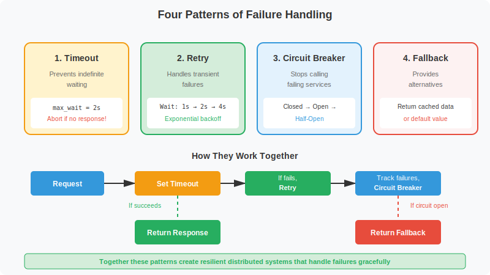
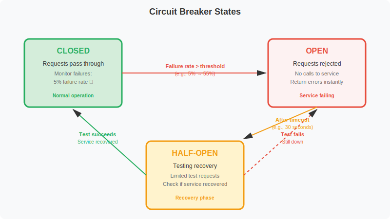
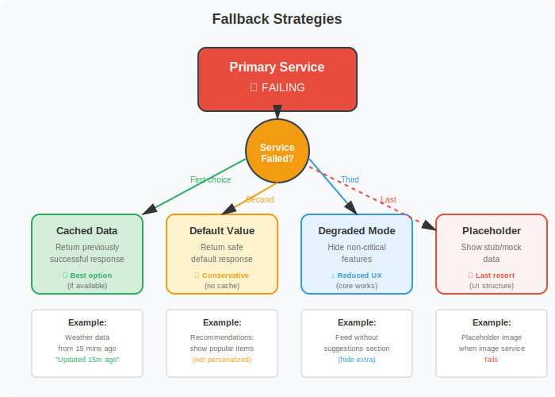

# Notes

In Microservices,Each service handles a specific function with its own database. But services cannot work in isolation. When a user places an order, the order service must check inventory, process payment, and send notifications. How do these separate services coordinate?

## The Communication Problem
An e-commerce site runs three microservices: orders, inventory, and payments. A customer buys a product. The order service receives the request. It needs inventory data to verify stock availability. It needs the payment service to charge the customer. Without communication between these services, the order cannot complete.


## Synchronous communication 

Synchronous communication uses direct request-response interactions. Service A sends a request to Service B and waits for a response before continuing. The calling thread blocks during this time.


REST over HTTP is the most common implementation. The order service makes an HTTP GET request to the inventory service. The inventory service queries its database and returns JSON with stock levels. gRPC offers a more efficient alternative using HTTP/2 and Protocol Buffers.

This pattern is simple to implement and debug. Code reads sequentially. Errors surface immediately. HTTP status codes indicate success or failure. Tools like curl and Postman make testing straightforward.

But synchronous calls create tight coupling. If the inventory service is down, the order fails completely. The user cannot place an order even though the order and payment services work fine. Failures cascade through service chains. Latency adds up across multiple hops.

## Asynchronous Communication


Asynchronous communication decouples services. The sender publishes a message and continues without waiting for a response. The receiver processes the message later.

One approach uses shared databases. Service A writes data to a table. Service B polls the table and processes new records. This is simple but creates tight coupling to the database schema. Both services must agree on table structure. Database becomes a bottleneck under high load.

Message queues provide a better solution. Service A publishes a message to RabbitMQ or Kafka. The queue guarantees delivery to Service B even if Service B is temporarily offline. Service B processes messages at its own pace.

When a user places an order, the order service publishes an "OrderCreated" event. The inventory service subscribes to this event and reserves stock. The notification service also subscribes and sends a confirmation email. Services work independently. If email fails, the order still completes.

Asynchronous communication handles high throughput well. Services do not block waiting for responses. The queue buffers messages during traffic spikes. But the complexity increases. Debugging distributed async flows is harder than tracing synchronous request chains.

## Choosing a Pattern
Use synchronous communication when you need an immediate response. User authentication must validate credentials before granting access. Fetching data to display on screen requires the actual data now. Payment processing needs confirmation before completing checkout.

Use asynchronous communication for operations that can happen eventually. Sending notification emails does not need to block the user. Updating analytics dashboards can happen in the background. Processing uploaded files can take minutes without blocking the upload response.

Many systems use both patterns. A REST API handles user requests synchronously. Background jobs use message queues for async processing. The API gateway returns a response immediately while publishing events for downstream processing.

# Synchronous communication


An API gateway receives a user request for order details. It calls the order service with order ID 12345. The gateway thread waits. The order service queries its database, finds the order, and returns JSON data. The gateway receives the response and forwards it to the user.

This pattern mirrors familiar web development. Express.js, Spring Boot, and Flask all implement synchronous request handlers by default. HTTP and gRPC support this model natively. Most developers write their first web service using synchronous communication.

## The Simplicity Advantage
Synchronous calls are straightforward to implement and reason about. Code reads sequentially. Fetch user data, then fetch their orders, then return both. The execution path matches the code structure.

Debugging follows the same linear flow. Request logs show the entire chain. A failed request at timestamp 10:05:23 shows calls from the gateway to the order service to the database. Each step has clear input and output. Postman and curl let developers test endpoints directly.

Errors surface immediately. A 404 means the resource does not exist. A 500 indicates a server error. The client knows the operation failed and can retry or show an error message. No ambiguity exists about operation status.

## The Coupling Problem
Synchronous calls create runtime dependencies. Service A cannot function if Service B is down. A user views their profile. The profile service calls the achievements service to fetch badges. If achievements is offline, the entire profile request fails. The user sees an error instead of their profile, even though their basic user data is available.

This coupling becomes worse with service chains. Service A calls B. B calls C. C calls D. If D responds in 200ms, C adds 50ms of processing, B adds 50ms, and A adds 50ms, total latency reaches 350ms. If D slows to 2 seconds, the entire chain waits 2 seconds plus overhead.

Failures cascade. If C crashes, B cannot get a response. B returns an error to A. A returns an error to the user. One service failure breaks three services. The blast radius expands with chain length.

## Resource Contention
Each synchronous request ties up resources while waiting. A thread handles the request and blocks until the response arrives. Under high load, all available threads can be waiting for responses. New requests queue up or get rejected.

An order service handles 100 concurrent requests. Each request calls the inventory service and waits 500ms for a response. All 100 threads are blocked waiting. A new request arrives but no threads are available. The request fails or waits in a queue.

This resource exhaustion spreads upstream. If 10 gateway instances each have 100 threads, and all block waiting for the order service, the gateway cannot serve new requests. Clients see timeouts.

## When Synchronous Communication Works
Use synchronous calls when you need an immediate response to proceed. User authentication must validate credentials before allowing access. Retrieving data for display requires the actual data. Payment processing needs confirmation before completing a purchase.

Keep service chains short. One or two hops are manageable. Three or more create latency and failure risks. If you find yourself chaining four services, consider whether all that data is truly needed immediately or if some can be fetched asynchronously.

Simple architectures with a few services handle synchronous calls well. A small application with three microservices can use REST APIs without complex failure handling. As the system grows, you need timeouts, retries, circuit breakers, and fallbacks to handle the inevitable failures.

REST and GRPC are two ways to implement synchronous communication!!

## Why Failures Happen
Service B receives 1000 requests per second normally. A bug causes a memory leak. Garbage collection pauses increase. Response time climbs from 50ms to 5 seconds. Service A sends requests and waits. Threads block. New requests queue up. Service A exhausts its thread pool and stops responding. Now Service A's callers time out. The failure spreads upstream.

Networks drop packets. A switch fails and reroutes traffic. Latency spikes from 10ms to 500ms. Requests that normally complete in 100ms now take 600ms. Callers waiting for 200ms timeout and retry. The retry flood overwhelms the network further.

A database deadlock holds a transaction for 30 seconds before aborting. The service waiting for that query blocks. Other requests pile up behind it. Memory pressure builds. The service runs out of resources and crashes.

## Preventing Cascading Failures
Four patterns defend against these failure modes.

- Timeouts prevent waiting indefinitely. Set a deadline. If the response does not arrive in time, abort and free resources. A 2-second timeout prevents a thread from blocking for 30 seconds on a deadlocked database.

- Retries handle transient failures. A network glitch drops a packet. The request fails. Wait briefly and try again. The second attempt succeeds. Exponential backoff prevents retry storms. Wait 1 second, then 2, then 4. Add jitter so clients do not retry simultaneously.Jitter adds randomness to backoff delays so that multiple clients do not retry at exactly the same time. Without jitter, synchronized retries from many clients can create traffic spikes that overwhelm the recovering service.

- Circuit breakers stop calling failing services. If 50% of requests to Service B fail, open the circuit. Stop sending requests. Return errors immediately. After 30 seconds, try one request. If it succeeds, close the circuit and resume normal traffic. This gives the failing service time to recover without being overwhelmed by continued requests.

    - Circuit breakers prevent cascading failures by stopping requests to a failing service once a failure threshold is reached. This allows the failing service time to recover without being overwhelmed by continued traffic.

- Fallbacks provide alternatives when services fail. Return cached data. Show default values. Degrade functionality gracefully. If the recommendations service is down, show popular items instead of personalized suggestions. The user gets a working page rather than an error.

## Combining Patterns

Effective systems layer these patterns. A request starts with a timeout to prevent blocking forever. If it fails, retry with exponential backoff. If retries exhaust, the circuit breaker tracks the failure. After enough failures, the circuit opens and stops wasting resources on a service that is clearly down. Meanwhile, the application serves a fallback response so users see degraded functionality rather than errors.



## What Timeouts Prevent
Service A calls Service B. Service B queries a database. The database deadlocks on a transaction and hangs for 30 seconds. Service B's thread blocks waiting for the query. Service A's thread blocks waiting for Service B. If 100 requests arrive at Service A, all 100 threads block. New requests cannot be processed. Service A appears to freeze entirely.

This cascading freeze spreads through the entire system. Service C calls Service A. Service C's threads block too. The failure of one database query brings down three services.

### How Timeouts Work
A timeout sets a maximum wait duration. Service A sets a 2-second timeout when calling Service B. If Service B does not respond within 2 seconds, Service A aborts the request and returns an error. The thread becomes available for other work.

When the database deadlocks, Service B's threads block. But Service A only waits 2 seconds per request. After 2 seconds, Service A returns an error to its caller. Service A remains operational. It can process other requests that do not depend on Service B.

### Setting Timeout Values
Choose timeouts based on measured latency under normal conditions. If Service B normally responds in 100ms, set a timeout around 500ms. This allows for some variance while preventing indefinite waits.

Measure the 95th or 99th percentile response time. If 99% of requests complete in 300ms, a 1-second timeout catches the slow 1% without being too aggressive. Too short a timeout causes false failures. Too long a timeout defeats the purpose.

Different operations need different timeouts. Reading from cache might timeout at 100ms. Complex database queries might need 5 seconds. External API calls might allow 10 seconds. Set timeouts per operation based on expected latency.

### Implementing Timeouts
Most HTTP and RPC libraries support timeouts directly. In Python with requests:

```py
import requests

try:
    response = requests.get("https://api.example.com/users/123", timeout=2)
    return response.json()
except requests.exceptions.Timeout:
    return {"error": "Service unavailable"}
```

Database connections also need timeouts. A PostgreSQL connection  
```Java
Properties props = new Properties();
props.setProperty("connectTimeout", "2");
props.setProperty("socketTimeout", "5");
Connection conn = DriverManager.getConnection(url, props);
```
### Timeouts and Retries
Timeouts work with retries. A request times out after 2 seconds. The caller retries with exponential backoff. Wait 1 second, retry. If that times out, wait 2 seconds, retry again. After 3 attempts, give up and return an error or fallback.

Without timeouts, retries make things worse. The first request blocks indefinitely. The retry also blocks. Now two threads are stuck instead of one. Timeouts ensure each retry attempt has a deadline.

# Retries
Timeouts prevent threads from blocking forever by aborting slow requests. But some failures are transient(lasting or continuing for a short period of time). A network packet gets dropped. A service restarts. A database connection pool is momentarily full. These failures resolve quickly. Retrying the same request often succeeds.

A mobile app calls the API gateway. The gateway forwards the request to the user service. A network switch hiccups and drops a packet. The request fails. The gateway immediately retries. The network is fine now. The retry succeeds. The user never knows anything failed.

Without retries, the user sees an error. They manually retry by tapping the button again. The second tap works. Automatic retries provide a better experience by hiding transient failures.

## When Not to Retry
Retries only help with transient failures. If a user requests a resource that does not exist, retrying returns the same 404 error. If authentication fails because credentials are wrong, retrying with the same credentials fails again.

Check the error type before retrying. Network errors and 5xx server errors might be transient. Retry them. 4xx client errors like 400 Bad Request or 401 Unauthorized are not transient. Do not retry them.

Non-idempotent operations need care. Creating a resource might succeed on the server but the response gets lost. Retrying creates a duplicate. Use idempotency keys. The client sends a unique ID with each request. The server stores successful operations by ID. A retry with the same ID returns the original result without creating a duplicate

### Exponential Backoff
Immediate retries can overwhelm a struggling service. If the service is overloaded, retrying instantly adds more load. The service falls further behind.

```py
import time
import requests

def call_service_with_retry(url, max_retries=3):
    for attempt in range(max_retries):
        try:
            response = requests.get(url, timeout=2)
            return response.json()
        except requests.exceptions.RequestException as e:
            if attempt == max_retries - 1:
                raise
            wait_time = 2 ** attempt  # 1, 2, 4 seconds
            time.sleep(wait_time)
```

Exponential backoff spaces out retries. Wait 1 second before the first retry. If that fails, wait 2 seconds. Then 4 seconds. Then 8 seconds. This gives the service time to recover.

#### Adding Jitter
Exponential backoff alone has a problem. If 1000 requests fail simultaneously, they all retry after 1 second. Then all retry after 2 seconds. This synchronized retry storm can overwhelm the service when it starts recovering.

Jitter adds randomness to wait times. Instead of waiting exactly 2 seconds, wait between 1 and 2 seconds. Each client retries at a slightly different time. The load spreads out.

```py
import random

wait_time = 2 ** attempt
jittered_wait = wait_time * (0.5 + random.random() * 0.5)
time.sleep(jittered_wait)
```

## Retry Limits
Always set a maximum number of retries. Three attempts is common. After three failures, give up. Return an error or use a fallback. Retrying forever wastes resources and delays error handling.

Track total elapsed time too. If the original request plus retries takes 10 seconds, stop even if you have retries left. The user has probably given up or the operation is no longer relevant.

### Combining with Circuit Breakers
Retries work well for occasional failures. But if Service B is completely down, retrying wastes time. Every request tries three times, waits for exponential backoff, then fails. This adds latency without helping.

Circuit breakers detect persistent failures and skip retries. After 10 consecutive failures, stop calling Service B entirely. Return errors immediately or use a fallback. 

# Circuit breaker

Retries handle transient failures by attempting requests multiple times. But what happens when a service fails persistently(lasting for a long time or happening often)? Retrying a completely down service wastes resources and adds latency. Circuit breakers detect these persistent failures and stop making doomed requests.

An electrical circuit breaker protects your home from overload. When an appliance draws too much current, the breaker trips and cuts power. This prevents damage to wiring and other devices. After you fix the problem, you can manually reset the breaker to restore power.



In the closed state, the circuit breaker allows all requests through. It monitors each request and tracks failures. If 10 out of 100 requests fail, the failure rate is 10%. The circuit remains closed as long as the failure rate stays below the threshold.

When failures exceed the threshold, the circuit transitions to the open state. A service normally has a 5% failure rate. Suddenly it climbs to 60%. The circuit breaker detects this and opens. In the open state, the circuit breaker immediately rejects all requests without attempting to call the service. This prevents wasting threads and network resources on calls that will almost certainly fail.

After a timeout period, the circuit transitions to half-open. The circuit breaker allows a small number of test requests through. If these requests succeed, the service has recovered. The circuit closes and normal traffic resumes. If the test requests fail, the service is still down. The circuit reopens for another timeout period.

## Configuration Parameters
The failure threshold determines when the circuit opens. A threshold of 50% means the circuit opens when half of requests fail. Set this based on normal failure rates. If a service normally fails 5% of requests, a 30% threshold gives enough headroom.

The timeout period controls how long the circuit stays open before testing recovery. A 30-second timeout means after the circuit opens, it waits 30 seconds before allowing test requests. Too short and you overwhelm a service trying to recover. Too long and users experience degraded service unnecessarily.

The window size affects how failures are counted. A rolling window of 100 requests means the circuit tracks the last 100 requests. If 50 of those 100 failed, the failure rate is 50%. This window should be large enough to smooth out noise but small enough to detect problems quickly.

Libraries like Hystrix and Resilience4j provide circuit breaker implementations. 
In Python with pybreaker:
```py
from pybreaker import CircuitBreaker

breaker = CircuitBreaker(fail_max=5, timeout_duration=30)

@breaker
def call_inventory_service():
    response = requests.get("http://inventory/stock/123", timeout=2)
    return response.json()

try:
    inventory = call_inventory_service()
except CircuitBreakerError:
    # Circuit is open, use fallback
    return {"stock": 0, "source": "default"}
```
### Monitoring Circuit State
Track circuit breaker state changes in metrics. Count how many times each circuit opens. Log when circuits transition states. Dashboard these metrics so operators can see which services are having problems.

A circuit that opens frequently indicates a dependency problem. Either the downstream service is unreliable or your failure threshold is too aggressive. A circuit that stays open for extended periods means a service is completely down and needs attention.

## Working with Fallbacks
When a circuit opens, requests fail immediately. Return a fallback response instead of an error. If the recommendations circuit opens, show popular items. If the user profile circuit opens, return cached data. The fallbacks section covers graceful degradation strategies in detail.

Circuit breakers and fallbacks together create resilient systems. The circuit breaker detects persistent failures quickly. The fallback provides acceptable alternatives. Users experience degraded functionality instead of complete failure.

# Fallbacks

Circuit breakers detect persistent failures and stop calling failed services. But blocking requests leaves users with error pages. Fallbacks provide alternative responses when primary operations fail. The system degrades gracefully instead of breaking completely.

### Why Fallbacks Matter
A product page displays item details, reviews, recommendations, and inventory status. The reviews service goes down. Without fallbacks, the entire page shows an error. The user cannot see the product or buy it, even though that functionality works. One failed dependency breaks the entire feature.

With fallbacks, the page loads without reviews. A message says "Reviews temporarily unavailable." The user sees the product details, checks inventory, and completes their purchase. Revenue continues. User experience degrades slightly but does not break.

Fallbacks turn catastrophic failures into minor inconveniences. They separate critical functionality from nice-to-have features. When non-critical services fail, the system continues operating with reduced features.



## Cached Responses
The simplest fallback returns previously cached data. A service caches successful responses with timestamps. When the primary service fails, return the cached version with a staleness indicator.

A weather service normally fetches live data from an external API. The API goes down. The service returns weather data from 15 minutes ago with a timestamp showing the age. Users get useful information instead of an error. Weather changes slowly enough that 15-minute-old data remains valuable.

Cache staleness must match the domain. Stock prices change every second. A 15-minute-old price is misleading. Return an error instead. User profiles change rarely. A day-old cached profile works fine as a fallback.

Set cache expiration appropriately. A 5-minute cache for product prices balances freshness with fallback coverage. A 24-hour cache for user avatars reduces load on the profile service while providing fallbacks for extended outages.

## Default Responses
When cached data does not exist or is too stale, return a safe default value. The key is choosing defaults that never mislead users.

A recommendations service suggests products based on user history. The service fails. Return a default list of popular items instead. Users get recommendations even without personalization. The recommendations might not match their preferences, but they are still relevant products. Showing popular items is better than showing nothing.

A discount calculator determines pricing for enterprise customers. The calculator service fails. Return the full price rather than a default discount. Charging full price is safe. Applying an incorrect discount loses revenue or violates contracts. The conservative default protects the business.

Make defaults explicit. Do not return zero or empty string as a default unless that makes sense in context. If the discount calculator returns zero, the checkout process might interpret that as "free." Return an error code alongside the default so callers know they are getting fallback data.

## Graceful Degradation
Disable non-essential features when their backing services fail. Core functionality continues while extras go offline.

A social media feed shows posts from friends, trending topics, and suggested accounts to follow. The suggestions service fails. Hide the suggestions section entirely. Users still see their friend's posts and trending topics. The feed works even though one enhancement is missing.

A video player supports multiple quality levels. The quality detection service fails. Default to standard definition instead of failing playback. Users can watch the video even if automatic quality selection is unavailable. Playback is more important than optimization.

Communicate degradation clearly. Show a banner: "Some features temporarily unavailable." Users understand the situation instead of wondering why things look different. They can retry later or contact support if needed.

## Stubbed Responses
Return placeholder data that maintains UI structure without real information. This works when showing empty space would confuse users but real data is unavailable.

An e-commerce site shows product images, titles, prices, and descriptions. The image service fails. Show a generic product placeholder image. The page layout remains intact. Users see the title and price and can make purchasing decisions. Missing images are an annoyance, not a blocker.

A dashboard displays charts and graphs. The analytics service fails. Show the chart framework with a "Data temporarily unavailable" message where the graph would appear. The dashboard layout remains consistent. Other working charts still display. Users can check back later for the missing data.

Stubs must be clearly identifiable. A placeholder image should look obviously generic, not like actual product photography. Users should never mistake stubbed data for real data.

## Combining Fallbacks With Circuit Breakers
Circuit breakers and fallbacks work together. When the circuit opens, the system immediately returns a fallback without attempting the failing call. This prevents wasting resources on calls that will fail.

A user profile service calls the achievements service for badges. The achievements service fails repeatedly. The circuit breaker opens. For the next 30 seconds, profile requests skip the achievements call entirely and return the profile without badges. After 30 seconds, the circuit goes half-open and tests a few requests. If achievements recovers, badges reappear. If not, the circuit reopens and fallback continues.

During an interview, discuss fallback strategies for the specific system you are designing. Identify which services are critical and which can degrade. Explain what users experience during each type of failure. Show that you understand the difference between catastrophic failures and acceptable degradation.

for trasient error use retries and timeout 

For persistent error use circuit breaker with fallbacks

