# Notes

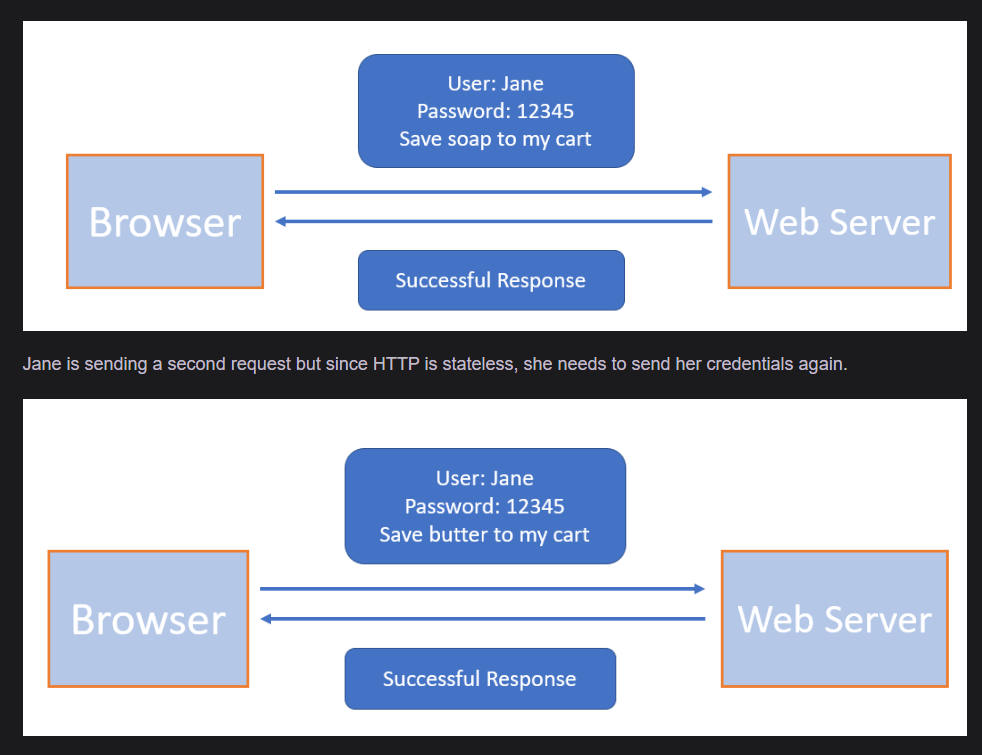

HTTP is a stateless protocol. This means that each HTTP request is considered an independent request and no information from the previous request is saved. If the application is static and it is available to everyone, then we don’t have any problems. We just need to inform the server which page we want to access, and we will get the result. If the application is dynamic, then we may need to send additional information regarding who is accessing the page.

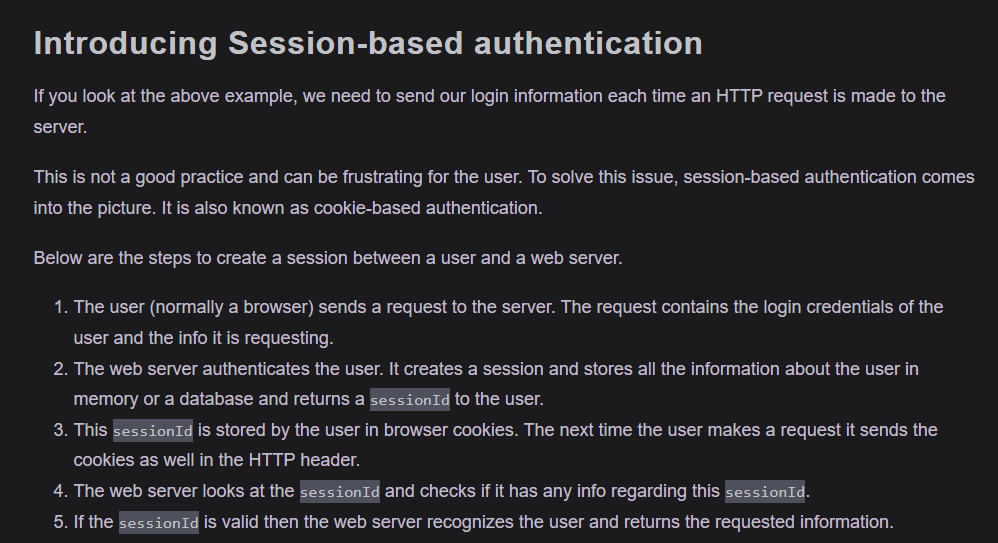

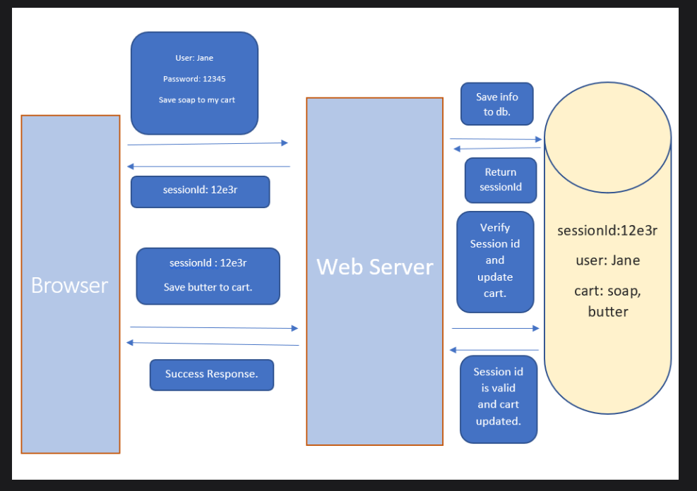

Limitations of Session-based authentication
There are a few limitations of the session-based authentication. We will discuss them here:

1. Problems faced in Distributed Systems
We know that in session-based authentication, the session details are saved on the server. However, in a distributed system, it is not necessary that a request from a given user will always go to the same server. It’s quite possible that one request is handled by one particular server and the next request is handled by another server.

    In this case, we can’t use session-based authentication as we can’t save the session info on both servers.

2. Performance Issue
Storing and retrieving the session information from the database or memory is a costly process. Each time a new user authenticates, we need to store their information. And whenever a user sends a sessionId with the request then we need to validate it from the database or memory. This leads to a lot of back and forth.

3. Cookie Fraud
It is possible that a malicious user or a website could gain access to your cookies and then perform some malicious operations on a website. This is also known as CSRF attack, which we have discussed earlier.

## Token Based authentication 

Here is the basic flow of token-based authentication:

- The client sends a request to the server with a username/password.
- The application validates the credentials and generates a secure, signed token for the client.
- The token is sent back to the client and stored there.
- When the client needs to access something new on the server, it sends the token through the HTTP header.
- The server decodes and verifies the attached token. If it is valid, the server sends a response to the client.
- When the client logs out, the token is destroyed.

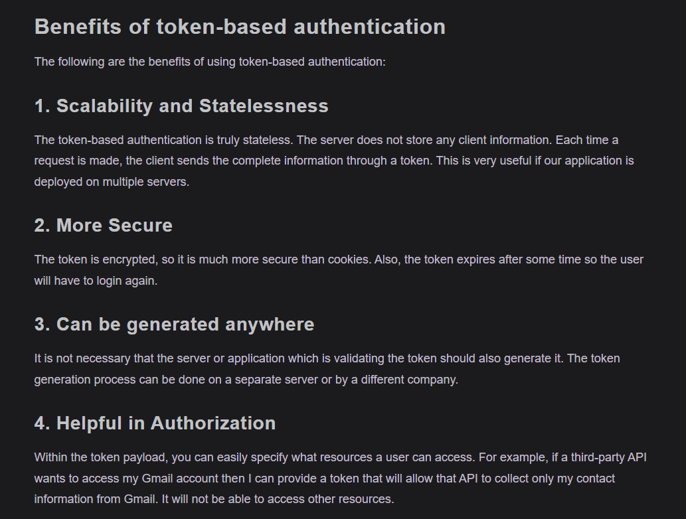

### Types of Tokens
There are basically two token types:

- Access Tokens
- Refresh Tokens

Access tokens are used to grant access to a protected resource. When a client first authenticates it is given both types of tokens, but the access token is set to expire after a short period. By doing this, even if someone manages to get access to your token, it can be used only for some time.

Refresh tokens are used to obtain a new access token when the current access token becomes invalid or expires, or to obtain additional access tokens with an identical or narrower scope. It does not need the credential information again. The refresh token is also valid for some duration, but it is much more than an access token.

## What is JWT?
A JSON Web Token (JWT) is a standard that defines a safe, compact, and self-contained way of transmitting information between a client and a server in the form of a JSON object. A JWT can either be signed (JWS) or encrypted (JWE) or both. If a JWT is neither signed nor encrypted, then it is called an insecure JWT.

 

 
  

  1. Header
This is the first part of JWT. It is also known as the JOSE header (JSON Object Signing and Encryption). This header describes what algorithm is used to sign or encrypt the data contained in the JWT.

The header defines two attributes:

- alg: the algorithm used to sign or encrypt the JWT.

- typ: the content that is being signed or encrypted.

>Note:This is just encoded and not encrypted. Anyone can easily decode this string and get the JSON.

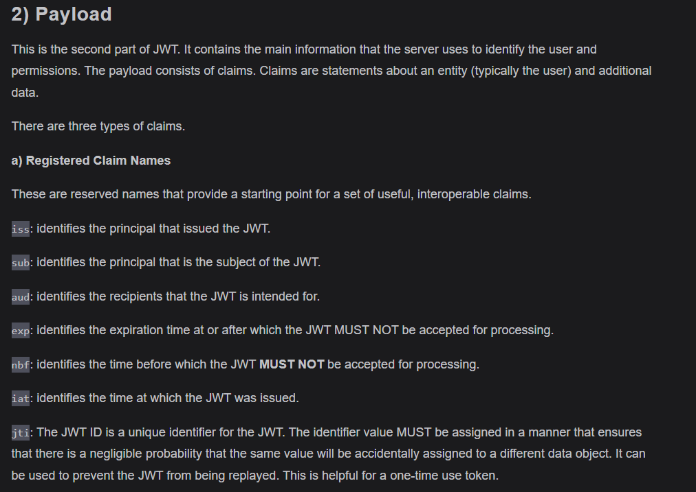

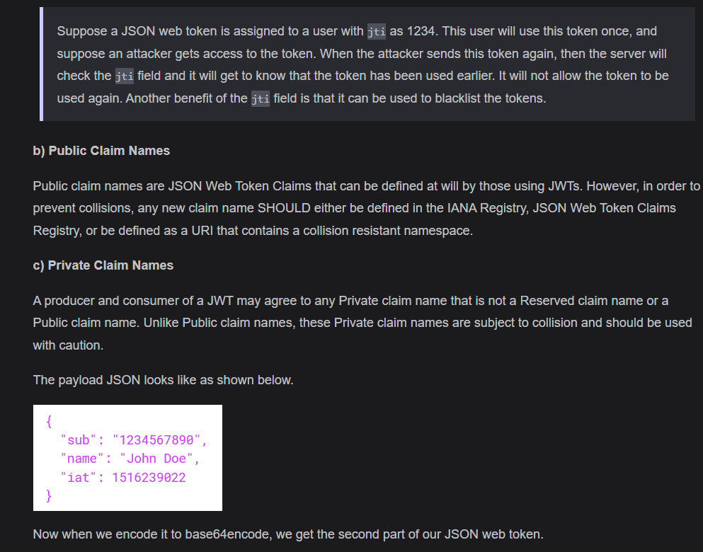

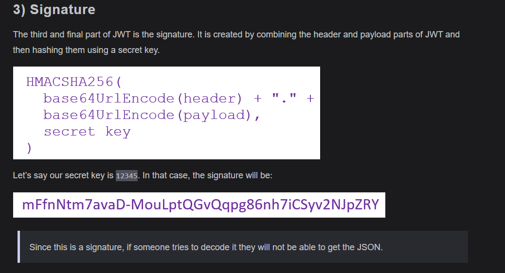

Knowing the hash value (the signature) alone does not allow someone to get the original JSON because hashing is a one-way function. Without the secret key used to create the signature, it is computationally infeasible to reverse the hash and retrieve the original header or payload data. This ensures the integrity of the JWT, preventing tampering.

If someone knows the secret key used to create the signature, they can both verify the JWT's integrity and potentially create a valid signature for any modified data. This means they could tamper with the JWT's header or payload and generate a new signature that the server would accept as valid. Therefore, keeping the secret key confidential is critical to maintaining the security of signed JWTs.

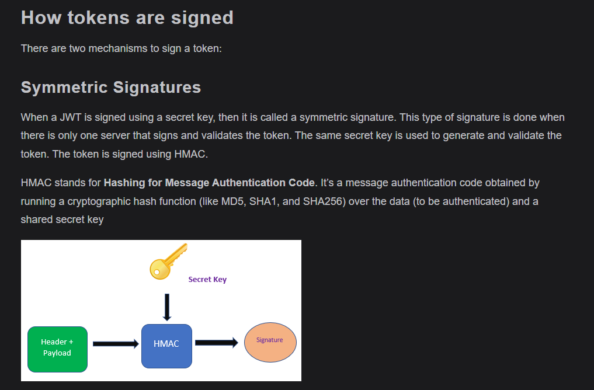

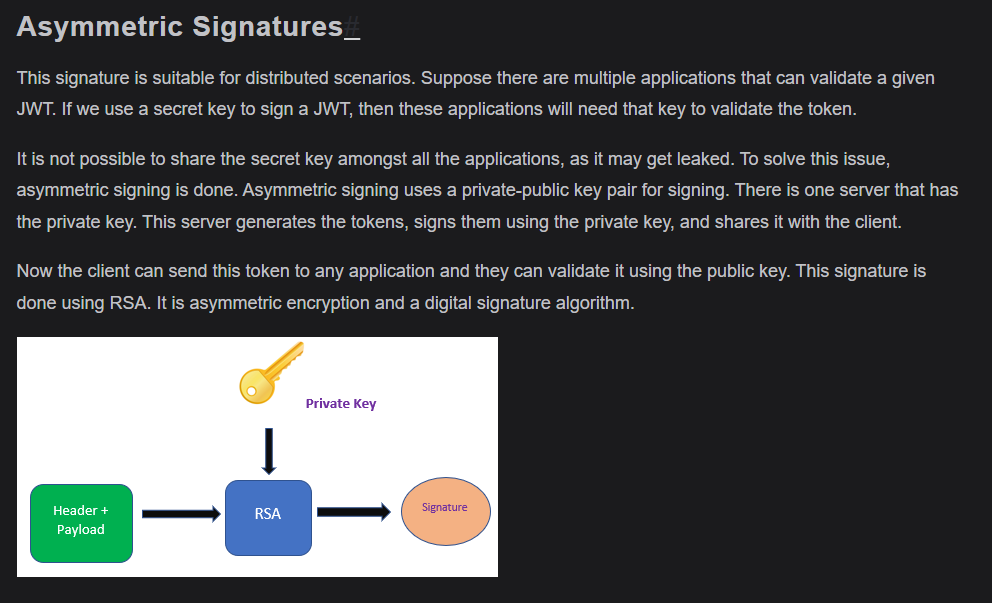

 the public key cannot be used by a hacker to get or forge a valid JWT. The public key is only used to verify the token's signature, not to create or sign it. Only the private key, which is kept secret on the server, can sign the JWT. This ensures that tokens cannot be forged even if the public key is known.

 In symmetric key signing, the same secret key is used to both sign and validate the JWT. If an attacker gets hold of this secret key, they could potentially create or forge valid JWTs. That's why symmetric keys must be kept very secure and are usually used only when a single trusted server handles both signing and validation.

  
    

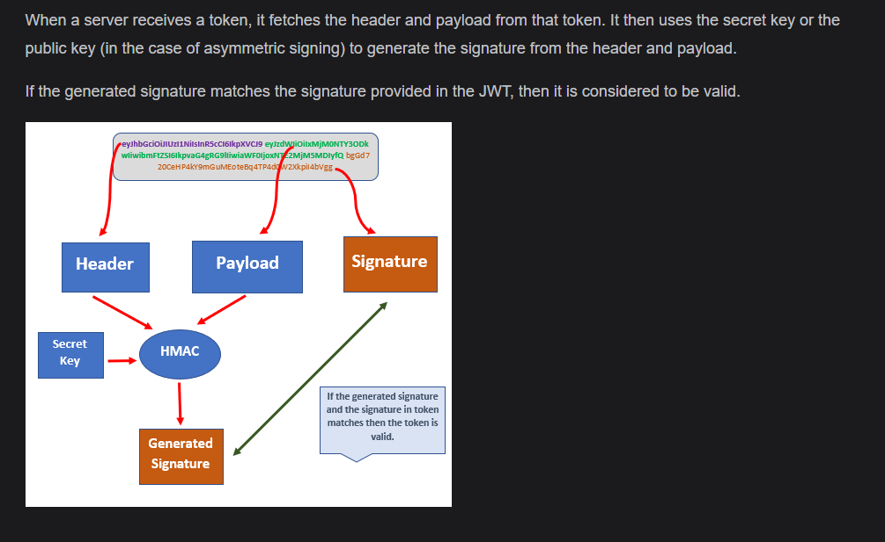

### Claims validations
 It is not sufficient to just validate the signature of the token. There are a few other security properties that need to be validated as discussed below:

- Check if the token is still valid. This can be validated through exp claim.
- Validate that the token is actually meant for you through the aud claim.
- Check if the token can be used at this time using the nbf claim. NBF stands for not before which means that this token should not be used before a particular time.

   
     
    

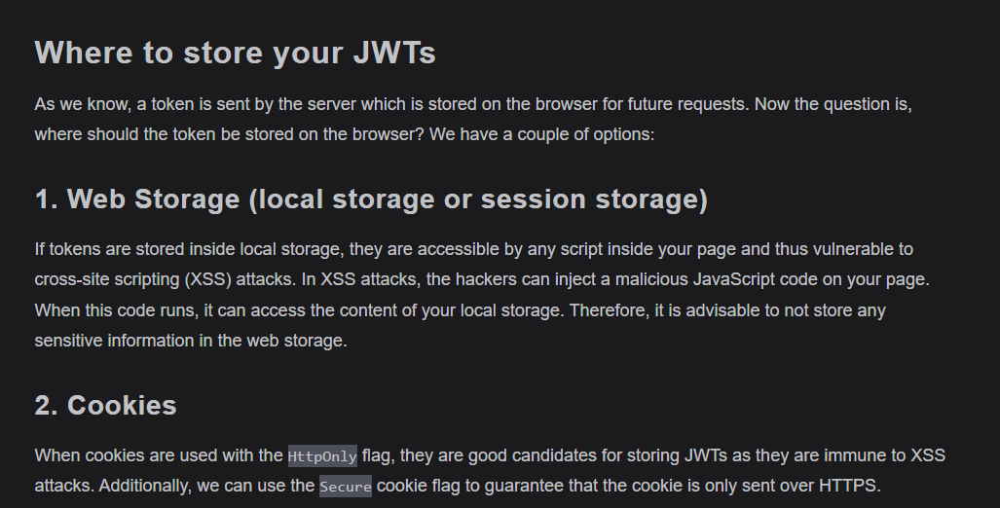

### Hacking JSON Web Tokens

In other words, is it possible for an attacker to change the data within a token, and have it still be validated by our server? Unfortunately, there are some ways through which an attacker can do this. Some of these issues have been caught already and fixed and some require extra caution from the token generator.

We will discuss each of these methods below:

1) Brute Force Approach

    In symmetric signing, we use a secret key to sign the token. If an attacker gets our secret key, the attacker can change the data in the token, sign it again using the secret key, and send it with the request.

    If an attacker has our valid JWT then the attacker can brute force various symmetric keys and compare the signature result to the known-valid signature. If there is a match, then the attacker has discovered the symmetric key and can modify and forge JWTs at will. There are plenty of libraries for doing this.

    To save ourselves from a brute force attack, we should carefully select our secret key. It should not be too easy to guess.

2) None Algorithm
In the alg claim, we provide the algorithm that is used to sign or encrypt the token. Earlier this claim was allowed to take None as value. If a token has None value in alg claim, then it means that this token need not be validated.

Any attacker can create a token with alg claim as None and get access to our resources. This issue was fixed in 2015 but there still might be some libraries that allow None value in alg claim.

3) Modify the algorithm RS256 to HS256
We already know that HS256 uses a secret key to sign and validate the token. We also know that RS256 uses a private key to sign the token and public key to validate it. Now if an attacker has access to our token (which is signed using RS256) then the attacker can change the token data using the following steps:

    Change the algorithm in alg parameter from RS256 to HS256.
    Make changes in the payload.
    Sign the token using the public key (assuming the attacker has access to the public key). Please note here that the public key cannot be used for signing. But, since the algorithm is changed to HS256, the public key will act as a secret key.

    In normal cryptographic practice, a public key is used only for verifying signatures, not for signing. However, in the attack described, the attacker changes the token's algorithm from RS256 (which uses asymmetric keys) to HS256 (which uses symmetric keys). The server then mistakenly uses the public key as if it were a secret symmetric key to verify the token. Since the attacker has the public key, they can sign the token using it under HS256, tricking the server into accepting the forged token. So, the public key isn't truly used for signing in the usual sense; the attack exploits the server's confusion between asymmetric and symmetric algorithms.

### What would happen if the private key is changed in asymmetric signing?#
As we know that in the case of asymmetric signing, the private key is used to sign the token and it can be verified by all the applications that have the public key. If we keep rotating the private key, then the public key will also change. How will an application get to know which public key to use?

We can associate each public key with a keyId and provide this keyId in the kid parameter of the token header. But in that case, each application will have to maintain a set of public ids for lookup. This is not a feasible option.

We have a JSON Web Key specification that offers a way to represent cryptographic keys in a JSON format. A JWK can be included in a JWT token as a way to distribute the public key. We have two ways in which we can include the public keys in our token header:

1. Directly embedding the public key
As the name suggests, public keys are public. So even if we add them into the token, it is not a security threat, as everyone can easily access the public key.

    However, we don’t add the public key directly into the token. We can convert the public key into JSON format using any of the available libraries. A JSON object that represents a cryptographic key is called JWK.

    A JWK can be included in the token header using jwk parameter.

2. Embedding a URL which contains the key
We can maintain the complete list of all the public cases at a particular location. Then in the token header, we can provide the URL of this location along with the key identifier. There are two claims available which help us in doing this. The first is kid, which we have discussed earlier also. It will contain the key identifier. The second claim is jku. It contains the URL of the location where all the keys are stored.

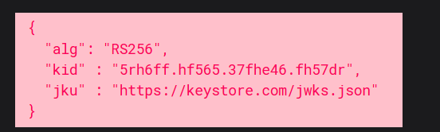