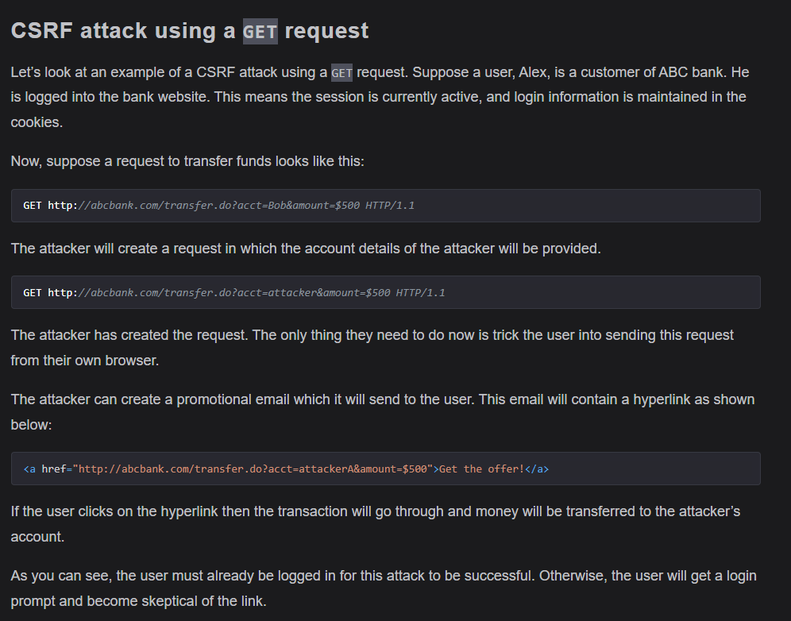
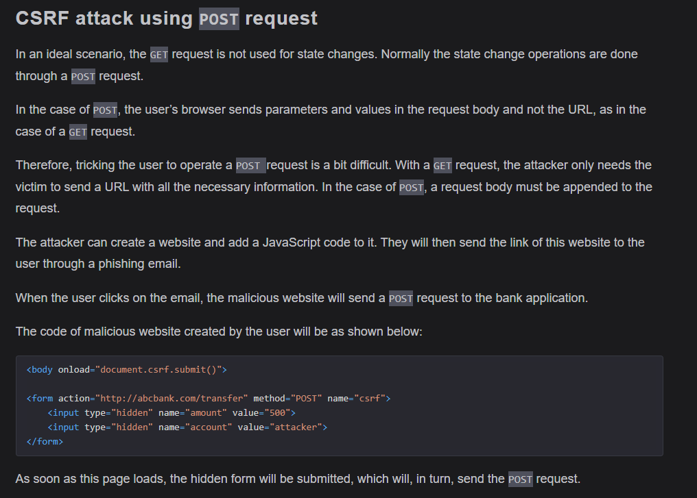
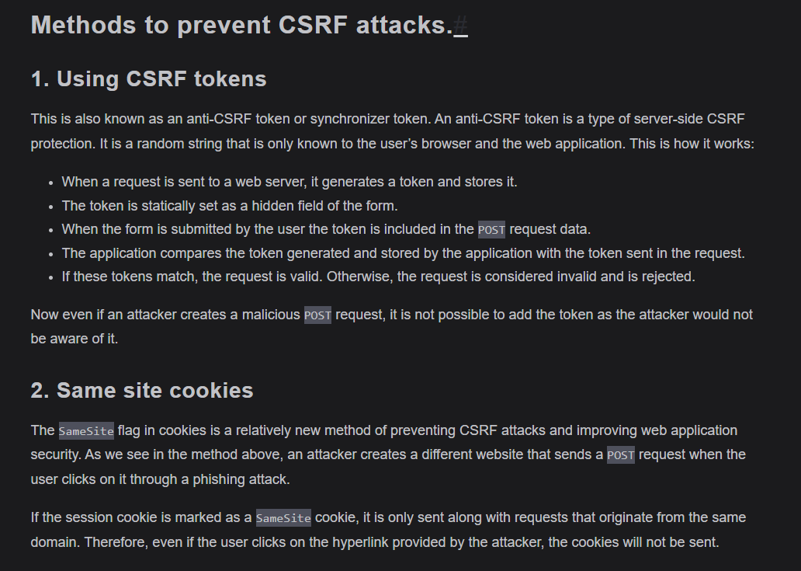
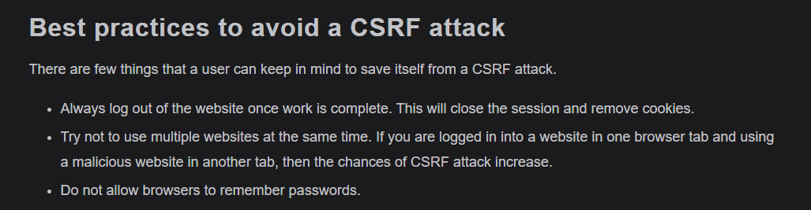
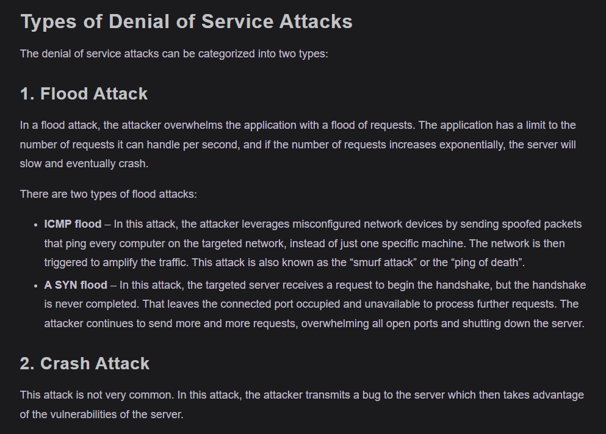
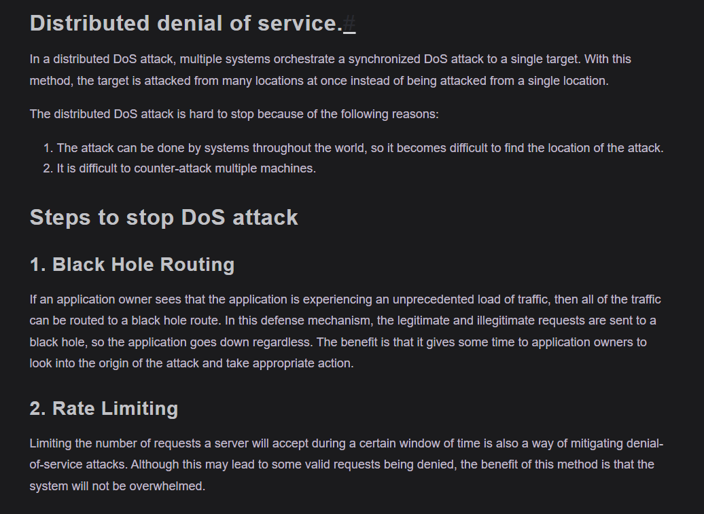
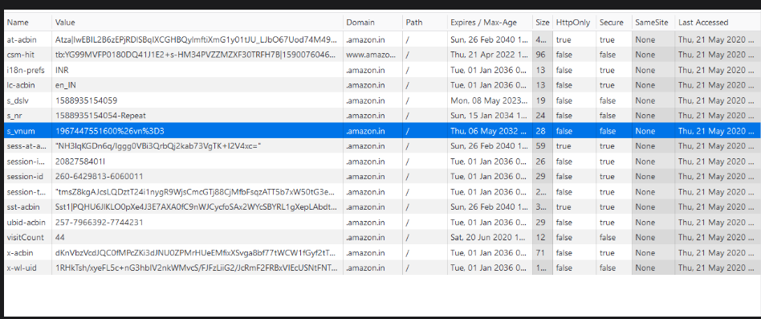
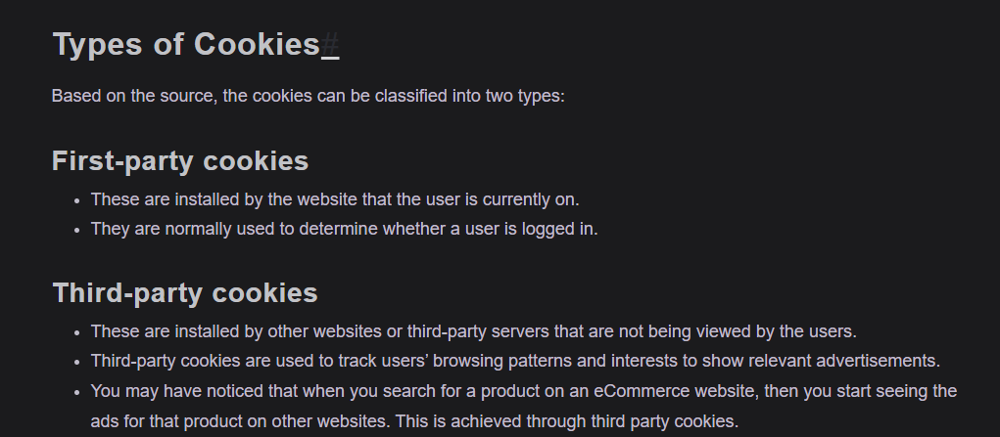
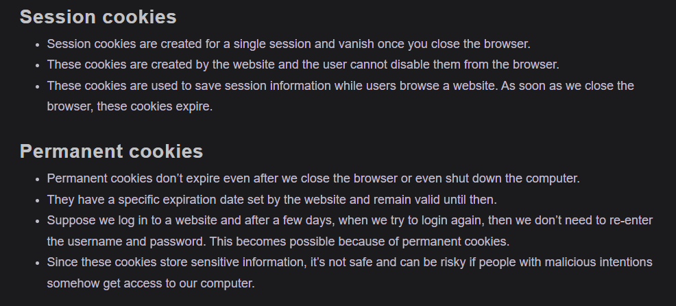

# Notes

## Cross-site Scripting Attack (XSS)

The Cross-site Scripting attack, also known as XSS attack, is a kind of attack in which a malicious script is added to a website. When a user accesses this website then they accidentally run this malicious script, compromising their data as the attacker gets control of the user’s browser.

1. Stored Cross-site Scripting Attack
This is the most dangerous type of XSS attack because it is very easy for the attacker to inject a malicious script through this method. These attack targets websites that allow user input and store it in the database, e.g. comments.

The attacker writes the malicious script inside the input box, for example, a comment box. When the attacker clicks submit, the malicious script is saved as a comment in the website database. When a user opens this website, the malicious script runs on the browser as soon as the comments load.

The malicious script can attack the user through the following methods:

- Installing browser-based Keyloggers to capture keystrokes of the victim. This can be dangerous as the attacker might use this to get access to social media passwords, email passwords, credit card info, banking passwords, etc.

- Capturing session cookies of the user, which can be used to trigger some other kind of attack, like a CSRF attack.

- Redirecting users to other malicious websites.

2. Reflected Cross-site Scripting Attack
In this kind of attack, the attacker tricks the user into clicking a link that contains the malicious script. This kind of attack is a bit more difficult to execute than stored XSS.

The user may receive the malicious link through email, search results, or advertisements on another website. As soon as the user clicks on the link, the malicious script is executed on the user’s browser. This script can then steal browser data, such as cookies, and send it to the attacker.

### How to prevent XSS
Since XSS works by injecting malicious code into a website, the website owners should make sure that all user inputs are validated before they are stored into the database. The theory here is to treat all data or input as malicious until they pass certain criteria, like type and length requirements.

Sanitizing user input is another mitigation method that essentially requires all user data to be cleaned of potentially dangerous symbols that are usually used in HTML markup and JavaScript code. There are lots of tools available that blacklist HTML tags in user input. If your website allows HTML in user input then you can use these tools to blacklist the tags that build malicious code.

## Cross-site Request Forgery (CSRF)

### What is CSRF?
Cross-site Request Forgery (CSRF), is an attack that tricks a web browser into executing an unwanted action in an application after a user logs in. It allows an attacker to force a logged-in user to act without their consent or knowledge.

In a CSRF attack, the attacker cannot access the data because the attacker does not have access to the response. This can be devastating, as the attacker can force the user to transfer funds from a banking website or share sensitive information.

How does CSRF work?
To perform a CSRF attack, a few conditions should be met.

- Cookie-based session handling – The user has already logged in into the website that is being attacked, and the website relies on cookies to identify the user.

- No unpredictable request parameters – The requests that perform the malicious action do not contain any parameters whose values the attacker cannot determine or guess. For example, when tricking a user into transfering funds, the attacker must not be required to know the password of the user.

## Denial-of-Service Attack

A denial of service or DoS, attack is a type of attack in which the attacker tries to crash an application so that the legitimate users are not able to access the application. The attacker does not gain any benefit from this attack. The main purpose of this attack is to harm an organization, and is often carried out by a competitor or mischievous hacker.

## What are Cookies
HTTP cookies, or web cookies, are small text files that store small pieces of information. They are created by the websites we visit and are stored on our browser. Cookies are limited to 4kb in size, which means they cannot store large amounts of data.

A cookie generally contains:

- name - A website or a third-party server identifies a cookie using its name.
- value - A random alphanumeric character, and it stores data like a unique identifier to identify the user and other information.
- attribute – A set of characteristics such as the expiration date, domain, path, and flags.

Firsta nd third party based on Source!!

### Are third party cookies harmful?
Third-party cookies are created by advertisers, marketers, and social media platforms to track your browsing history. Based on your browsing history, these organizations suggest advertisements to the user.

If you search for a product on Amazon and choose not to buy it, then suddenly you may start seeing the ads for that product on many of the websites you visit. The reason you are now seeing these ads is that your web browser stored a third-party cookie and is using this information to send you targeted advertisements.

If you visit a website and try to create an account, then you may provide certain information like name, address, phone number, and email address. If the website uses third-party cookies, then your contact information may get revealed to other parties in order to send you spam.

According to advertising agencies, third-party cookies are a good thing as they help the advertiser to show relevant ads to the user. From the perspective of a user, though, they might be an attack on privacy.

