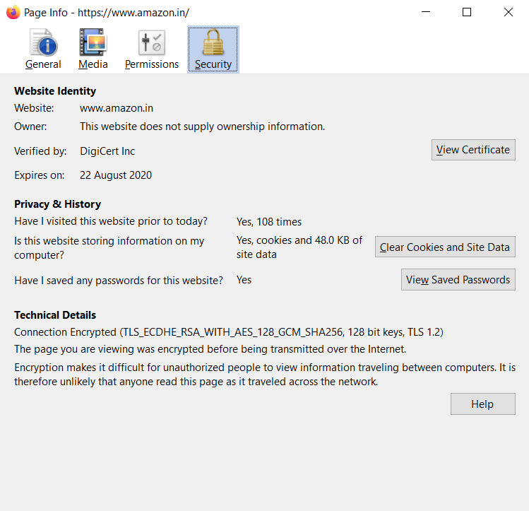
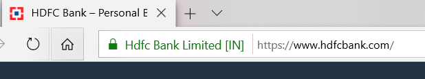
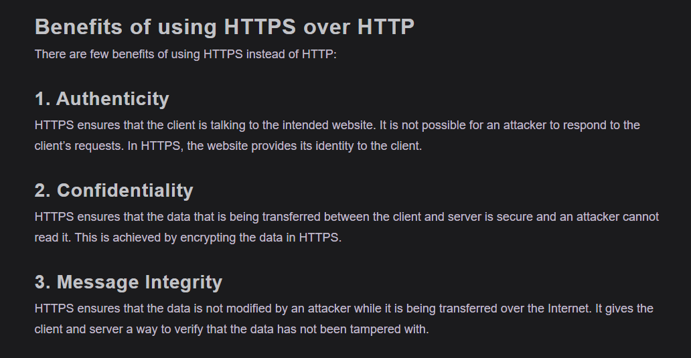
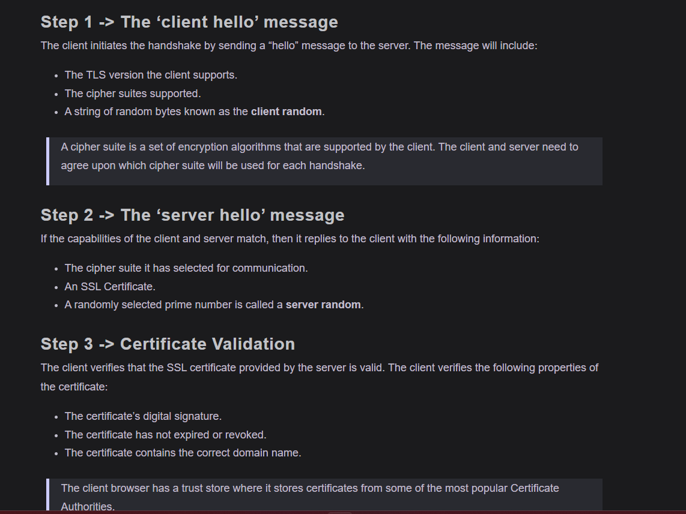
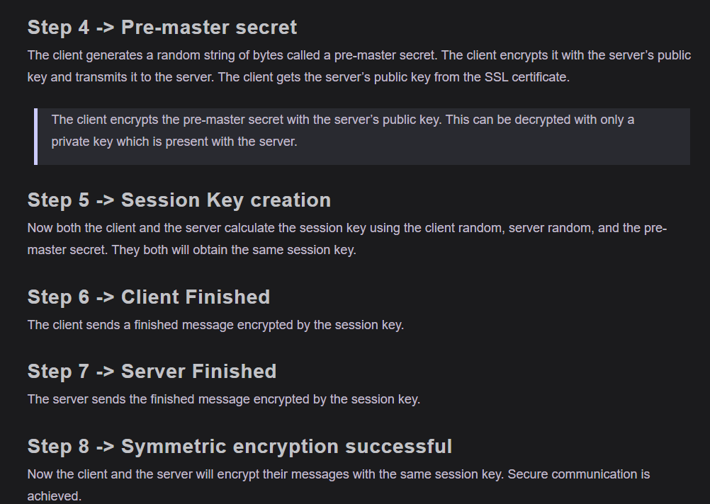
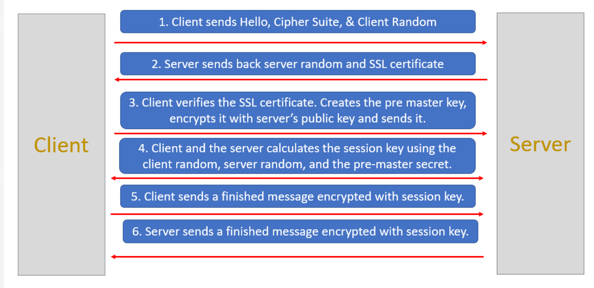

# Notes

Encryption is a way of converting plaintext into ciphertext (an encoded text that is not understandable by the third party). Encryption requires the use of an encryption key and an encryption algorithm. The key is used to encrypt/decrypt the plaintext into ciphertext. How that key is used to encrypt the plaintext is defined by the encryption algorithm. Both the receiver and the sender must have the encryption key.

## Types of encryption
There are two main types of encryption:

1. Symmetric Encryption
In symmetric encryption, the same key is used for both encryption and decryption. Here’s a good analogy to explain how symmetric encryption works:

    Suppose John needs to send a message to Carl. John will put a message in a box and will lock the box. Carl already has a duplicate copy of the key which was used to lock the box. Carl will receive the box and will unlock it using the key. This is symmetric encryption. Symmetric encryption is much faster than asymmetric encryption and is used to encrypt a large amount of data.

    The disadvantage of this encryption type is that the sender and receiver will have to send their key to each other. An attacker may access this key while in transit and will be able to read all the messages. The keys used in symmetric encryption are not very large, as the max length is 256 bits.

2. Asymmetric Encryption
In asymmetric encryption, the sender and receiver use a separate key to encrypt and decrypt the message. This is also known as PKI (Public Key Infrastructure). The advantage of this encryption is that the keys are not transferred over the network. So, it is much safer than symmetric encryption. This encryption is achieved through a public-private key model.

    The recipient sends a public key to all the senders. The senders then encrypt the messages using this public key. When the receiver receives the message, it uses its private key to decrypt the message. The keys used in asymmetric encryption are fairly large and can be around 2048 bits.

    >Note:Since asymmetric encryption is very slow, it is normally used once to exchange the encryption key safely. After that, all the communication is done using symmetric encryption.

    The process starts with asymmetric encryption to securely exchange a symmetric key. The receiver generates a pair of keys: a public key and a private key. The receiver shares the public key with the sender. The sender uses this public key to encrypt a symmetric key and sends it to the receiver. Since only the receiver has the private key, only they can decrypt and obtain the symmetric key. After this secure exchange, both sender and receiver use the symmetric key for all further communication. Symmetric encryption is much faster, so it is used for encrypting the actual data once the key is safely shared.

### What is an encryption algorithm?
An encryption algorithm is a mathematical formula used to transform data into ciphertext. An encryption algorithm uses an encryption key to transform plaintext into ciphertext. The ciphertext can be changed back to plaintext using a decryption algorithm and the decryption key.

Below are some of the commonly used encryption algorithms:

- AES
- DES
- Blowfish
- TwoFish
- RC4, RC5, RC6

## What is a brute force attack?#
In a brute force attack, an attacker tries to guess the decryption key. The attacker is not required to do this manually, and there is computer software that performs the same actions. To prevent this from happening, the key should be very strong, so that it becomes impossible for the computer to try all the combinations.

Let’s see what we mean by a strong key. We know that data is represented by bits in computing language. Each bit can have a value of 0 or 1. If a key is 2 bits long then there are four possible combinations, i.e. 00, 01, 10, 11. This is very easy for computers to crack.

Let’s take a key which is 256 bits long. The total number of possible combinations are 
`2^256`. A 256-bit private key will have 115, 792, 089, 237, 316, 195, 423, 570, 985, 008, 687, 907, 853, 269, 984, 665, 640, 564, 039, 457, 584, 007, 913, 129, 639, 936 (approximately 1.16 x 10^77)possible combinations. No supercomputer can crack that in any reasonable timeframe. So, to prevent brute force attacks, the key should be of sufficient length.

## What are SSL certificates?
When a user accesses a website, data is transferred between the client (browser) and the server (website). This data is not safe to send in the clear because it may be read by an attacker. This is a problem if we are sending sensitive data like credit card details, passwords, or personal information over the Internet.

SSL (Secure Sockets Layer) certificates create an encrypted environment between a client and a server. A Secure Sockets Layer certificate (SSL certificate) is a small data file installed on a Web server that allows for a secure connection between the server and a web browser.

The certificate is base64 encoded and contains the following information:

- Name of the entity to which the certificate was issued.
- The public key required for encryption and digital signature verification.
- The digital signature created with the private key of the certificate issuer.

>SSL is a protocol that is used to secure the HTTP. SSL is deprecated now and Transport Layer Security (TLS) protocol is used instead. Most SSL certificates today also support the Transport Layer Security (TLS) protocol, which is considered to be more secure than SSL.

The application owner should install the SSL certificate on its web server. When an application is secured by an SSL certificate then its URL starts with https instead of http.

In the below screenshot you might have noticed a lock symbol before the URL. This symbol tells that this website is secured by a certificate.

>Note:A Certification Authority (CA) is a company or an organization which is trusted to sign, issue and revoke digital certificates. Some of the most popular certification authorities are Sectigo SSL, Symantec SSL, RapidSSL, GeoTrust SSL, and Thawte SSL.

### SSL certificates validation level
Before a Certification Authority (CA) issues an SSL certificate to an organization, they have to validate the organization. The CA needs to validate that the organization is doing legal business and owns the domain. This is what’s known as SSL certificate validation.

There are three main types of validations:

1. Domain Validation Certificates

    Domain Validation SSL or DV SSL is the most basic type of SSL certificate. This type of certificate can be obtained in a few minutes and is not very expensive. This certificate is suitable for websites that just need encryption and nothing more.

    To obtain this certificate, an applicant needs to prove their control over the domain name only. The issued certificate contains the domain name that was supplied to the certification authority within the certificate request.

2. Organization Validation Certificates

    To acquire this certificate, the applicant needs to prove that their company is a registered and legally accountable business. Getting this certificate may take 3-4 days, as the business is vetted to confirm that it is a legal business. This type of certificate is suitable for sites that need the user to authenticate.

    The OV SSL provides a way for customers to check the verified business information in the certificate details section. This is not available in Domain Validation Certificates.

3. Extended Validation Certificates

    This certificate is very expensive and takes some time, as a lot of vetting is done before this certificate is issued. This is suitable for applications that ask for confidential details of users like credit card numbers.

    This certificate can be easily distinguished from the other two certificates, as the URLs of websites with this certificate have a green address bar containing the company name.

The green address bar is visible only in Internet Explorer. In Firefox and Chrome, the EV and DV certificates are displayed similarly with just a lock icon.

>Note: Vetting is the process of thoroughly checking and verifying the legitimacy or credentials of an entity.
In the lesson context, vetting refers to the Certification Authority verifying that a business is legally registered and accountable before issuing Organization Validation or Extended Validation SSL certificates.

### Types of SSL certificates
The SSL certificates can be divided into three types based on the number of domains it protects.

1. Single-name SSL certificates

    A single-name SSL certificate can only be used on a single domain or IP. It is not applicable on sub domains. For example, if www.mysite.com has a certificate then it is not applicable to blog.mysite.com.

    This is the default SSL certificate type and it is available at all validation levels.

2. Wildcard SSL certificates

    A wildcard SSL certificate is applicable to a domain and all its subdomains. For example, if *.mysite.com has a wildcard certificate then this certificate will be applicable on all its sub-domains like contact.mysite.com or mail.mysite.com will also have the certificate.

3. Multi-Domain SSL Certificates

    A multi-domain SSL certificate lists multiple distinct domains on one certificate. With an MDC, domains that are not subdomains of each other can share a certificate. For example, domains like www.mysite.com, www.example.com, and www.abc.com can share the same certificate.

# Https 
## What is HTTPS?
Since the beginning of the Internet, HyperText Transfer Protocol (HTTP) has been used to transfer information between the client and the server. The data is transferred in plain text format through HTTP. This means an attacker can get access to the data that is being transferred over the Internet. In the initial years of the Internet, the data that was transferred was mostly static HTML pages and did not raise any security concerns. As the Internet became more widely used for sensitive tasks like banking, more people felt the need for a secure way to transfer their data.

In 1994, Netscape Communications enhanced HTTP with some encryption. They introduced a new encryption protocol named Secure Socket Layer (SSL) and added it on top of HTTP. This combination of HTTP and SSL is called HTTPS (HTTP Secure).

In 1999, Transport Layer Security (TLS) protocol was introduced. This was more efficient than the SSL protocol, so SSL is no longer used.

## Steps 

The client verifies the SSL certificate by checking its digital signature against trusted Certificate Authorities (CAs) stored in the client's trust store. It ensures the certificate was issued by a trusted CA, confirms the certificate is still valid (not expired or revoked), and checks that the domain name on the certificate matches the server's domain. This process ensures the certificate is authentic and trustworthy.

>Note: Let’s suppose an attacker is listening to all the messages while a connection is being established. The attacker can get client random and server random, but it cannot get the pre-master secret. This is because the pre-master secret is encrypted using the server’s public key. Only the server can decrypt it, using its private key. So, the attacker will not be able to calculate the session key.

So summary 

The TLS handshake is a process that establishes a secure connection between a client and a server before data transfer. It involves several steps:

 1) The client sends a 'client hello' message with supported TLS versions, cipher suites, and a random byte string (client random).
 
  2) The server responds with a 'server hello' message, choosing a cipher suite, sending its SSL certificate, and a random byte string (server random). 
  
  3) The client validates the server's certificate.
  
   4) The client creates a pre-master secret, encrypts it with the server's public key from the certificate, and sends it to the server. 
   
   5) Both client and server generate a session key using the client random, server random, and pre-master secret. 
   
   6) The client sends a finished message encrypted with the session key. 
   
   7) The server sends a finished message encrypted with the session key. 
   
   8) Secure communication begins using symmetric encryption with the session key. This handshake ensures authenticity, confidentiality, and message integr

 ### Must know
During the TLS handshake, asymmetric encryption is used first to securely exchange the pre-master secret between the client and server. Once both have this secret, they generate a shared session key, which is then used for faster symmetric encryption to secure the communication.

