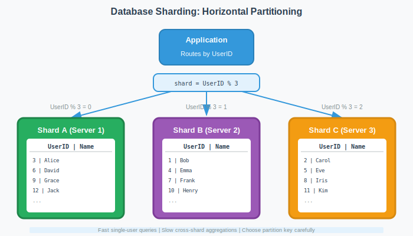

# Storage
Storage is the backbone for designing scalable systems. It's not just about having a place to put data; it's about how quickly you can access it, how securely it's stored, and how efficiently it can scale as your needs grow. Let's dive into the role of storage in system architecture and why choosing the right type of storage is crucial for meeting specific system requirements.

### The Role of Storage
Imagine a library filled with an immense number of books. This library is meticulously organized, allowing you to find any book you need quickly. In this analogy, the library represents your storage system, and the books represent the data. Just as the organization of the library impacts how quickly you can find a book, the structure and type of your storage system affect how swiftly and efficiently you can access and manage your data.

Storage in system architecture serves several key purposes:

- Persistence: Data needs to outlive the process that created it. Whether it's user profiles, transaction records, or session data, storage ensures that this information is preserved for future access.
- Performance: The speed at which data can be read or written directly impacts the performance of applications. Efficient storage solutions enhance application responsiveness and user satisfaction.
- Scalability: As an application grows, so does its data. Storage solutions must be able to scale, accommodating increasing amounts of data without compromising performance.
- Reliability and Availability: Data must be reliably stored and readily available whenever needed. This involves protecting against data loss and ensuring that the system can withstand various failure scenarios.

## Types of Storage Systems
The world of data storage can largely be categorized into three primary types: SQL, NoSQL, and Blob/Object Storage. Each serves different data storage needs and comes with its unique strengths and weaknesses.

### SQL (Structured Query Language) Databases
SQL databases, also known as relational databases, are the traditional choice for storing structured data. They organize data into tables, which can relate to one another through primary and foreign keys, facilitating complex queries and transactions.

### NoSQL Databases
NoSQL databases are designed to store, retrieve, and manage semi-structured and unstructured data. They come in various forms, including key-value stores, document databases, column-family stores, and graph databases. NoSQL is known for its flexibility, scalability, and performance with large volumes of data.

### Blob/Object Storage
Blob (Binary Large Object) or Object Storage is used to store unstructured data such as multimedia files, backups, and logs. This type of storage manages data as objects, each containing the data itself, metadata, and a unique identifier. Blob/Object Storage is highly scalable and accessible over HTTP/HTTPS, making it ideal for storing large amounts of unstructured data.


# SQL Database

## The Problem Without Structure
A bank processes account transfers. Customer A transfers $100 to Customer B. The operation requires two steps: deduct $100 from A, add $100 to B. A network error occurs after the deduction but before the addition. Account A loses $100. Account B gains nothing. The money vanishes.

File-based storage can't prevent this. Neither can most key-value stores. You need coordinated operations that either fully succeed or fully fail. This guarantee is the foundation of SQL databases.

## Why SQL Exists
Production systems face three related problems that unstructured storage cannot solve.

First, race conditions corrupt data. Two ticket buyers read seats_available=1 simultaneously. Both proceed to purchase. The second write overwrites the first. Two customers hold tickets for the same seat. File systems and simple databases let both writes succeed.

Second, partial failures create inconsistent state. An e-commerce order involves inventory decrement, payment processing, and order creation. If payment succeeds but inventory update fails, the store oversells. Manual reconciliation takes hours or days.

Third, unstructured data drifts over time. One engineer stores phone numbers as integers. Another uses strings with dashes. A third includes country codes. Queries break. Reports fail. Schema enforcement prevents this drift.

SQL databases solve these problems through structured schemas and transactional guarantees.

## ACID Transactions
ACID properties guarantee reliable transaction processing. Atomicity treats multiple operations as a single unit. Consistency enforces schema rules and constraints. Isolation prevents concurrent transactions from interfering. Durability ensures committed data survives crashes.

Consider the bank transfer example. Wrap both operations in a transaction:
```sql
BEGIN TRANSACTION;

UPDATE Accounts SET Balance = Balance - 100
WHERE AccountID = 'A' AND Balance >= 100;

UPDATE Accounts SET Balance = Balance + 100
WHERE AccountID = 'B';

COMMIT;
```
Atomicity ensures both updates execute or neither does. If the second update fails, the database rolls back the first. The network error scenario becomes impossible. Consistency enforces the balance check; accounts can't go negative. 

Isolation prevents other transactions from reading intermediate state. Different isolation levels trade off correctness for performance. Durability writes committed changes to disk before acknowledging success.

Write-Ahead Log (WAL). Databases write changes to a sequential log before modifying data files. Each log entry contains the old value and new value. On crash, the database replays the log to restore consistent state. This enables durability without sacrificing write performance.

### When to Use SQL Databases
SQL databases excel when data relationships and integrity matter more than flexibility.

Financial systems require atomic multi-account updates. A payment processing system debits one account and credits another. These operations must succeed together or fail together. SQL transactions provide this guarantee. Stripe's payment infrastructure uses PostgreSQL to ensure payment consistency.

E-commerce platforms manage inventory, orders, and customer data with strict referential integrity. An order must reference an existing customer and product. Inventory decrements must match order creation. Foreign key constraints enforce these relationships. Attempting to delete a product with pending orders fails automatically.

Healthcare systems store patient records, appointments, and prescriptions. Privacy regulations demand audit trails showing who accessed which records when. SQL databases provide row-level permissions and transaction logs. Regulatory compliance often requires this level of control.

## Challenges with SQL Databases
Scaling SQL databases requires careful planning. A single server handles limited throughput. Adding capacity means choosing between vertical and horizontal scaling.

Vertical scaling adds CPU, RAM, and faster disks to existing servers. This approach is simple but expensive. Hardware costs grow exponentially. A server with 512GB RAM costs more than twice a 256GB server. Eventually you hit physical limits.

Horizontal scaling distributes data across multiple servers through sharding. This requires partitioning data by some key. User data might partition by user ID ranges. Orders might partition by creation date. Queries spanning partitions become expensive. Joins across servers require network round trips and application-level coordination


Replication helps with read scaling. Write to a primary server. Replicas copy changes and serve reads. This works when reads vastly outnumber writes. Write-heavy workloads still bottleneck on the primary.

Schema changes become complex at scale. Adding a column to a billion-row table locks the table for hours. Production systems use online migration tools that copy data incrementally while serving traffic. GitHub's gh-ost demonstrates this approach.

Microservices architectures complicate SQL usage. Traditional monoliths use a single shared database. Microservices favor a database per service. This improves independence but loses transactional guarantees across services. Implementing distributed transactions or sagas adds complexity.

---
# Introduction to NoSQL Databases

We explored SQL databases and their ACID guarantees. They excel at structured data with complex relationships. But they struggle with two modern problems: flexible schemas and horizontal scaling.

## The Schema Rigidity Problem
A social media startup stores user profiles in PostgreSQL. Each user has a name, email, and bio. The schema looks clean:

```sql
CREATE TABLE users (
    user_id int PRIMARY KEY,
    name varchar(255),
    email varchar(255),
    bio text
);
```
Three months later, the product team wants verified badges for some users. Add a column. Six months later, premium users get custom themes. Add another column. A year in, influencers need follower counts, average engagement rates, and top hashtags. Every new feature requires a schema migration on a table with 10 million rows. Each migration locks the table. Deployments take hours.

Meanwhile, a competitor using MongoDB adds new fields instantly. No migration. No downtime. They ship features weekly while the SQL-based startup ships monthly.

## The Horizontal Scaling Problem
An e-commerce site stores product catalogs in MySQL. Traffic grows. The database hits CPU limits. Vertical scaling helps temporarily: upgrade from 8 cores to 16, then 32, then 64. Eventually hardware limits appear. A 128-core server costs exponentially more than two 64-core servers.

SQL databases struggle with horizontal scaling. Sharding requires manual partition key selection and application-level routing. Joins across shards become expensive. Foreign key constraints break. The team spends months building sharding logic instead of features.

NoSQL databases solve both problems. They embrace flexible schemas and distribute data automatically.

## How NoSQL Works
NoSQL databases store data without fixed schemas. Different records can have different fields. Adding new fields requires no migration.

The term "NoSQL" means "Not Only SQL." These databases sacrifice some SQL guarantees for flexibility and scalability. They typically trade strong consistency for availability and partition tolerance.


### Schema Flexibility
A document database stores user profiles as JSON:

```json
{
  "user_id": 123,
  "name": "Alice",
  "email": "alice@example.com",
  "bio": "Software engineer"
}
```
Add a badge field for one user:

```json
{
  "user_id": 456,
  "name": "Bob",
  "email": "bob@example.com",
  "verified": true,
  "badge_color": "gold"
}
```
No migration needed. The database accepts both documents. Application code handles missing fields. This flexibility enables rapid iteration.

## Horizontal Scaling
NoSQL databases partition data automatically. DynamoDB distributes records across multiple servers based on partition keys. Add more servers to increase capacity. The database rebalances data automatically.

Cassandra replicates data across nodes with configurable consistency. Write to three replicas for durability. Read from one for speed. The system remains available even when nodes fail.

## Types of NoSQL Databases
NoSQL databases optimize for different access patterns. Four main categories exist.

Key-Value Stores map keys to values. Redis stores session data. DynamoDB handles high-throughput lookups. These databases excel at simple get/put operations with predictable performance.

Document Databases store JSON-like documents. MongoDB manages product catalogs. CouchDB handles content management. Documents can have nested fields and arrays, matching application object models.

Column-Family Stores organize data by columns instead of rows. Cassandra handles time-series data. HBase processes analytics workloads. Scanning specific columns becomes efficient while full-row scans remain expensive.

Graph Databases model relationships explicitly. Neo4j powers social networks. ArangoDB supports recommendation engines. Traversing relationships (friend-of-friend queries) becomes fast while aggregations remain slow.

## When to Use NoSQL
NoSQL databases fit specific scenarios where SQL struggles.

Unpredictable schemas benefit from NoSQL flexibility. Instagram's user profiles evolved rapidly during growth. Adding profile fields weekly would cripple MySQL migrations. Cassandra absorbed changes without downtime.

High write throughput demands horizontal scaling. Discord stores trillions of messages. A single database can't handle millions of writes per second. Cassandra partitions writes across hundreds of nodes.

Simple access patterns don't need SQL complexity. Shopping carts require key-value lookups by session ID. Session data needs no joins or transactions. Redis provides microsecond latency without SQL overhead.

Global distribution benefits from eventual consistency. Social media feeds can tolerate stale data for seconds. Users don't notice if a like count updates with slight delay. DynamoDB replicates globally with configurable consistency.

Large unstructured datasets exceed SQL capabilities. Log aggregation systems collect gigabytes per second. Elasticsearch indexes and searches text without schemas. SQL full-text search becomes impractical at this scale.

## Challenges with NoSQL
NoSQL databases sacrifice guarantees that SQL provides.

Eventual consistency complicates application logic. Two users editing the same document might see different versions. Application code must handle conflicts. Dynamo's shopping cart merges conflicting updates by keeping all items ever added. Users occasionally see deleted items reappear.

No ACID transactions across records forces workarounds. Transferring money between accounts requires two separate updates. If the system fails between updates, money disappears or duplicates. Applications implement saga patterns or accept inconsistency.

Limited query capabilities require denormalization. SQL joins multiple tables efficiently. NoSQL databases store redundant data to avoid joins. A user's posts include their name in each document. Name changes require updating thousands of posts.

Operational complexity increases. SQL databases mature tooling exists for backup, monitoring, and debugging. NoSQL databases require learning new tools. Cassandra's eventual consistency makes debugging difficult. DynamoDB's pricing model requires careful capacity planning.

## Choosing Between SQL and NoSQL

Most applications can use either database type. Start with the simpler choice. PostgreSQL handles 99% of use cases including JSON fields and horizontal scaling extensions.

Use NoSQL when specific requirements demand it. Need millions of writes per second? Use Cassandra. Schema changes deploy daily? Use MongoDB. Simple key-value lookups only? Use Redis.

Many systems use both. E-commerce sites store orders in PostgreSQL for ACID guarantees, cache sessions in Redis for speed, and index products in Elasticsearch for search. Choose the right tool for each component.

## Columnar db

A Columnar Database (like ClickHouse, Amazon Redshift, or Google BigQuery) is a type of database that stores data tables by column rather than by row.

While a standard SQL Database (like MySQL or PostgreSQL) is "Row-Oriented" and optimized for processing individual transactions, a Columnar DB is optimized for Analytical Queries (OLAP) involving massive datasets

### Row-Based vs. Columnar DB

* **Row-Based (OLTP):** Optimized for **Writes**. Think of a grocery store checkout where you process one customer's entire cart at a time.
* **Columnar (OLAP):** Optimized for **Reads**. Think of a census bureau that only wants to know the "Age" of every person in the country without caring about their names.

**When to choose Columnar:**
1. You have billions of rows.
2. You frequently run aggregate queries (`SUM`, `AVG`, `COUNT`, `GROUP BY`).
3. You rarely update individual records.
4. You need to save on storage costs through high compression.

### Row-Oriented vs. Columnar Databases

In a System Design interview, the distinction between these two often determines whether you choose a transactional database (MySQL) or an analytical warehouse (ClickHouse/Redshift).

---

### 1. The Physical Storage Difference

Imagine a table with **ID**, **Name**, and **Salary**.


* **Row-Oriented (Standard SQL):** Stores all data for User 1, then all data for User 2.
    * **Storage:** `(1, Alice, 50000), (2, Bob, 60000), (3, Charlie, 70000)`
* **Column-Oriented:** Stores all IDs together, then all Names together, then all Salaries together.
    * **Storage:** * **ID:** `(1, 2, 3)`
        * **Name:** `(Alice, Bob, Charlie)`
        * **Salary:** `(50000, 60000, 70000)`

---

### 2. Key Differences Table

| Feature | Row-Oriented (Standard SQL) | Columnar Database |
| :--- | :--- | :--- |
| **Best For** | **OLTP:** Banking, E-commerce, individual CRUD. | **OLAP:** Data warehousing, Analytics, Big Data. |
| **Read Speed** | Fast for fetching a **whole row** (e.g., `SELECT *`). | Fast for fetching **specific columns** (e.g., `AVG(salary)`). |
| **Write Speed** | Fast; adding a row is a single write operation. | Slower; adding a row requires updating multiple files. |
| **Compression** | Low; data types vary row-to-row. | **Extremely High;** similar data types are stored together. |
| **Scalability** | Usually vertical (bigger server). | Usually horizontal (distributed clusters). |

---

### 3. Why Columnar is Better for Analytics

#### **A. I/O Efficiency (The "Scan" Problem)**
If you want to calculate the average salary of 100 million employees:
* **SQL (Row):** The database must read the **entire table** from the disk (Names, IDs, Addresses) just to get the Salary column. This wastes massive amounts of Disk I/O.
* **Columnar:** The database ignores every other column and **only reads the Salary file**. This reduces Disk I/O by 90% or more.


#### **B. Massive Compression**
Since a column contains the same type of data (e.g., all dates or all integers), the database can compress it incredibly well. 
* **Example:** If a "City" column has "Delhi" repeated 1 million times, a columnar DB doesn't store the word a million times. It stores it once as: `Delhi: [Rows 1 - 1,000,000]`. This saves huge amounts of disk space compared to a row-based DB.


Transactional databases (OLTP) serve applications. They handle user interactions in real-time. Insert an order. Update inventory. Delete a comment. Each operation touches a few rows. Thousands of these operations happen per second.

Analytical databases (OLAP) serve business intelligence. They answer aggregate questions. What's total revenue by region? Which products sell together? How many users signed up each month? Each query scans millions of rows. Fewer queries run, but each one is expensive.

---

### Summary for Interview
* **Choose Row-Based** if your app needs to update specific records frequently (like changing a user's password).
* **Choose Columnar** if you need to generate reports, dashboards, or perform complex aggregations over billions of rows.

## Blob/Object Storage

### Why Object Storage is Essential for Modern System Design

In modern system design, we move away from traditional file systems and databases for large assets like images, videos, and logs. We use **Object Storage** (like AWS S3, Google Cloud Storage, or Azure Blob Storage) because it treats data as distinct "objects" rather than pieces of a file or rows in a table.


---

### 1. Unlimited Scalability
Traditional File Systems (NFS/Local Disk) have a limit on how many files a single folder or drive can hold before performance degrades.

* **Flat Hierarchy:** Object Storage uses a flat structure. There are no "folders" in the physical sense—just a flat bucket where you can store trillions of objects.
* **Unique Keys:** Each object is assigned a unique ID (the Key), allowing the system to find it instantly regardless of how much total data exists.


---

### 2. Cost-Effectiveness
Storing 100TB of video on high-performance SSDs (Block Storage) is incredibly expensive.

* **Commodity Hardware:** Object Storage uses cheaper commodity hardware.
* **Pay-as-you-go:** You pay only for what you use. If you store 1MB, you pay for 1MB; you don't have to "pre-provision" 1TB of disk space.
* **Storage Tiers:** Most providers offer tiers (e.g., S3 Glacier), where you pay almost nothing for data you rarely access, like 5-year-old logs.

---

### 3. Metadata and Searchability
In a standard file system, you only have basic metadata (size, date, name).

* **Custom Metadata:** In Object Storage, you can attach custom key-value pairs directly to the object.
* **Example:** For an image, you can store metadata like `user_id: 123`, `camera: iPhone`, or `license: creative-commons`. This makes it much easier to categorize and manage data at scale.

---

### 4. High Availability and Durability
Object storage providers usually guarantee "11 nines" of durability ($99.999999999\%$).

* **Replication:** When you upload an object, it is automatically replicated across multiple physical disks and often multiple data centers (Availability Zones).
* **Fault Tolerance:** Even if an entire data center is destroyed, your data remains safe and accessible.


---

### Comparison: Object vs. Block vs. File

| Feature | File Storage (NFS) | Block Storage (EBS/SSD) | Object Storage (S3) |
| :--- | :--- | :--- | :--- |
| **Structure** | Hierarchical (Folders) | Raw blocks | **Flat (Buckets)** |
| **Accessibility** | Via Network protocols | Attached to one VM | **Via HTTP/HTTPS APIs** |
| **Speed** | Moderate | **Fastest (Low Latency)** | Moderate (High Throughput) |
| **Best For** | Shared office files | Databases, OS Boot Disks | **Images, Videos, Backups** |

---

### Summary for System Design Interviews

* **Scalability:** Handles petabytes of data without the limits of a traditional file system.
* **API-Driven:** Designed for the web; access files via URL (HTTP).
* **Durability:** Data is mirrored across multiple locations automatically.
* **Use Case:** Use Object Storage for the **Blob** (the actual photo/video) and a SQL/NoSQL database for the **Metadata** (pointers to that object).

### The File System Problem
A video streaming service stores millions of videos. Each video ranges from megabytes to gigabytes. Traditional file systems organize files in directories: /videos/2024/01/video1.mp4.

This hierarchy creates problems at scale. Finding a specific video requires traversing directories. List all videos uploaded in January? Scan thousands of subdirectories. The file system wasn't designed for billions of files.

Databases can store binary data as BLOBs. But inserting a 1GB video into PostgreSQL is impractical. The database loads the entire blob into memory. Backups become enormous. Replication slows down. Databases optimize for structured data, not large binary files.

Cloud applications need to serve files globally. A user in Tokyo requests a video. The file lives in a US datacenter. Latency suffers. File systems lack built-in global distribution.

## How Object Storage Works
Object storage treats each file as an independent object. Upload a video. The system assigns a unique ID and stores it in a flat namespace. No directories. No hierarchy.

Each object contains three parts: the data itself, metadata, and a unique key. The key might be videos/paris.mp4. Metadata stores content type, upload date, and custom tags. Access the object by key over HTTP.
```json
{
  "ObjectKey": "videos/paris.mp4",
  "Metadata": {
    "ContentType": "video/mp4",
    "UploadDate": "2024-01-15",
    "Duration": "120s"
  },
  "Data": "Binary video data..."
}
```

Objects are stored in buckets. A bucket is a top-level container. Create a bucket called my-videos. Store millions of objects inside. Each object has a unique key within the bucket.

HTTP access enables global distribution. Request `https://storage.example.com/my-videos/paris.mp4`. The storage system returns the file. CDNs can cache objects at edge locations. Users get low latency worldwide.

Flat namespace scales infinitely. No directory traversal needed. Look up objects by key using hash tables. Performance stays constant whether you have 1,000 objects or 1 billion.

## Bucket is a folder only??

### 1. The "Illusion" of Folders
When you see a path like `my-bucket/images/vacation/beach.jpg`, your brain sees two folders. But for Object Storage, the **entire string** is just a single **Key** (the name of the file).


* **File System:** Uses a **Directory Table**. To find `beach.jpg`, the OS must traverse the tree: Open `images` $\rightarrow$ Open `vacation` $\rightarrow$ Find file.
* **Object Storage:** Uses a **Flat Hash Map**. It treats the entire path as a string and searches for `"images/vacation/beach.jpg"` directly in a global index.

---

### 2. Why this distinction matters (The "Scale" Factor)

| Feature | Real Folders (File System) | "Prefixes" (Object Storage) |
| :--- | :--- | :--- |
| **Performance** | Gets slower as you add more files to a single folder. | **Constant speed ($O(1)$)** regardless of "folder" depth. |
| **Renaming** | **Instant.** You just update a single folder pointer. | **Very Slow.** You must physically copy every object to a new name and then delete the originals. |
| **Empty Folders** | Can exist as empty directories on the disk. | **Cannot exist.** If you delete the last object with the prefix `images/`, the "folder" vanishes. |
| **Storage** | Limited by the physical disk/volume size. | **Virtually infinite** across thousands of physical servers. |

---

### 3. Comparison Table: Physical vs. Logical

| Aspect | Traditional Folders (NFS/Ext4) | Object Storage "Folders" (S3/GCS) |
| :--- | :--- | :--- |
| **Physical Reality** | A nested data structure (B-Tree/Linked List) on disk. | A **Flat List** of strings (Keys) in a distributed index. |
| **Management** | Hard to move across different servers/clusters. | Highly distributed across a massive global cluster. |
| **Search** | Must traverse the tree (slow for billions of files). | Uses a **Global Index** (fast for trillions of files). |


---

### 4. Critical Interview Insight: Prefixes & Throughput

In high-performance systems (like S3), "folders" are actually **Prefixes**. Cloud providers often partition your data based on these prefixes. 

* **Optimization Tip:** If you have massive traffic, spreading your files across different prefixes (e.g., `folder-A/`, `folder-B/`) allows the system to distribute the load across more backend servers, effectively increasing your **Requests Per Second (RPS)**.

In a System Design interview, the most accurate way to describe a bucket is indeed as a Distributed Hash Map.

### Concept: A Bucket is a Distributed Hash Map

In a System Design interview, the most accurate way to describe a bucket is as a **Distributed Hash Map**. While a standard Hash Map lives in the RAM of a single computer, Object Storage (like S3) is a Hash Map spread across thousands of servers.

---

### 1. The Key-Value Analogy
When you interact with a bucket, the system performs a standard $O(1)$ look-up:

* **The Key:** The "File Path" string (e.g., `/user123/photos/cat.jpg`).
* **The Value:** The **BLOB** (Binary Large Object) + **Metadata**.


---

### 2. How it differs from a "Real" Hash Map
While the concept is the same, the implementation at scale adds unique layers to handle persistence and massive data sizes:

| Feature | Standard `HashMap` | Object Storage Bucket |
| :--- | :--- | :--- |
| **Storage** | Volatile RAM | Persistent Disk/SSD |
| **Consistency** | Strong (Immediate) | Strong (Modern) / Eventual (Historical) |
| **Data Size** | Small (bytes/KB) | **Massive** (up to 5TB per object) |
| **Retrieval** | Memory address | **REST API (HTTP GET/PUT)** |

---

### 3. The Distributed Look-up Process
Because one server cannot hold the index for trillions of objects, the "Hash Map" is partitioned:

1.  **Hashing the Key:** The system takes your key `/images/vacation.png` and runs a hash function.
2.  **Locating the Partition:** The hash result tells the system which specific **Index Server** (or Partition) holds the metadata for that specific key.
3.  **Fetching the Data:** The index server points to the **Storage Server** where the actual physical bits are stored.


---

### 4. Summary for Interviews
* **Flat Namespace:** Behavior like a Hash Map allows for **$O(1)$ discovery** of data regardless of how many petabytes are stored.
* **Decoupling:** By separating the **Index** (where the key is) from the **Data** (where the bits are), the system can scale storage and metadata independently.
* **Throughput:** Because it's a hash-based look-up, you avoid the bottlenecks of traversing a directory tree, allowing for thousands of concurrent requests.

## Built-in Durability
Object storage replicates data automatically. Upload an object to AWS S3. S3 copies it to multiple servers in different availability zones. One server fails? The system serves the file from another copy. Data durability reaches 11 nines: 99.999999999%.

Versioning protects against accidental deletion. Delete an object. The system marks it as deleted but keeps the data. Retrieve previous versions anytime. This prevents data loss from application bugs or user errors.

## When to Use Object Storage
Multimedia content fits naturally. YouTube stores billions of videos. Netflix serves petabytes of streaming content. Each video becomes an object. HTTP URLs enable direct browser access. No application server needed.

Backup and disaster recovery benefit from durability and scale. Database backups grow to terabytes. Object storage handles this scale cheaply. Geographic replication protects against datacenter failures.

Static website hosting uses object storage directly. Upload HTML, CSS, JavaScript, and images. Configure the bucket for static hosting. The storage system serves files over HTTP. This costs less than running web servers.

Data lakes collect raw data for analytics. IoT sensors generate millions of events per day. Store raw JSON or CSV files as objects. Analytics tools like Spark read directly from object storage. This separates storage from compute.

## Popular Services
Amazon S3 leads the market. It provides versioning, lifecycle policies, and cross-region replication. Most AWS services integrate with S3. Lambda functions can trigger on S3 uploads. Analytics tools read S3 data directly.

Google Cloud Storage offers similar features with tighter integration to Google's analytics stack. BigQuery queries data in Cloud Storage directly. No ETL needed.

Azure Blob Storage provides tiered storage: hot for frequently accessed data, cool for backups, archive for long-term storage. Each tier has different pricing and access speeds.

Using object storage is straightforward:
```py
import boto3

s3 = boto3.client('s3')

# Upload a file
s3.upload_file('video.mp4', 'my-bucket', 'videos/video.mp4')

# Download a file
s3.download_file('my-bucket', 'videos/video.mp4', 'local-video.mp4')

# Delete a file
s3.delete_object(Bucket='my-bucket', Key='videos/video.mp4')

```


