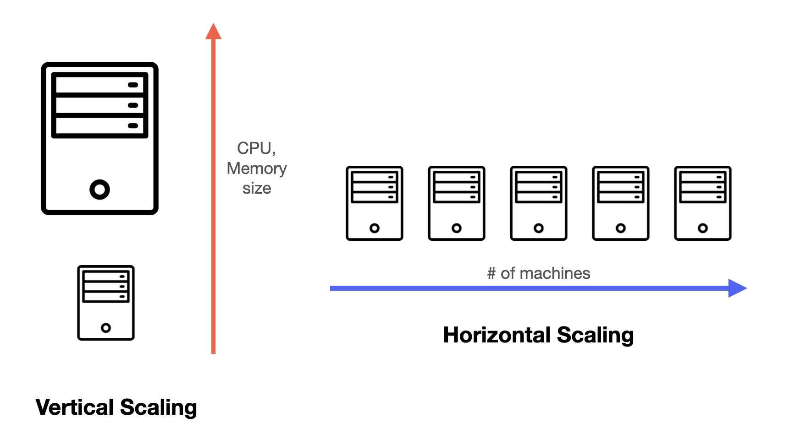
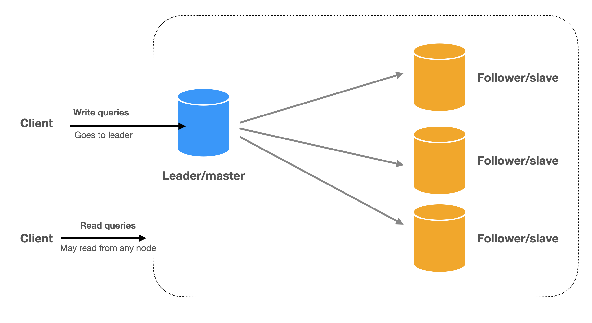
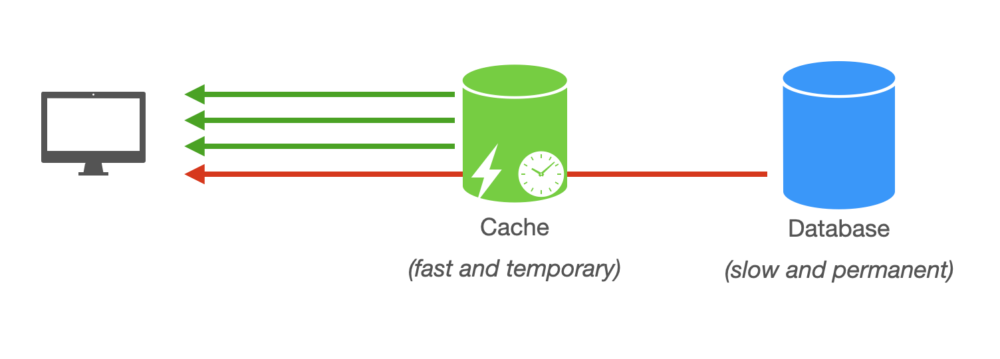
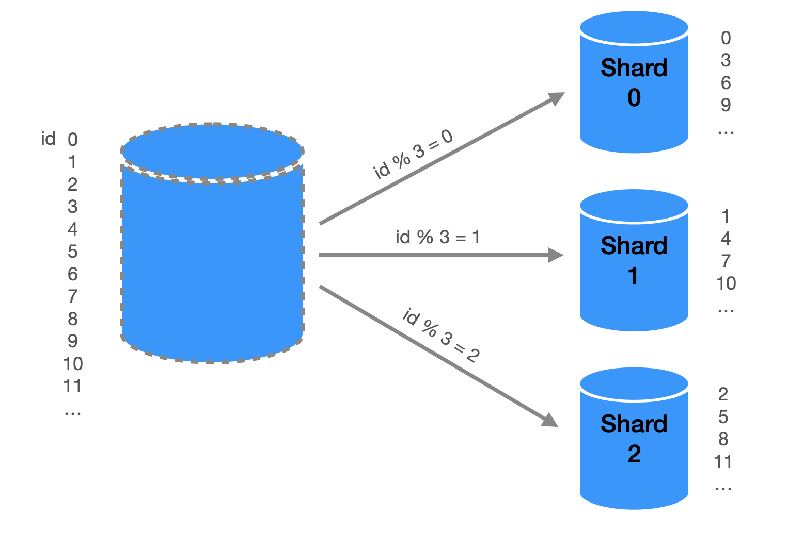
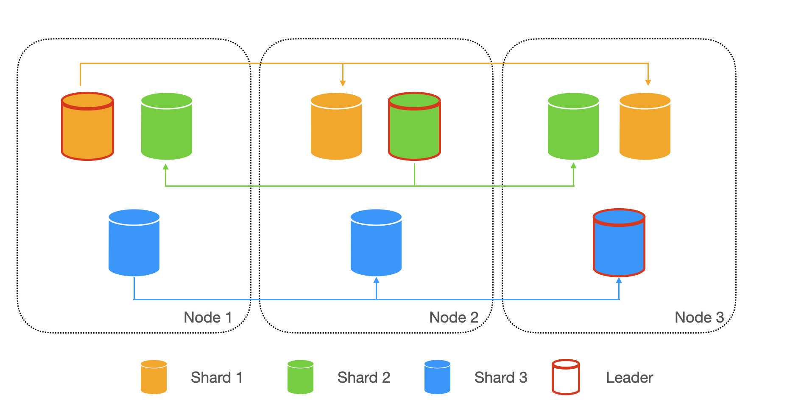

# scaling dbs

## Vertical scaling vs horizontal scaling
Vertical scaling is like upgrading your computer by adding more resources (RAM, CPU, or storage) to handle a heavier workload. This involves adding more resources (such as CPU, memory, or disk space) to a single server to increase its capacity. This is typically the easiest and quickest way to scale a database, but it can be more expensive and there are limitations in the technology available that prevent a single machine from handling a particular workload effectively. Additionally, cloud providers may have limitations based on the hardware configurations they offer. As a result, there is a limit to how much a database can be vertically scaled.

Horizontal scaling, on the other hand, is like connecting multiple computers together to share the workload. This way, you can keep adding more computers as needed, making it more flexible and cost-effective.

Due to the limitations of vertical scaling, you almost always use horizontal scaling in system design.

A quick note on terminology:

When we do horizontal scaling, we connect the computers (also called machines) together, forming a "distributed system." A distributed system is essentially a network of interconnected machines working together to achieve a common goal. In this context, the machines are also called nodes, which are the individual components of the distributed system.

It's important to remember that the terms "machines," and "nodes," can be used interchangeably in future discussions, as they all refer to the same concept: the individual computers within a distributed system.

## Scaling Reads with Replication
We can scale reads with replication, a process that helps manage the increasing number of read requests as an application grows.

Replication is a technique that creates additional copies of the data and allows clients to read from the copies. By distributing data across multiple machines, we can handle a higher volume of read requests, ensuring that the system remains responsive even as demand increases.

The nodes are called replicas. The most common way is to have a leader node that accepts write requests and passes the updates to the followers. This is called single-leader replication (or Primary-replica replication) where all the writes go to one replica and the reads go to followers. This is the simplest and most commonly used database replication method. RDBMS

Write: client writes to the primary and primary asynchronously writes to read replicas.

Read: client can read from any replica.

There is also multi-leader replication and leaderless replication. We will cover them in the Replication section.

Additionally, replication redundancy and availability. Redundancy means having multiple copies of the data, so if one machine goes down, we can redirect its traffic to other machines with minimal disruption to the service. High availability refers to the service's ability to stay operational even if some machines break down. Replication ensures that if one machine fails, the service can still rely on the remaining machines to keep running.

## Scaling Reads with Caching

Caching is another effective technique for scaling reads in a system, focusing on storing frequently accessed data in a faster storage medium for quicker retrieval. The goal is to have the cache handle as many requests as possible and only access the database when the cache does not have the data.

## Scaling Writes with Partitioning (Sharding)
Partitioning is a method of horizontally partitioning a database table, so that the data is spread across multiple servers. By partitioning the data into discrete parts, we can put them on independent machines and store more data by adding more machines. Each partition shares the same schema, though the actual data on each partition is unique to the shard.

The advantage of this is a write request only goes to one partition and the write load is distributed across all the partitions.

A question that immediately comes to mind is how to decide how many partitions to use and which partition a piece of data goes to. 

The field used to partition the data is called the partition key. Since the ultimate goal of partitioning is to distribute write load, we obviously want to distribute the keys as evenly as possible.

Here’s a simple example of taking the MOD of user_id as the hash function to decide on which partition a data entry goes to.

The model we've discussed is quite simple, and there are several important factors to consider when implementing it:

-   Performing range queries: In the basic hash partitioning method, it's challenging to execute queries like "find all records where user_id is between x and y." This might be acceptable for user_ids, but for fields requiring counting and range queries, it poses a problem.
- Hot partitions: Imagine developing a social app where users can post comments on others' profiles. If the comment database is partitioned using user_id as described earlier, a celebrity user receiving many comments could cause an imbalance in traffic. The partition containing the celebrity's data will experience much higher traffic than other partitions, which is undesirable.
- Rebalancing: As the app scales, partitions may eventually fill up. Adding new partitions means the previous hashing function will no longer be sufficient. For instance, if we add a 5th partition, the %4 hash function won't cover the new partition. We could change it to %5, but this would require moving data across all other partitions, as their keys might not hash to the same partition anymore.

These questions and challenges will be addressed in the following section, where we'll delve deeper into partitioning strategies. Hands-on exercises will be provided, giving you the opportunity to practice partitioning data and finding solutions to these issues.

## Relationship Between Partitioning and Replication

Partitioning and replication are often used together to provide fault tolerance. We can make copies of each partition and store them on multiple nodes. This means even though each record exists in only one partition, it may live on multiple nodes. This way each node acts as leader for some partitions and follower for other partitions.

If a node fails or becomes unavailable, the system can continue to operate because the other nodes with replicas of the affected partition can serve the requests. This ensures that the system remains operational even in the face of node failures or other issues.

## Summary
- Sharding: divide into pieces and store separately to scale write
- Replication: make copies to scale read
- Caching: store frequently used data in memory

