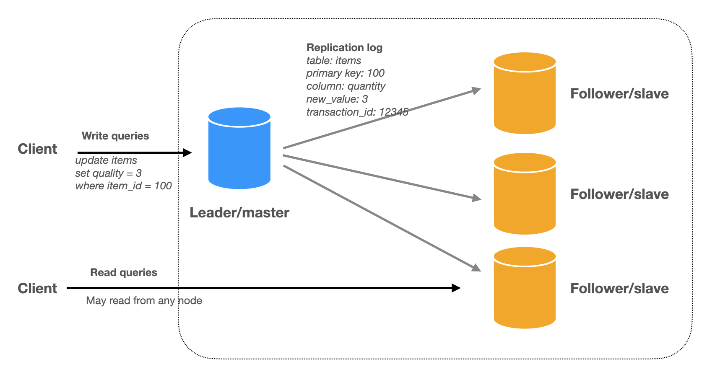
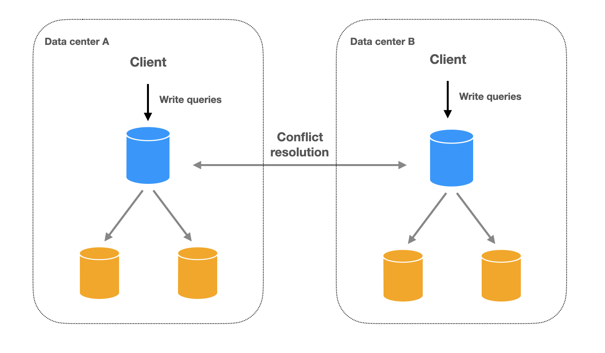
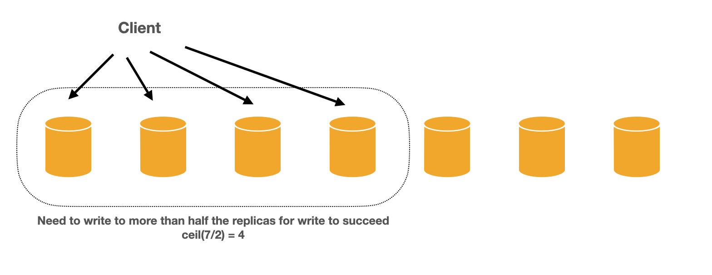
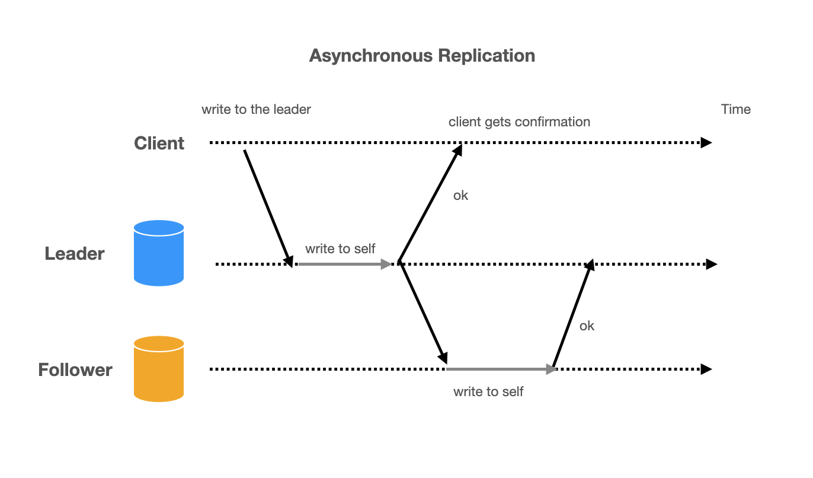
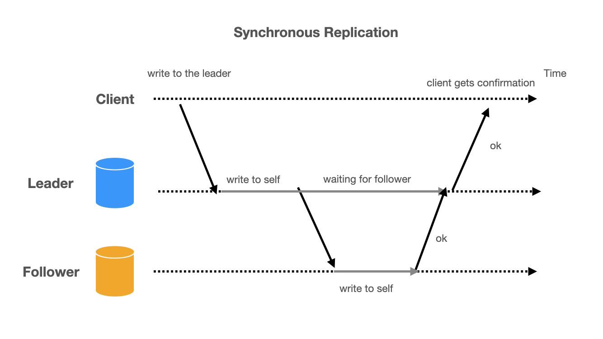

# DB replication

## What is Replication
Make multiple copies of the data and put them on different machines (often called nodes like a node in a graph). Each node that stores a copy of the data is a replica.

### Why Replication
The primary benefit is to scale the system to handle more read requests. Throughput: With multiple replicas, the system can handle more read requests simultaneously. Additionally, it also improves:

- Availability: The system continues to operate even when some replicas are down.
- Latency: By placing replicas close to the user's geographical location, the response time can be reduced.

### Why Replication is Tricky
If the data is immutable, replication is straightforward: simply copy the data and it's done.

The challenge arises when dealing with mutable data, i.e., ensuring that all replicas consistently reflect the same data changes. This requires implementing strategies to synchronize and manage updates across replicas, while maintaining the desired level of consistency, availability, and performance. This may sound abstract, but it'll be very clear once we take a look at how replication algorithms work.

### Replication Algorithms
First let’s clarify the terminology:

Leader = primary

Follower = secondary = replica

#### Single-Leader Replication

In single-leader replication, write operations are directed to a single leader (also known as the primary). The leader processes the write requests and then replicates the changes to its followers (also known as the replicas or secondaries). Read operations can be served by the leader or any of the followers. This approach is the most common replication method used by databases. We will cover the nitty-gritty of single-leader replication later in this article.



#### Multi-Leader Replication
There are multiple leaders, and clients can send requests to any of them. The leaders send data changes to each other and followers.

Multi-leader replication is mainly used in setups with multiple data centers, where each data center has its own leader. Write operations can be performed on any leader, and changes are then propagated to other leaders and their followers. This approach introduces the challenge of handling conflicts that may arise when different leaders accept conflicting updates for the same data. Conflict resolution mechanisms must be put in place to ensure data consistency across all replicas.



#### Leaderless Replication
In leaderless replication, write operations can be directed to any replica, and a quorum is used to decide whether read and write operations succeed. This means that a certain number of replicas must agree on the state of the data before an operation is considered successful. Leaderless replication is a unique approach that is mostly used in Dynamo-style databases like the original Amazon Dynamo from 2007, Apache Cassandra, and Riak.



## Implementing Database Replication: Practical Guide and Failover Strategies

Which replication algorithm does my database use?
Today, virtually all the databases support single-leader replication. This is for good reasons. Having a single source of truth greatly simplifies things and makes conflict resolution much easier.

The main problem with single-leader replication comes when the leader goes down (e.g., machine failure, network partition). This is where we need to elect a new leader among the remaining machines. If there happens to be a network partition and the remaining machines are divided into more than one group, there could be more than one leader elected, causing a “split-brain” situation. This is where things get really tricky. To prevent this, most data systems use consensus algorithms during leadership election. We will cover consensus algorithms in a later section.

Traditionally, Dynamo-style databases such as Amazon Dynamo, Apache Cassandra, and Riak use leaderless replications.

For data systems that span multiple data centers (especially the cloud-native databases), we’d need a multi-leader setup. This is called different names in different cloud providers. For example, “global tables” in AWS, “multi-region” in GCP and “Active geo-replication” in Azure are all examples of multi-leader replication.


### Replication in Practice

If you use a managed cloud database service, the replication and scaling is mostly automatic. For example, Amazon Web Services (AWS) offers Amazon RDS for managed relational databases, which includes features such as automated backups and replication. Similarly, Google Cloud Platform (GCP) offers Cloud SQL for managed MySQL and PostgreSQL databases, which includes automatic replication to multiple zones. This makes it easier for you to focus on your application development and deployment, without having to worry about the underlying infrastructure. However, it is still worth knowing the mechanism behind the scene. We will focus on single-leader replication for the rest of this article.

### Single-leader replication

Leaders and followers

One of the replicas is designated as the leader. All write requests go to the leader, and the leader updates for followers using replication logs.


Read and Write in leader-follower replication

#### Replication logs
Replication logs help us get back any changes made to the database. We will learn about three types of logs: statement-based logs, write-ahead logs, and logical logs.

1. Statement-Based Logs

    Statement-based logs record the exact SQL commands that change the data. Let's look at a MySQL example:
    ```sql
    INSERT INTO students (name, age) VALUES ('John', 15);
    UPDATE students SET age = 16 WHERE name = 'John';
    DELETE FROM students WHERE name = 'John';

    ```
2. Write-Ahead Logs

    Write-ahead logs (WAL) record changes at the byte level which is very low level. This means they store the data in a way that only the storage engine can understand. Because of this, other apps might find it difficult to read.

    In PostgreSQL, they're called "write-ahead logs."
    In MySQL, they’re called “redo logs”.
    Example of a WAL record in PostgreSQL:

    ```log
    rmgr: Heap        len (rec/tot):     24/    24, tx:       5828, lsn: 0/016F4130, prev 0/016F410C, desc: INSERT+INIT off 3, xmax 0 (0/0), xmin 5828 (0/0), cmin 0, cmax 0, blkref #0: rel 1663/16384/1259, blk 0, pos 0
    ```

3. Logical Logs

    Logical logs capture the purpose of the changes made to the data. They show us:

    - For a new row, the log has the new values of all the columns.
    - For a deleted row, the log has enough details to find the deleted row (usually the primary key).
    - For an updated row, the log has enough details to find the updated row, and the new values of all the columns (or at least the new values of the changed columns).

    These logs are independent of the storage engine, which means other applications can read them too.

    Examples of logical logs:

    MySQL’s binlog

    PostgreSQL’s logical decoding

    In contrast, PostgreSQL’s WAL is a physical log. It is faster and more efficient, as it directly records the changes made at the byte level.

    However, logical logs are independent of storage engine so they can be parsed by other applications and therefore is generally preferred to be used in techniques such as Change Data Capture (CDC).

#### Async vs Sync Replication Log in Single Leader Replication

In single leader replication, there are two ways a leader can send replication logs to its followers: asynchronous (async) and synchronous (sync) replication.

##### Asynchronous (Async) Replication:

In async replication, the leader sends the replication log to the followers without waiting for their acknowledgment.

- Pros:

    Faster, as the leader doesn't have to wait for followers to respond before processing new writes.
- Cons:

    If the leader fails before the data is processed by any replica, there's a risk of data loss, which weakens durability.



##### Synchronous (Sync) Replication:

In sync replication, the leader waits for the followers to acknowledge receipt of the replication log before processing new writes.

- Pros:

    All followers will have the same data, ensuring consistency across the replicas.

- Cons:

    If any follower is slow to respond or doesn't respond (due to crashes, network partitions, etc.), the leader must block all new writes and wait for the replica to respond. This can impact write performance, making it impractical to always use sync replication.




### Asynchronous Replication

Most of the time, async is configured for performance.

In MySQL, you can configure replication as either asynchronous (async) or semi-synchronous (semi-sync replication). MySQL does not have fully synchronous replication out-of-the-box, but the semi-synchronous replication provides a middle ground between async and sync replication. By default, MySQL uses asynchronous replication.

To enable semi-synchronous replication, you need to install and enable the corresponding plugins on both the primary and the replicas.

On the primary server, add the following settings to the my.cnf configuration file:
```sql
[mysqld]
# Enable semi-synchronous replication
plugin-load = rpl_semi_sync_master=semisync_master.so
rpl_semi_sync_master_enabled = 1
```
Then, restart the MySQL server to apply the changes.

On the replica servers, add the following settings to the my.cnf configuration file:

```sql
[mysqld]
# Enable semi-synchronous replication
plugin-load = rpl_semi_sync_replica=semisync_replica.so
rpl_semi_sync_replica_enabled = 1

```

Restart the MySQL server on the replica servers to apply the changes.

Now, the primary server will wait for at least one replica to acknowledge that it has received and logged the transaction before considering the transaction as committed. This ensures that there is always at least one replica with the same data as the primary, reducing the risk of data loss in case of primary failure.

Remember that semi-synchronous replication can impact write performance, as the primary has to wait for the acknowledgment from at least one replica. The choice between asynchronous and semi-synchronous replication depends on the specific requirements of your system, such as its tolerance for data loss and the importance of write performance.

### Failover

Nodes can go down, which could be because of hardware failures or just plain system updates.

- Follower goes down

    Remember followers keep change data in their local logs. If one goes down and comes back up, it can simply ask the leader for changes from the point it failed and apply the changes. When it’s all caught up, it can continue to receive data as before.

- Leader goes down

    Things are more problematic when the leader goes down since the leader coordinates the writes. One of the followers needs to be promoted as the new leader and all followers need to start receiving updates from the new leader. This process is called a failover.

Failover

Failovers can be done manually or automatically. Manual failover handling is conceptually simpler since a human makes the decisions. Automatic failover is a little more complex

confirm the leader is dead. this could be unreachable in 30s
elect a new leader. this is a consensus problem.
reconfigure the system to use the new leader
As you would imagine, a whole slew of things can go wrong in this process. For example,

- what if the older leader comes back alive? It still thinks it’s the leader but everyone else knows it is not. It needs to find out that reality somehow.
- If two nodes both believe they are the leader, a “split brain” situation may occur. This is bad because if they both accept writes and sends updates to followers who should the followers believe in? There could be conflicts in the updates.
and many other things

This is where consensus algorithms come in. Consensus algorithms are complex distributed system algorithms to achieve agreement among nodes. We can use consensus algorithms to guarantee data consistency in case of a failover. This is the topic in a future section.


