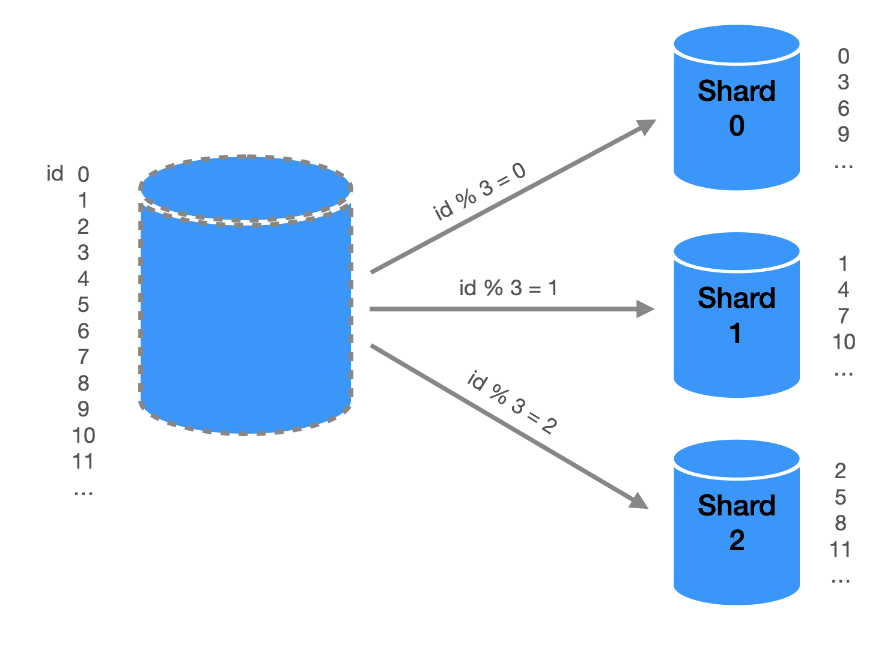
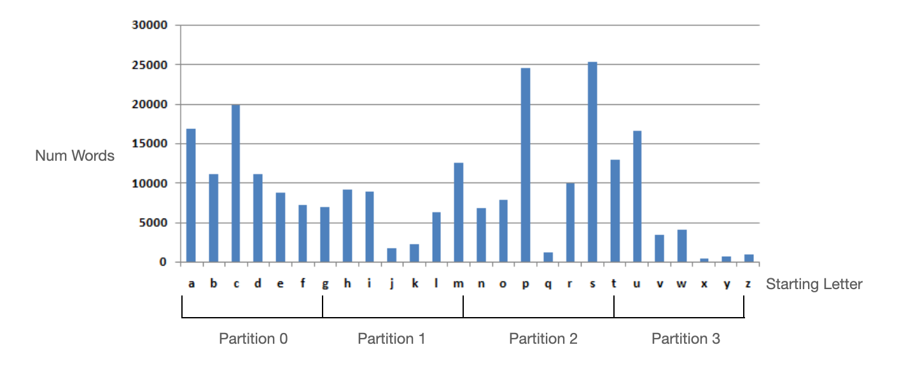
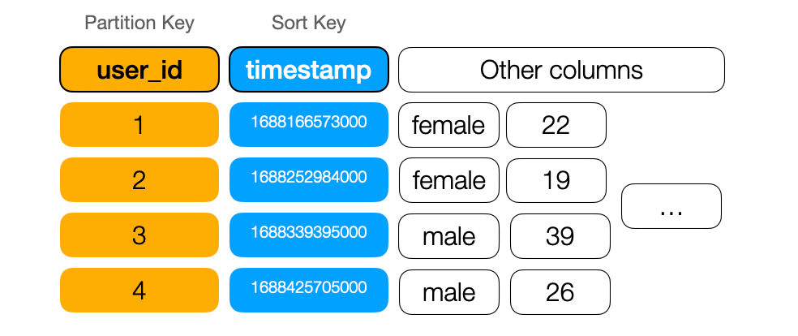

# Partitioning vs Sharding

Before we do anything, let’s clarify the terminology here. Partitioning and sharding mean exactly the same thing. It means breaking the data up into smaller partitions. A partition goes by various names in different databases, as computer scientists often come up with unique terminology. Here's a handy table to help clarify these terms next time you browse through documentation:

### Database Sharding & Partitioning Terminology

Different systems use different names for the same fundamental concept: breaking a large dataset into smaller, manageable "chunks" distributed across nodes.

| Database / System | Term for Partition / Shard |
| :--- | :--- |
| **MongoDB** | Shard |
| **Elasticsearch** | Shard |
| **Apache Cassandra** | Partition / vnode (Virtual Node) |
| **Apache HBase** | Region |
| **Google Cloud Bigtable** | Tablet |
| **Google Cloud Spanner** | Split |
| **Amazon DynamoDB** | Partition |
| **CockroachDB** | Range |
| **Microsoft Azure CosmosDB** | Physical Partition |
| **Redis Cluster** | Hash Slot |
| **Apache Kafka** | Partition |
| **Riak** | vnode |
| **CouchDB** | vBucket |

---

### Understanding the "Logical" vs. "Physical" Unit


In most of these systems, there is a distinction between how you **group** data and where it **lives**:

1. **The Partition Key:** This is the attribute (like `user_id`) used by the system's hashing algorithm to determine which "chunk" a piece of data belongs to.
2. **The Logical Chunk:** (e.g., a **Tablet** in Bigtable or a **Region** in HBase). This is a subset of the data.
3. **The Physical Node:** One physical server (node) can host multiple logical chunks. For example, in **DynamoDB**, a single physical partition might hold many logical partitions.


#### Why terminology matters in interviews:
When discussing **Apache Kafka**, always use the word "Partition." If you use the word "Shard," the interviewer will still understand you, but using the specific domain language shows you have deep, hands-on experience with that specific technology.

## Why Partitioning
Partitioning makes it easier to work with lots of data and use resources more efficiently. Replication mainly helps with reading data because users can read from the closest or least busy copy. On the other hand, partitioning helps with writing data because users can write to different partitions that are hopefully spread out evenly. This way, the workload is shared and the system can handle more tasks.

- Better Performance and Scalability: Reads and writes are distributed across many nodes instead of one.
- Fault Tolerance: In a distributed database, if one server or partition goes down, the other partitions can still continue to operate. This means that the database is more resistant to failures and can recover more easily.

## How Partitioning Works
Partitioning works by dividing data into smaller units called "partitions." Think of partitions as mini-databases that can handle operations independently. This division allows each partition to process data more efficiently, leading to better overall performance.

Partitioning works hand-in-hand with replication, which is the process of making multiple copies of data. Each node (a computer in a network) has a partition's leader and other partitions' followers to increase fault tolerance. Fault tolerance is the ability of a system to continue functioning even when something goes wrong or breaks.

Each partition is stored on a separate server or group of servers. Each partition is self-contained, with its own set of rows and indexes, and is responsible for a subset of the data. Queries and updates are directed to the appropriate partition based on the value of a partition key, which is a column in the table that is used to determine the location of a particular row.



In modern cloud services, partitioning is often built directly into the database itself to enable autoscaling and fault tolerance. Here are some examples of cloud databases that handle partitioning automatically:

Amazon DynamoDB: DynamoDB automatically partitions data based on the partition key. As the amount of data or the workload increases, DynamoDB automatically splits partitions and re-distributes the data across the new partitions to maintain performance and storage efficiency. DynamoDB partitions have a soft limit of 10 GB of data each.

Google Cloud Spanner: Cloud Spanner automatically partitions data across multiple nodes based on the primary key. It also monitors and adjusts the partitioning as the data grows or as the query patterns change, ensuring optimal performance and scalability.

Azure Cosmos DB: Cosmos DB monitors the partition's storage and throughput, and if a partition approaches its maximum throughput or storage capacity (which is 20 GB), Cosmos DB automatically splits the partition into smaller ones to maintain performance

## Partition Strategies
To partition data, you need to decide which row should go to which partition when the data is written. Typically, we pick a key to partition on. There are different methods to achieve this, such as partitioning by key range, by key hash, or using a mixed approach.

### Partition by Key Range
Partitioning by key range is like organizing a dictionary by the first letter of each word. For example, you might have partitions for words starting with A-B, C-D, and so on.

Range partition is supported by most databases. This method is good for easy range queries and keeping adjacent keys next to each other. However, it has a downside called "hot partition," where one partition may be handling more data than others, leading to imbalanced workloads.

Let's consider an illustration where we aim to store all the English words and organize them based on the order of their initial letter. Due to the uneven distribution, there is a possibility of experiencing higher traffic in either Partition 0 or Partition 2.



### Hotspots
The downside of range partitioning is that certain access patterns lead to hot spots. In the example above, if there are an exceptionally high number comments in 2019 then that partition will get disproportionately high traffic while other partitions sit idle. Since the goal is to evenly distribute data, many data systems use hash partition.


### Partition by Key Hash
A good hash function takes skewed data and makes it uniformly distributed. Even if the input strings are similar, the hash outputs are evenly distributed.

Partitioning by key hash uses a mathematical function called a hash function (like md5) to convert the key into a unique value. Each node then handles a range of these hash values.

Let's take a look at a real example. We will use the 5 characters of the MD5 hash as partition keys. We will have a total of 3 partitions:

Partition A: 00000-55555

Partition B: 55556-aaaaa

Partition C: aaaaa-fffff


### Distributed Partition Assignment via Hashing

| Timestamp | Full MD5 Hash | First 5 Characters | Assigned Partition |
| :--- | :--- | :--- | :--- |
| 2023-04-21 12:34:54 | d0f9c6a4d6af4e4b1a9a94f6d8a42040 | d0f9c | Partition C |
| 2023-04-21 12:34:55 | c3df39f881ebda67e8d6e1b6a2b78764 | c3df3 | Partition C |
| 2023-04-21 12:34:56 | 87b65c3e5e5d5ce5f5a5f5c95b082a8b | 87b65 | Partition B |
| 2023-04-21 12:34:57 | 2f2a97a51d0f50a6d8956f8126696cb1 | 2f2a9 | Partition A |
| 2023-04-21 12:34:58 | 6a64c0af0a8e011dfb17f70b7a26c8e2 | 6a64c | Partition B |
| 2023-04-21 12:34:59 | 37b5d2a6e619db6d39e6af71cdd963f7 | 37b5d | Partition A |

---

### Why we use Hashing for Partitions


1. **Uniform Distribution:** Even if timestamps are very close together (sequential), the resulting MD5 hashes are wildly different (the "Avalanche Effect"). This ensures data is spread evenly across Partition A, B, and C.
2. **Deterministic Routing:** If you hash the same timestamp again, you will always get the same hash and the same partition. This allows the system to find the data without a central index.
3. **Avoiding Hotspots:** Without hashing, sequential data (like logs) would overwhelm one single partition while others sit idle.


### How it works in System Design
In a real-world system like **Apache Kafka** or **Cassandra**, the "First 5 Characters" would be converted from Hexadecimal to an integer and then a modulo operation is applied:
`Partition = Integer(Hash_Prefix) % Total_Partitions`

Hash partitioning is available for most databases. The downside of this method is that it doesn't allow for easy range queries, as adjacent keys may not be next to each other.

## Mixed Approach (composite primary key)

A mixed approach to partitioning uses a "compound key," or “composite primary key” which is a combination of multiple columns. The first column is hashed to determine the hash partition, and the other keys are concatenated and used as an index for sorting the data.

Databases like Cassandra, DynamoDB, Google Cloud Spanner use this method. This approach is particularly useful for one-to-many relationships, such as a social media user posting (user_id, timestamp). The user_id is used as the hash key, and the timestamp is used as the range key. This ensures that all of a user's data is stored in one partition and sorted by timestamp.




When you create a new table in DynamoDb, you will be asked to provide a partition key which is the hash partition key we discussed earlier. You may optionally check the box to provide a sort key. If you do, you’d use a composite primary key

## Skewed loads
Besides the obvious hotspot issue from range partitioning, a database may experience a skewed workload due to certain users or entities generating a disproportionate amount of data. For example, in a social media platform, a celebrity with millions of followers may generate a significant amount of user-generated content, such as comments or likes, causing an uneven workload on the database.

A common solution to this problem is to add a random number to the key so that the load is distributed to multiple partitions. For detailed example, check out DynamoDb’s invoice example.

The downside of this method is that now reading a specific item is more work since we need to keep track of the random number attached to the keys. For the majority of the use cases, this is unnecessary overhead. We mention it here just so that you'd know it if an interviewer asks.


## How to pick a partitioning key?
This is a popular interview question. Again, the principle of system design is to design the system according to access patterns. In general, the factors you should consider when picking a shard key are:

- Access Patterns: Understand how your application accesses data. For example, for a ticketing system, access patterns might include looking up events by location, date, or event type. The shard key should facilitate these queries to be efficient.

- Write Distribution: The shard key should distribute write operations evenly across shards to prevent hotspots. Uneven distribution can lead to some shards being overloaded while others are underutilized.

- Query Isolation: Ideally, most queries should be able to be satisfied by accessing a single shard rather than requiring cross-shard queries, which are more complex and less performant.

- Data Growth: Choose a shard key that allows for balanced data growth over time. Consider how new data will be distributed across shards as the system scales.

Additionally, we want to pick keys that

- Has high cardinality: The column used as a partition key should have a large number of distinct values. This helps to ensure that the data is evenly distributed across partitions. For example, unique ids like user_id, order_id.
- Use composite keys to match access patterns. For example, in the user comments example, imagine we are designing a video platform comments system and the access pattern is to load comments for each video by chronological order. We could use a composite key like (video_id, timestamp).
- Add random number for write-heavy use cases as described in the skewed loads paragraph above if necessary.


### Partition other data storage technologies
Databases are not the only thing we can partition. The same concept can be applied to message queues, cache, streaming services. Although platform specific, Azure Data Partitioning Strategies offers a comprehensive strategy guide on how to partition many data storage technologies including SQL database, blob storage, message queue, NoSQL database an cache etc.


## Partition example

```sql
CREATE TABLE comments
  (
   comment_id INT NOT NULL,
   page_id INT NOT NULL,
   user_id INT NOT NULL,
   content TEXT NOT NULL,
   created_time DATETIME NOT NULL
  )
 PARTITION BY RANGE (year(created_time))
  (
   PARTITION pold VALUES LESS THAN (2019),
   PARTITION p19 VALUES LESS THAN (2020),
   PARTITION p20 VALUES LESS THAN (2021),
   PARTITION p21 VALUES LESS THAN (2022),
   PARTITION p22 VALUES LESS THAN (2023)
  );
  
  
INSERT INTO `comments` (
  `comment_id`, `page_id`, `user_id`, 
  `content`, `created_time`
) 
VALUES 
  (
    '1', '1', '1',
    'The Times 03/Jan/2009 Chancellor on brink of second bailout for banks', 
    '2009-01-03 18:15:05'
  ), 
  (
    '2', '2', '2',
    'Hello algo.monster', 
    '2021-10-11 18:45:02'
  )
;


SELECT * FROM comments;

SELECT * FROM comments PARTITION (pold);

SELECT * FROM comments PARTITION (p21);
```

The first query should print both comments. The second query shows the comment from 2009, and the third query shows the comment from 2021.


### SQL Fiddle Query Results

**Context:** The database is partitioned by year. Querying a specific partition acts as a filter that only looks at the "slice" of data stored in that specific physical location.

---

#### 1. Full Table Scan
**Query:** `SELECT * FROM comments;`
**Description:** Fetches every row from every partition in the table.

| comment_id | page_id | user_id | content | created_time |
| :--- | :--- | :--- | :--- | :--- |
| 1 | 1 | 1 | The Times 03/Jan/2009 Chancellor on brink of second bailout for banks | 2009-01-03 18:15:05 |
| 2 | 2 | 2 | Hello algo.monster | 2021-10-11 18:45:02 |

---

#### 2. Historic Partition Scan (`pold`)
**Query:** `SELECT * FROM comments PARTITION (pold);`
**Description:** Only looks at the partition containing data where `YEAR(created_time) < 2019`.

| comment_id | page_id | user_id | content | created_time |
| :--- | :--- | :--- | :--- | :--- |
| 1 | 1 | 1 | The Times 03/Jan/2009 Chancellor on brink of second bailout for banks | 2009-01-03 18:15:05 |

---

#### 3. Recent Partition Scan (`p21`)
**Query:** `SELECT * FROM comments PARTITION (p21);`
**Description:** Only looks at the partition containing data where `YEAR(created_time)` is 2021.

| comment_id | page_id | user_id | content | created_time |
| :--- | :--- | :--- | :--- | :--- |
| 2 | 2 | 2 | Hello algo.monster | 2021-10-11 18:45:02 |

---

### Key Takeaway for System Design


In this result set, notice that **Query 2** and **Query 3** return different data despite using the same table. This proves that the data is physically separated. In a high-traffic system (like a log aggregator), this allows you to search through billions of rows in milliseconds because the database engine skips (prunes) the partitions that don't match your time range.


