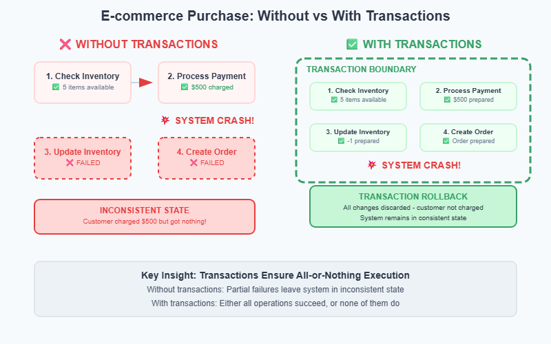
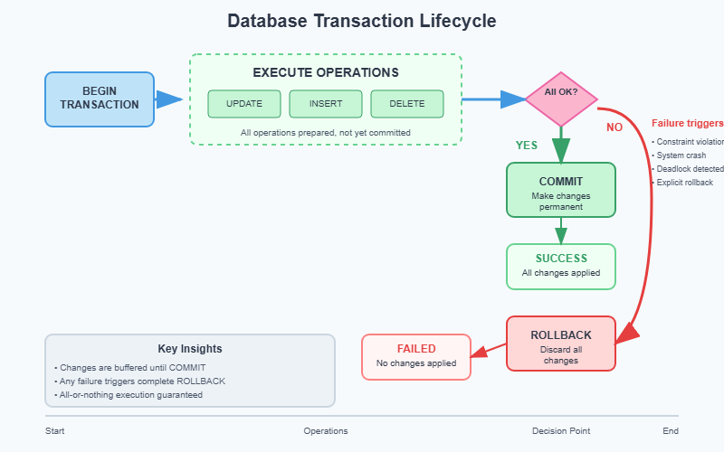
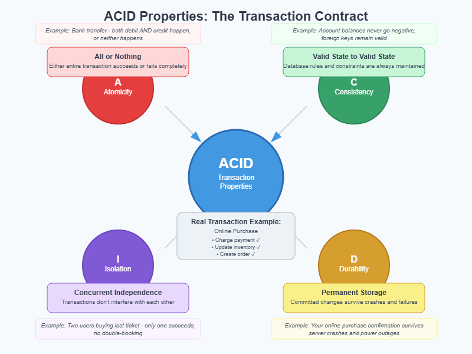

# Database Transactions


When you buy concert tickets online, what happens if the payment succeeds but the ticket reservation fails? Or when transferring money between bank accounts, what prevents your account from being debited without the recipient's account being credited? These scenarios require database transactions, the foundation of data consistency.

Consider this

```py
# Dangerous: No transaction protection
def purchase_item(user_id, item_id, quantity):
    # Step 1: Check inventory
    available = get_inventory_count(item_id)
    if available < quantity:
        return "Out of stock"

    # Step 2: Charge payment
    payment_result = charge_credit_card(user_id, item_price * quantity)
    if not payment_result.success:
        return "Payment failed"

    # Step 3: Reduce inventory
    reduce_inventory(item_id, quantity)

    # Step 4: Create order record
    create_order(user_id, item_id, quantity)

    return "Purchase successful"
```

## What could go wrong?

This code has four separate database operations that must all succeed together. But since they're not wrapped in a transaction, failures can occur between any steps:

- Payment succeeds, but inventory reduction fails → If reduce_inventory() throws an exception or the database connection drops after step 2, the customer gets charged but keeps their money AND the item remains in stock for others to buy.

- Inventory reduced, but order creation fails → If create_order() fails after step 3, the inventory count decreases but there's no record of who bought it or how to fulfill the order. The item is effectively lost.

- Two customers buying the last item simultaneously → Customer A and B both execute step 1 at the same time, both see available = 1, both proceed through payment, both reduce inventory. Final result: -1 items in stock, but both customers expect to receive the item.

- System crashes between steps → If the server crashes after payment but before inventory update, the customer is charged but the item remains available. After restart, there's no way to know which payments need to complete their purchase flow.

#### The core problem: Multi-step operations need all-or-nothing execution to maintain data integrity.



## What Are Database Transactions?
A database transaction is a sequence of operations that are executed as a single, atomic unit. Either all operations succeed, or none of them do.

Key insight: Transactions solve the coordination problem when multiple related changes must happen together consistently.

## Transactions vs Individual Queries
Individual Query (single operation):
```sql
UPDATE accounts SET balance = balance - 100 WHERE account_id = 'alice';
```
Transaction (multiple related operations):
```sql
BEGIN TRANSACTION;
    UPDATE accounts SET balance = balance - 100 WHERE account_id = 'alice';
    UPDATE accounts SET balance = balance + 100 WHERE account_id = 'bob';
    INSERT INTO transfers (from_account, to_account, amount) VALUES ('alice', 'bob', 100);
COMMIT;
```

The transaction ensures that Alice's debit, Bob's credit, and the transfer record all succeed together, or none of them happen.





```py
import random

class BankAccount:
    def __init__(self, account_id, initial_balance):
        self.account_id = account_id
        self.balance = initial_balance
        self.transaction_log = []

    def get_balance(self):
        return self.balance

    def add_transaction(self, description, amount):
        self.transaction_log.append(f"{description}: ${amount}")

class TransactionDemo:
    def __init__(self):
        self.accounts = {}
        self.transaction_active = False
        self.pending_changes = []

    def create_account(self, account_id, initial_balance):
        self.accounts[account_id] = BankAccount(account_id, initial_balance)
        print(f"Created account {account_id} with balance: ${initial_balance}")

    def begin_transaction(self):
        if self.transaction_active:
            raise Exception("Transaction already in progress")
        self.transaction_active = True
        self.pending_changes = []
        print("\n=== TRANSACTION STARTED ===")

    def debit_account(self, account_id, amount):
        if not self.transaction_active:
            raise Exception("No active transaction")

        account = self.accounts[account_id]
        if account.balance < amount:
            raise Exception(f"Insufficient funds in account {account_id}")

        # Store pending change (don't apply yet)
        self.pending_changes.append(('debit', account_id, amount))
        print(f"  Pending: Debit ${amount} from {account_id}")

    def credit_account(self, account_id, amount):
        if not self.transaction_active:
            raise Exception("No active transaction")

        # Store pending change
        self.pending_changes.append(('credit', account_id, amount))
        print(f"  Pending: Credit ${amount} to {account_id}")

    def simulate_failure(self, failure_chance=0.3):
        """Simulate system failure during transaction"""
        if random.random() < failure_chance:
            raise Exception("System failure occurred!")

    def commit_transaction(self):
        if not self.transaction_active:
            raise Exception("No active transaction")

        try:
            # Simulate potential failure point
            self.simulate_failure()

            # Apply all changes atomically
            for operation, account_id, amount in self.pending_changes:
                account = self.accounts[account_id]
                if operation == 'debit':
                    account.balance -= amount
                    account.add_transaction("Debit", -amount)
                elif operation == 'credit':
                    account.balance += amount
                    account.add_transaction("Credit", +amount)

            print("  All changes applied successfully")
            print("=== TRANSACTION COMMITTED ===")

        except Exception as e:
            print(f"  Transaction failed: {e}")
            print("=== TRANSACTION ROLLED BACK ===")
            print("  All pending changes discarded")
            raise
        finally:
            self.transaction_active = False
            self.pending_changes = []

    def show_balances(self):
        print("\nCurrent Account Balances:")
        for account_id, account in self.accounts.items():
            print(f"  {account_id}: ${account.balance}")

def demo_atomicity():
    """Demonstrate atomicity with successful and failed transactions"""
    print("=== Database Transaction Atomicity Demo ===")
    bank = TransactionDemo()

    # Setup accounts
    bank.create_account("alice", 500)
    bank.create_account("bob", 200)
    bank.show_balances()

    print("\n" + "="*50)
    print("SCENARIO 1: Successful Transfer")
    print("="*50)

    try:
        bank.begin_transaction()
        bank.debit_account("alice", 100)
        bank.credit_account("bob", 100)
        bank.commit_transaction()
        bank.show_balances()

    except Exception as e:
        print(f"Transfer failed: {e}")
        bank.show_balances()

    print("\n" + "="*50)
    print("SCENARIO 2: Failed Transfer (Insufficient Funds)")
    print("="*50)

    try:
        bank.begin_transaction()
        bank.debit_account("alice", 1000)  # Alice only has $400 now
        bank.credit_account("bob", 1000)
        bank.commit_transaction()

    except Exception as e:
        print(f"Transfer failed: {e}")
        bank.show_balances()  # Balances unchanged due to rollback

    print("\n" + "="*50)
    print("SCENARIO 3: System Failure During Transaction")
    print("="*50)

    # Run multiple attempts to show random failures
    for attempt in range(3):
        print(f"\nAttempt {attempt + 1}:")
        try:
            bank.begin_transaction()
            bank.debit_account("alice", 50)
            bank.credit_account("bob", 50)
            bank.commit_transaction()
            bank.show_balances()
            break  # Success

        except Exception as e:
            print(f"Transfer failed: {e}")
            bank.show_balances()  # Balances unchanged

    print("\nKey Insight: Notice how failed transactions never leave")
    print("accounts in an inconsistent state - either the transfer")
    print("completes entirely, or nothing changes at all!")

# Execute the demonstration
if __name__ == "__main__":
    demo_atomicity()

```
### Output

```text
=== Database Transaction Atomicity Demo ===
Created account alice with balance: $500
Created account bob with balance: $200

Current Account Balances:
  alice: $500
  bob: $200

==================================================
SCENARIO 1: Successful Transfer
==================================================

=== TRANSACTION STARTED ===
  Pending: Debit $100 from alice
  Pending: Credit $100 to bob
  All changes applied successfully
=== TRANSACTION COMMITTED ===

Current Account Balances:
  alice: $400
  bob: $300

==================================================
SCENARIO 2: Failed Transfer (Insufficient Funds)
==================================================

=== TRANSACTION STARTED ===
Transfer failed: Insufficient funds in account alice

Current Account Balances:
  alice: $400
  bob: $300

==================================================
SCENARIO 3: System Failure During Transaction
==================================================

Attempt 1:
Transfer failed: Transaction already in progress

Current Account Balances:
  alice: $400
  bob: $300

Attempt 2:
Transfer failed: Transaction already in progress

Current Account Balances:
  alice: $400
  bob: $300

Attempt 3:
Transfer failed: Transaction already in progress

Current Account Balances:
  alice: $400
  bob: $300

Key Insight: Notice how failed transactions never leave
accounts in an inconsistent state - either the transfer
completes entirely, or nothing changes at all!
```

## Consistency: Valid State to Valid State
Definition: Transactions move the database from one valid state to another, preserving all defined rules and constraints.

Key insight: Consistency prevents business rule violations, like negative account balances or booking more seats than exist.

Examples of consistency rules:

- Bank account balances cannot go negative
- Concert venues cannot sell more tickets than seats available
- User emails must be unique
- Foreign key relationships must remain valid

## Isolation: Concurrent Transactions Don't Interfere
Definition: Concurrent transactions execute as if they were running one after another, even when running simultaneously.

The problem without isolation:
```text
# Two users buying the last concert ticket simultaneously
User A: checks availability → sees 1 ticket available
User B: checks availability → sees 1 ticket available
User A: purchases ticket → inventory becomes 0
User B: purchases ticket → inventory becomes -1 (overbooking!)
```
With proper isolation:
```text
# Database ensures only one purchase succeeds
User A: BEGIN TRANSACTION → checks availability → purchases ticket → COMMIT
User B: BEGIN TRANSACTION → waits for User A → checks availability → sees 0 tickets → fails
```

The classic race condition scenario: What happens when multiple users try to buy the last few tickets simultaneously?

Without proper isolation:

```sql
# Both users see 2 tickets available
User A: SELECT available_tickets FROM events WHERE id = 'concert123';  # Returns 2
User B: SELECT available_tickets FROM events WHERE id = 'concert123';  # Returns 2

# Both users proceed to buy 2 tickets each
User A: UPDATE events SET available_tickets = 0 WHERE id = 'concert123';  # 2 -> 0
User B: UPDATE events SET available_tickets = -2 WHERE id = 'concert123'; # 0 -> -2

# Result: 4 tickets sold for 2 available seats!
```
With proper transaction isolation:
```sql

-- User A's transaction
BEGIN TRANSACTION;
SELECT available_tickets FROM events WHERE id = 'concert123' FOR UPDATE;  -- Locks row
-- User B must wait here
UPDATE events SET available_tickets = available_tickets - 2 WHERE id = 'concert123';
COMMIT;  -- Lock released

-- User B's transaction (runs after A completes)
BEGIN TRANSACTION;
SELECT available_tickets FROM events WHERE id = 'concert123' FOR UPDATE;  -- Returns 0
-- Sees no tickets available, purchase fails safely
ROLLBACK;
```

## Durability: Committed Changes Are Permanent
Definition: Once a transaction commits, the changes survive system crashes, power failures, and other failures.

How databases achieve durability:

- Write-Ahead Logging (WAL): Changes are logged to disk before being applied
- Checkpoints: Periodic saves of the entire database state
- Replication: Changes are copied to multiple database servers
- Real-world importance: After you submit your tax return online, the data must survive even if the server crashes immediately after confirmation.


## System Design Interview Tips

Transaction-Related Questions

"How would you handle race conditions in ticket booking?"

- Explain pessimistic locking with SELECT FOR UPDATE
- Discuss optimistic locking with version numbers
- Consider queue-based approaches for high concurrency

"How do you ensure payment consistency in an e-commerce system?"

- Describe the transaction boundary around payment + inventory
- Explain compensation patterns for distributed systems
- Discuss event sourcing for complex financial operations

"What happens if a database crashes mid-transaction?"

- Explain Write-Ahead Logging (WAL) for durability
- Describe transaction recovery on restart
- Discuss the role of checkpoints and replication

### Common Mistakes to Avoid
- Making transactions too long → Leads to deadlocks and poor performance
- Not handling deadlocks → Application crashes instead of graceful retry
- Wrong isolation level → Either poor performance or race conditions
- Ignoring distributed transactions → Inconsistency across microservices
- Not considering compensation → Can't handle failures in distributed systems


