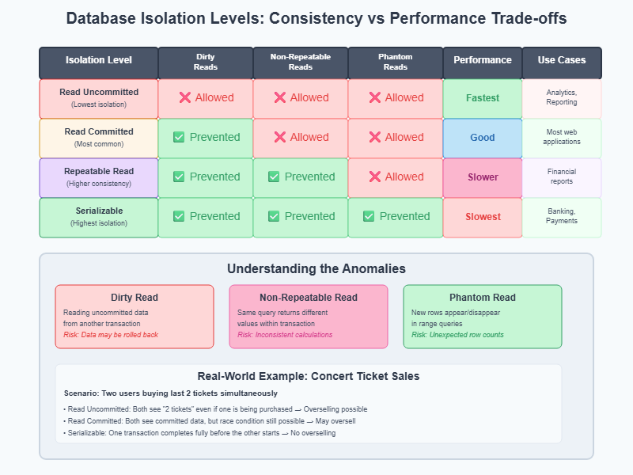

# Database Isolation Levels


When multiple transactions run simultaneously, they can interfere with each other in unexpected ways. Imagine two users trying to buy the last concert ticket, or your bank balance being read while a transfer is in progress. Database isolation levels control how transactions interact with each other, balancing data consistency against system performance.

Understanding isolation levels is useful for system design interviews involving concurrent systems like Design TicketMaster, Design E-commerce Store, and any application where multiple users access shared data.


```py
# Two users buying the last item simultaneously
User A: reads inventory = 1 item available
User B: reads inventory = 1 item available  # Same time as User A
User A: updates inventory = 0 (purchases item)
User B: updates inventory = 0 (also purchases item)
# Result: Both users bought the "last" item - oversold!
```
The core problem: When transactions run concurrently, they can see inconsistent data states, leading to business logic violations and data corruption.



## The Four Isolation Levels
The SQL standard defines four isolation levels, each preventing different combinations of read phenomena:

### Read Uncommitted (Lowest Isolation)
What it prevents: Nothing

What it allows: Dirty reads, non-repeatable reads, phantom reads

Trade-offs:

✅ Advantages:
- Highest performance (minimal locking)
- Best for high-throughput scenarios

❌ Disadvantages:
- Can see uncommitted changes from other transactions
- Risk of reading data that gets rolled back
- Unpredictable results in business logic

When to use: Analytics systems where approximate data is acceptable, logging systems where performance matters more than perfect consistency.

### Read Committed (Most Common Default)
What it prevents: Dirty reads

What it allows: Non-repeatable reads, phantom reads

Trade-offs:

✅ Advantages:
- Good balance of consistency and performance
- Never see uncommitted data
- Default in most databases (PostgreSQL, Oracle, SQL Server)

❌ Disadvantages:
- Same query can return different results within a transaction
- Not suitable for complex calculations requiring stable data

When to use: Most web applications, e-commerce systems, general OLTP workloads. This is the recommended starting point for most systems.


### Repeatable Read

What it prevents: Dirty reads, non-repeatable reads

What it allows: Phantom reads

Trade-offs:

✅ Advantages:
- Stable reads within a transaction
- Good for reports and calculations
- Default in MySQL InnoDB

❌ Disadvantages:
- New rows can still appear/disappear (phantoms)
- Higher locking overhead than Read Committed

When to use: Financial reporting, batch processing, scenarios where you need consistent reads but can tolerate new rows appearing.

### Serializable (Highest Isolation)
What it prevents: Dirty reads, non-repeatable reads, phantom reads

What it allows: Nothing (complete isolation)

Trade-offs:

✅ Advantages:
- Complete consistency guarantee
- Transactions appear to run sequentially
- No concurrency anomalies possible

❌ Disadvantages:
- Potential for significant performance impact
- Higher chance of deadlocks and lock timeouts
- May serialize transactions that could safely run concurrently

When to use: Financial systems, inventory management with strict accuracy requirements, systems where data integrity is more important than performance.

## Performance Considerations
While specific performance numbers vary by database and workload, the general pattern is:

- Read Uncommitted: Fastest (no read locks)
- Read Committed: Good performance (default for most systems)
- Repeatable Read: Moderate performance impact
- Serializable: Potential significant performance impact

```py

import time

class DatabaseSimulator:
    def __init__(self):
        self.data = {"account_balance": 1000}
        self.transaction_log = []

    def log_event(self, transaction, event):
        self.transaction_log.append(f"{transaction}: {event}")
        print(f"{transaction}: {event}")

    def reset(self):
        self.data = {"account_balance": 1000}
        self.transaction_log = []

def demo_read_uncommitted():
    """Demo showing dirty reads are possible"""
    print("\n=== READ UNCOMMITTED ISOLATION DEMO ===")
    db = DatabaseSimulator()

    # Simulate timeline of events
    print("Timeline simulation:")
    print("T1: Reader transaction begins")
    print("T2: Writer transaction begins")
    print("T3: Writer updates balance (UNCOMMITTED)")
    print("T4: Reader reads balance (sees dirty data!)")
    print("T5: Writer ROLLBACK (update never happened)")
    print("T6: Reader reads again (now sees original value)")
    print()

    # Step-by-step execution
    db.log_event("Reader", "BEGIN TRANSACTION")
    db.log_event("Writer", "BEGIN TRANSACTION")

    # Writer makes uncommitted change
    original_balance = db.data["account_balance"]
    db.data["account_balance"] = original_balance - 500
    db.log_event("Writer", f"Updated balance to ${db.data['account_balance']} (UNCOMMITTED)")

    # Reader sees dirty data (in Read Uncommitted this would be allowed)
    balance = db.data["account_balance"]
    db.log_event("Reader", f"Read balance: ${balance} (DIRTY READ!)")

    # Writer rollback
    db.data["account_balance"] = original_balance
    db.log_event("Writer", f"ROLLBACK - balance restored to ${db.data['account_balance']}")

    # Reader reads again
    balance = db.data["account_balance"]
    db.log_event("Reader", f"Read balance again: ${balance} (original value)")
    db.log_event("Reader", "COMMIT")

    print("\n❌ Problem: Reader saw $500 balance that never actually existed!")

def demo_read_committed():
    """Demo showing dirty reads are prevented"""
    print("\n=== READ COMMITTED ISOLATION DEMO ===")
    db = DatabaseSimulator()

    print("Timeline simulation:")
    print("T1: Reader transaction begins")
    print("T2: Writer transaction begins")
    print("T3: Reader reads balance (only sees committed data)")
    print("T4: Writer updates and COMMITS")
    print("T5: Reader reads again (now sees new committed value)")
    print()

    db.log_event("Reader", "BEGIN TRANSACTION")
    db.log_event("Writer", "BEGIN TRANSACTION")

    # In Read Committed, reader only sees committed data
    balance = db.data["account_balance"]
    db.log_event("Reader", f"Read balance: ${balance} (only committed data)")

    # Writer commits change
    original_balance = db.data["account_balance"]
    db.data["account_balance"] = original_balance + 200
    db.log_event("Writer", f"COMMIT - balance updated to ${db.data['account_balance']}")

    # Reader sees new committed value
    balance = db.data["account_balance"]
    db.log_event("Reader", f"Read balance again: ${balance} (sees new committed value)")
    db.log_event("Reader", "COMMIT")

    print("\n✅ Safe: Reader never saw uncommitted data")

def demo_repeatable_read():
    """Demo showing repeatable reads within transaction"""
    print("\n=== REPEATABLE READ ISOLATION DEMO ===")
    db = DatabaseSimulator()

    print("Timeline simulation:")
    print("T1: Reader transaction begins, reads balance")
    print("T2: Writer updates and commits")
    print("T3: Reader reads same data again (same value guaranteed)")
    print()

    db.log_event("Reader", "BEGIN TRANSACTION")

    # Reader's first read
    balance = db.data["account_balance"]
    db.log_event("Reader", f"First read: ${balance}")

    # Writer commits change (but reader won't see it in Repeatable Read)
    db.log_event("Writer", "BEGIN TRANSACTION")
    original_balance = db.data["account_balance"]
    db.data["account_balance"] = original_balance + 300
    db.log_event("Writer", f"COMMIT - balance updated to ${db.data['account_balance']}")

    # In Repeatable Read, reader would still see original value
    db.log_event("Reader", f"Second read: ${original_balance} (same as first read)")
    db.log_event("Reader", "COMMIT")

    print("\n✅ Guaranteed: Same query returns same result within transaction")

def demo_serializable():
    """Demo showing complete isolation"""
    print("\n=== SERIALIZABLE ISOLATION DEMO ===")
    db = DatabaseSimulator()

    print("Timeline simulation:")
    print("T1: Reader transaction begins and completes")
    print("T2: Writer transaction waits, then executes")
    print("(Transactions appear to run one after another)")
    print()

    # Reader transaction runs completely first
    db.log_event("Reader", "BEGIN TRANSACTION")
    balance = db.data["account_balance"]
    db.log_event("Reader", f"Read balance: ${balance}")
    db.log_event("Reader", f"Read balance again: ${balance} (guaranteed same)")
    db.log_event("Reader", "COMMIT")

    # Writer transaction runs after reader completes
    db.log_event("Writer", "BEGIN TRANSACTION (waited for reader)")
    original_balance = db.data["account_balance"]
    db.data["account_balance"] = original_balance + 300
    db.log_event("Writer", f"COMMIT - balance updated to ${db.data['account_balance']}")

    print("\n✅ Perfect isolation: Transactions appear sequential")

def demo_phantom_reads():
    """Demo showing phantom read phenomenon"""
    print("\n=== PHANTOM READS DEMO ===")

    print("Scenario: Counting available concert seats")
    print("Timeline simulation:")
    print("T1: Counter reads: 'SELECT COUNT(*) FROM seats WHERE available = true' → 100")
    print("T2: Booking system: 'INSERT INTO bookings...; UPDATE seats...' → commits")
    print("T3: Counter reads same query again → 99 (phantom row disappeared)")
    print()

    seats_available = 100
    print(f"Counter: First count query → {seats_available} seats available")

    # Another transaction books a seat
    seats_available -= 1
    print(f"Booking: Seat booked and committed")

    print(f"Counter: Second count query → {seats_available} seats available")
    print("\n❌ Problem: Same query returned different row count (phantom read)")

def demo_all_isolation_levels():
    """Run demonstrations of different isolation levels"""
    print("=== Database Isolation Levels Interactive Demo ===")
    print("This demo shows how different isolation levels handle concurrent transactions")

    # Demo each isolation level
    demo_read_uncommitted()
    demo_read_committed()
    demo_repeatable_read()
    demo_serializable()
    demo_phantom_reads()

    print("\n" + "="*60)
    print("=== ISOLATION LEVELS SUMMARY ===")
    print()
    print("Read Uncommitted:")
    print("  ❌ Allows: Dirty reads, non-repeatable reads, phantom reads")
    print("  ✅ Performance: Fastest (no locking)")
    print()
    print("Read Committed:")
    print("  ✅ Prevents: Dirty reads")
    print("  ❌ Allows: Non-repeatable reads, phantom reads")
    print("  ✅ Performance: Good (most common default)")
    print()
    print("Repeatable Read:")
    print("  ✅ Prevents: Dirty reads, non-repeatable reads")
    print("  ❌ Allows: Phantom reads")
    print("  ⚠️  Performance: Moderate impact")
    print()
    print("Serializable:")
    print("  ✅ Prevents: All read phenomena")
    print("  ❌ Performance: Potential significant impact")
    print("  ✅ Consistency: Perfect isolation")

    print("\n=== Key Decision Factors ===")
    print("• E-commerce browsing → Read Committed")
    print("• Financial transfers → Serializable")
    print("• Analytics dashboards → Read Uncommitted")
    print("• Audit reports → Repeatable Read")

# Execute the demonstration
if __name__ == "__main__":
    demo_all_isolation_levels()


```
Output:

```text
=== Database Isolation Levels Interactive Demo ===
This demo shows how different isolation levels handle concurrent transactions

=== READ UNCOMMITTED ISOLATION DEMO ===
Timeline simulation:
T1: Reader transaction begins
T2: Writer transaction begins
T3: Writer updates balance (UNCOMMITTED)
T4: Reader reads balance (sees dirty data!)
T5: Writer ROLLBACK (update never happened)
T6: Reader reads again (now sees original value)

Reader: BEGIN TRANSACTION
Writer: BEGIN TRANSACTION
Writer: Updated balance to $500 (UNCOMMITTED)
Reader: Read balance: $500 (DIRTY READ!)
Writer: ROLLBACK - balance restored to $1000
Reader: Read balance again: $1000 (original value)
Reader: COMMIT

❌ Problem: Reader saw $500 balance that never actually existed!

=== READ COMMITTED ISOLATION DEMO ===
Timeline simulation:
T1: Reader transaction begins
T2: Writer transaction begins
T3: Reader reads balance (only sees committed data)
T4: Writer updates and COMMITS
T5: Reader reads again (now sees new committed value)

Reader: BEGIN TRANSACTION
Writer: BEGIN TRANSACTION
Reader: Read balance: $1000 (only committed data)
Writer: COMMIT - balance updated to $1200
Reader: Read balance again: $1200 (sees new committed value)
Reader: COMMIT

✅ Safe: Reader never saw uncommitted data

=== REPEATABLE READ ISOLATION DEMO ===
Timeline simulation:
T1: Reader transaction begins, reads balance
T2: Writer updates and commits
T3: Reader reads same data again (same value guaranteed)

Reader: BEGIN TRANSACTION
Reader: First read: $1000
Writer: BEGIN TRANSACTION
Writer: COMMIT - balance updated to $1300
Reader: Second read: $1000 (same as first read)
Reader: COMMIT

✅ Guaranteed: Same query returns same result within transaction

=== SERIALIZABLE ISOLATION DEMO ===
Timeline simulation:
T1: Reader transaction begins and completes
T2: Writer transaction waits, then executes
(Transactions appear to run one after another)

Reader: BEGIN TRANSACTION
Reader: Read balance: $1000
Reader: Read balance again: $1000 (guaranteed same)
Reader: COMMIT
Writer: BEGIN TRANSACTION (waited for reader)
Writer: COMMIT - balance updated to $1300

✅ Perfect isolation: Transactions appear sequential

=== PHANTOM READS DEMO ===
Scenario: Counting available concert seats
Timeline simulation:
T1: Counter reads: 'SELECT COUNT(*) FROM seats WHERE available = true' → 100
T2: Booking system: 'INSERT INTO bookings...; UPDATE seats...' → commits
T3: Counter reads same query again → 99 (phantom row disappeared)

Counter: First count query → 100 seats available
Booking: Seat booked and committed
Counter: Second count query → 99 seats available

❌ Problem: Same query returned different row count (phantom read)

============================================================
=== ISOLATION LEVELS SUMMARY ===

Read Uncommitted:
  ❌ Allows: Dirty reads, non-repeatable reads, phantom reads
  ✅ Performance: Fastest (no locking)

Read Committed:
  ✅ Prevents: Dirty reads
  ❌ Allows: Non-repeatable reads, phantom reads
  ✅ Performance: Good (most common default)

Repeatable Read:
  ✅ Prevents: Dirty reads, non-repeatable reads
  ❌ Allows: Phantom reads
  ⚠️  Performance: Moderate impact

Serializable:
  ✅ Prevents: All read phenomena
  ❌ Performance: Potential significant impact
  ✅ Consistency: Perfect isolation

=== Key Decision Factors ===
• E-commerce browsing → Read Committed
• Financial transfers → Serializable
• Analytics dashboards → Read Uncommitted
• Audit reports → Repeatable Read

```


### PostgreSQL vs. MySQL (InnoDB) Isolation Level Comparison

| Isolation Level | PostgreSQL Behavior | MySQL (InnoDB) Behavior |
| :--- | :--- | :--- |
| **Read Uncommitted** | Not supported (treated as **Read Committed**) | Supported, allows **dirty reads** |
| **Read Committed** | Uses **MVCC**, no dirty reads | Uses **MVCC**, no dirty reads |
| **Repeatable Read** | Uses **snapshot isolation**, prevents phantom reads | Default level, some phantom reads possible |
| **Serializable** | Uses **serializable snapshot isolation** (SSI) | Full locking-based serialization |

---

### Key Architectural Differences

#### 1. Implementation of MVCC
* **PostgreSQL:** When a row is updated, a new version of the row is created in the same table. Old versions are later cleaned up by a process called **VACUUM**.
* **MySQL (InnoDB):** Uses an **Undo Log**. When a row is updated, the original data is moved to the undo log, and the table is updated in place. This can make "Rollbacks" faster but "Snapshots" more complex.


#### 2. Handling Phantom Reads
A "Phantom Read" occurs when a transaction reads a set of rows, but another transaction inserts a new row that fits the criteria before the first transaction finishes.

* **PostgreSQL:** At the **Repeatable Read** level, Postgres uses a snapshot of the entire database from the start of the transaction, effectively preventing phantom reads entirely.
* **MySQL:** At the **Repeatable Read** level, MySQL uses "Gap Locking" to prevent inserts into the ranges you have read, but certain edge cases can still allow phantom rows to appear.


#### 3. Serializable Level
* **PostgreSQL:** Uses **SSI (Serializable Snapshot Isolation)**. It is non-blocking. It monitors for "read/write conflicts" and only fails a transaction if a real serialization anomaly is detected.
* **MySQL:** Uses **Pessimistic Locking**. It literally locks the rows/ranges you are touching, which can lead to more "Deadlocks" and lower performance under high concurrency.

### What is MVCC?
 Think of it like a library with photocopiers. In traditional locking, when someone checks out a book to make changes, everyone else has to wait in line. With MVCC, the library keeps multiple copies of each book - when you want to read, you get a photocopy of the book as it existed when you started reading, even if someone else is currently editing the original. This way, readers never wait for writers, and writers don't block readers. The database automatically manages these "photocopies" (versions) behind the scenes, unlike application-level patterns like optimistic locking where you manually track version numbers.


