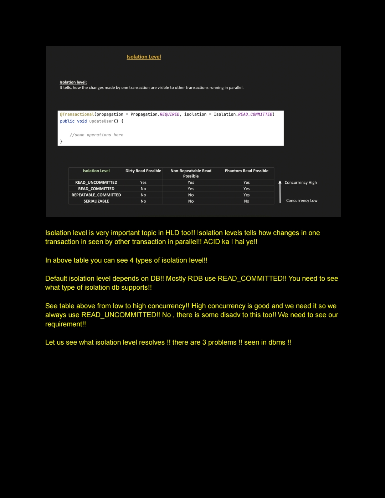
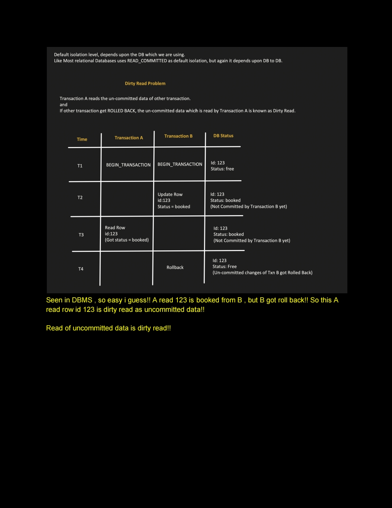
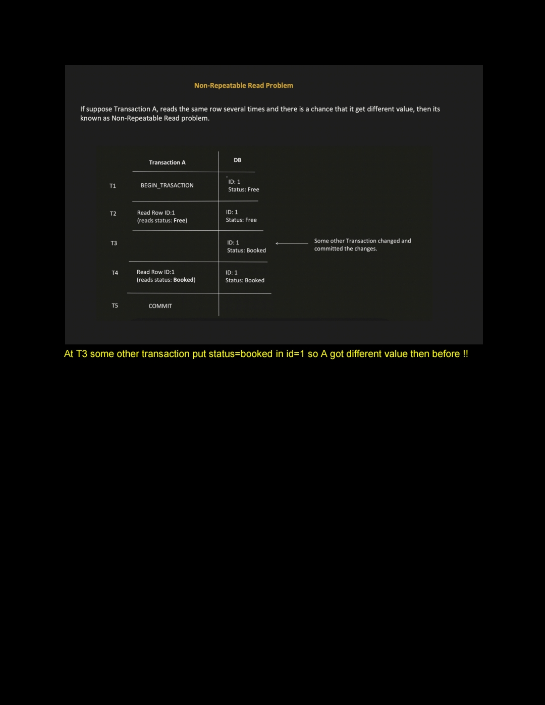
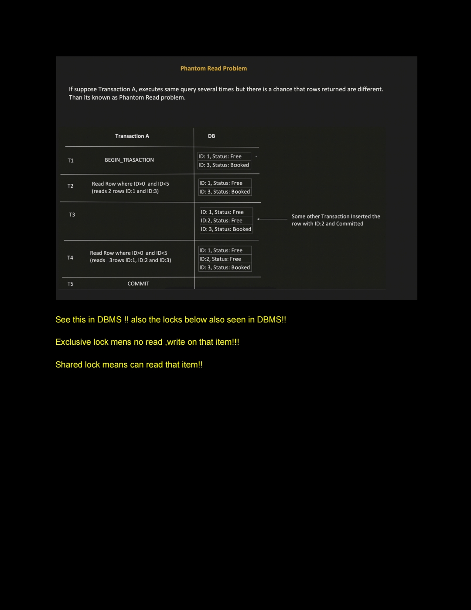
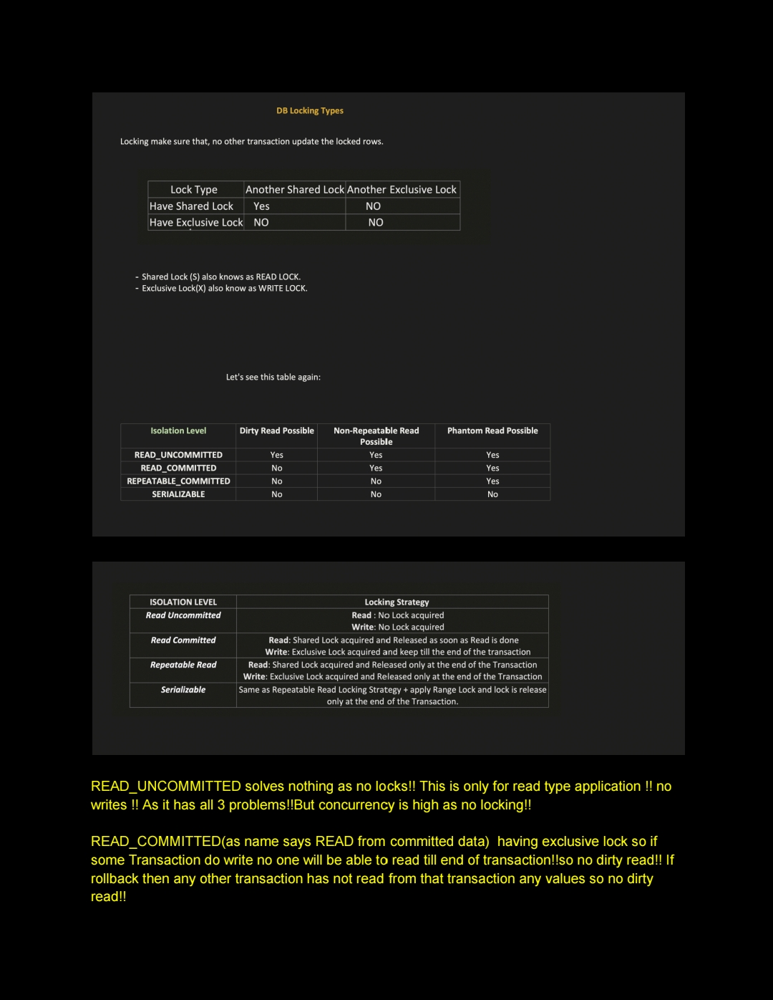
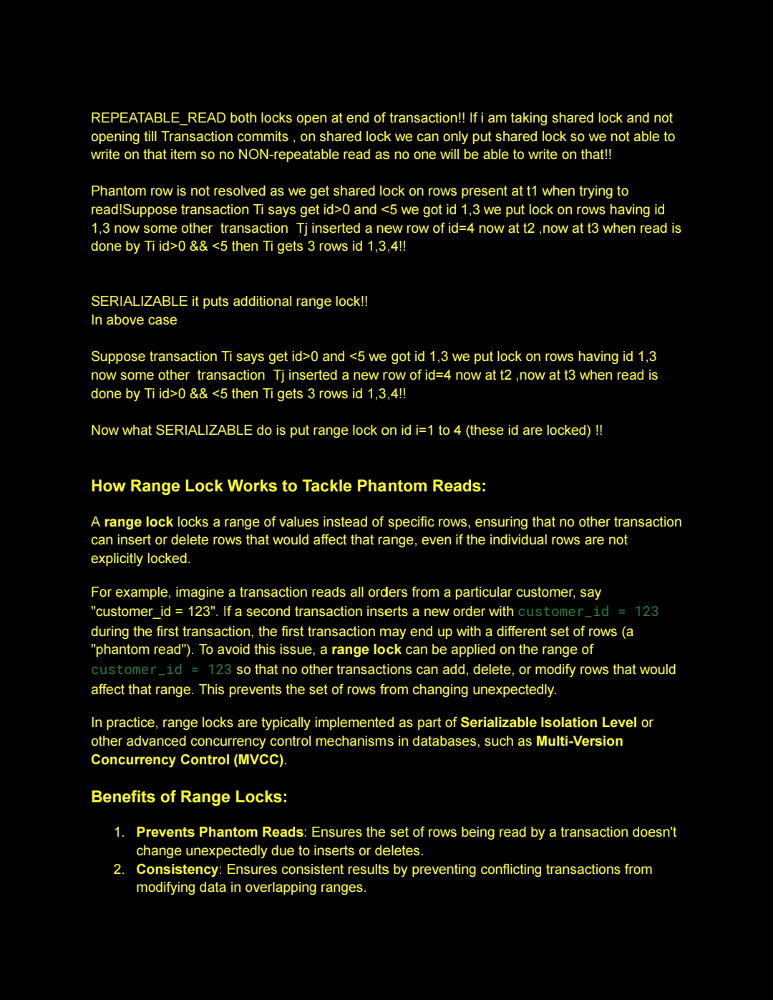
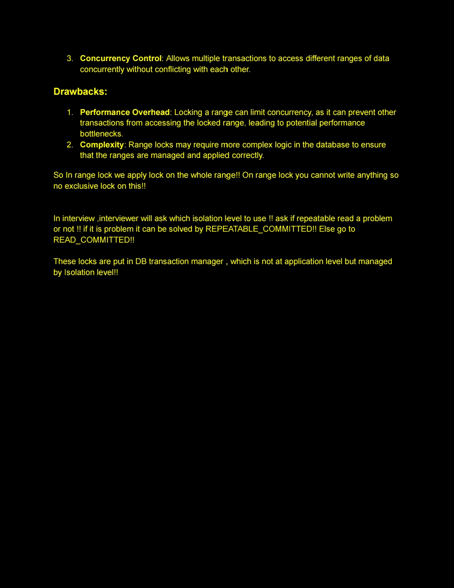

# Notes

 This is shrayansh jain transaction 3 
 below table in image shows wrong relation in isolation and consitency.Correct is in text

 

The lower the Isolation Level, the more "anomalies" (errors) are allowed to occur. These anomalies directly threaten Consistency

### Isolation Levels vs. Consistency Risks

| Isolation Level | Dirty Reads | Non-Repeatable Reads | Phantom Reads | Consistency Level |
| :--- | :--- | :--- | :--- | :--- |
| **Read Uncommitted** | Possible | Possible | Possible | **Lowest**: Can see "junk" data from failed transactions. |
| **Read Committed** | No | Possible | Possible | **Moderate**: Default for many DBs (Postgres, SQL Server). |
| **Repeatable Read** | No | No | Possible | **High**: Data won't change while you are looking at it. |
| **Serializable** | No | No | No | **Highest**: Transactions act as if they ran one after another. |

---

### Understanding the Trade-offs

#### 1. Why use lower isolation?
If you set everything to **Serializable**, your database becomes incredibly slow because it has to lock rows or tables constantly to prevent any overlap. For high-scale systems (like social media "likes"), **Read Committed** is usually enough because a tiny bit of inconsistency won't crash the system.

#### 2. Why use higher isolation?
For financial systems (like moving money between bank accounts), you often need **Repeatable Read** or **Serializable**. You cannot risk a "Dirty Read" where you think money is in an account when it actually isn't.

#### 3. Summary of Anomalies
* **Dirty Read:** Seeing data that hasn't been saved (committed) yet.
* **Non-Repeatable Read:** Reading the same row twice and getting different results.
* **Phantom Read:** Running the same search twice and getting a different "set" of rows (newly added rows).

     