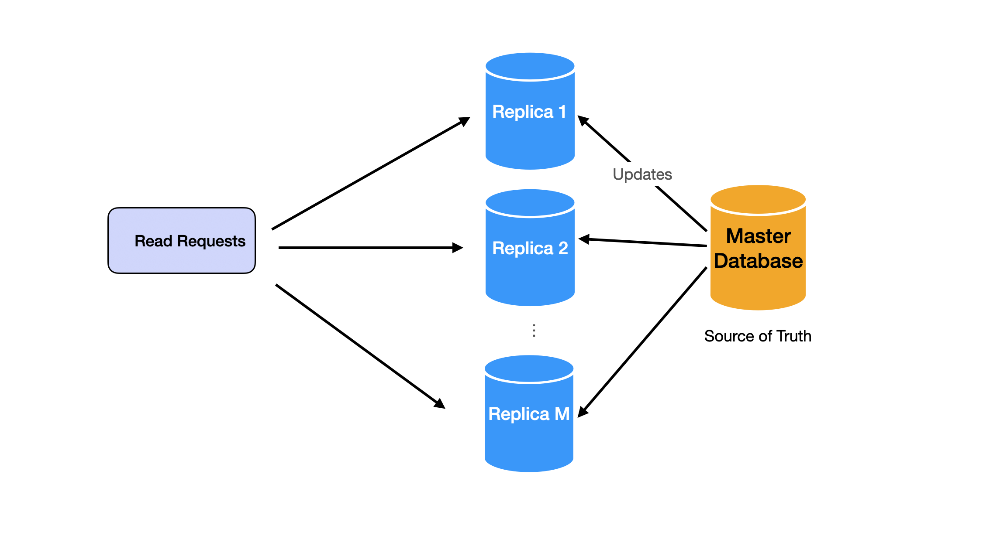
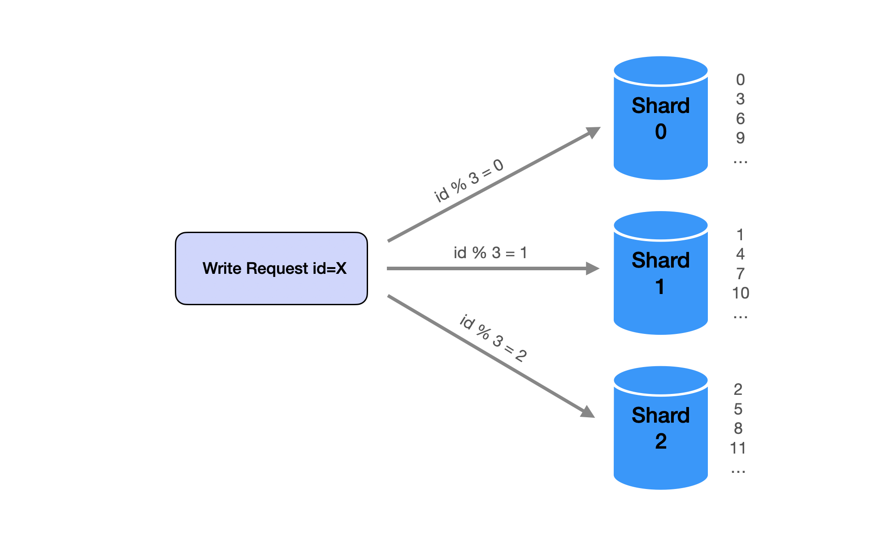

# Throughput

Throughput is defined as the amount of information or the number of transactions a system can process within a given period. It's a direct measure of a system's performance and efficiency. High throughput means the system can handle a greater load, translating to faster and more robust applications.

Importance in System Design Throughput is a critical non-functional requirement in system design. It impacts how a system scales and responds to increased demands. In today's fast-paced digital world, users expect quick and responsive services. A system with high throughput can meet these demands, ensuring user satisfaction and better overall performance.

## Strategies for Increasing Throughput
To increase throughput, we can

- decrease the time it takes to process a request (reducing latency)
- increase the number of requests processed per unit of time (increasing concurrency)

We've already discussed latency in the last section. In this article, we'll focus on increasing concurrency to improve throughput.

## Scaling Reads with Replication

Replication is the process of creating copies of data across multiple servers. This approach allows a system to handle more read requests simultaneously, effectively distributing the load. By replicating data, a system can continue to provide quick responses even under a heavy read load.

## Scaling Writes with Partitioning (aka Sharding)

Partitioning involves dividing a database into smaller, more manageable parts. This technique is particularly useful for scaling write operations. By partitioning data, a system can distribute write requests across multiple servers or partitions, reducing the load on any single server and increasing overall write throughput.

## Scaling Out Data Flow with Message Queues and Consumers
Message queues act as intermediaries in data processing. They allow systems to handle requests asynchronously, improving throughput. Consumers, which are processes or services that process these messages, can be scaled to increase processing capacity. This approach is especially effective in systems where requests can be processed independently.

