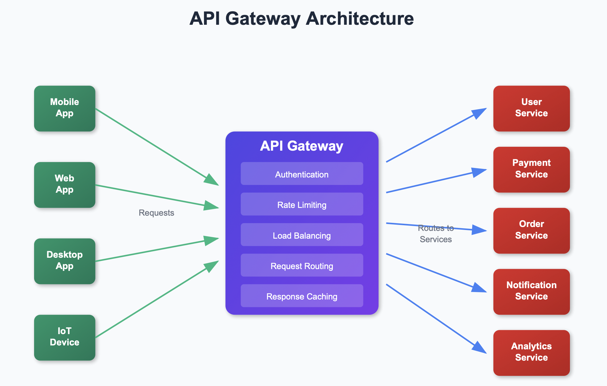
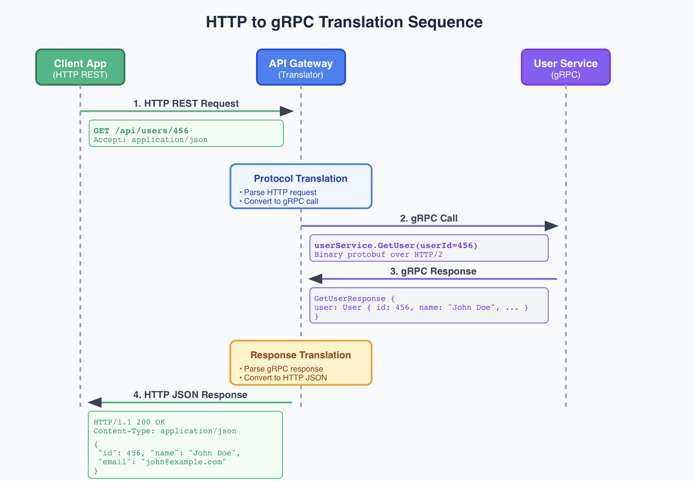

# Thundering Herd Problem

A popular product page caches its data with a 60-second TTL. The cache expires. Within milliseconds, 10,000 users request the same page. All requests miss the cache. All 10,000 requests hit the database simultaneously. The database overloads. Response times spike from 50ms to 30 seconds. This is the thundering herd problem, also called cache stampede.

The thundering herd occurs when multiple clients simultaneously request a resource that is not present in cache or has expired. This creates a sudden surge of requests hitting the database, causing increased load, latency, and potential failures. The term "thundering herd" describes animals stampeding at the same time.

The problem happens in stages. A popular cached item expires or is invalidated. Numerous clients request the same item around the same time. All requests bypass the cache and hit the database. The database becomes overloaded, leading to slow responses or downtime.

## How to Prevent Thundering Herd Problem
Since the problem is cache misses causing many requests to hit the backend, the key is to make the cache not expire at the same time.

### Cache Locking
Ensure that only one request fetches the data from the backend while others wait. When the cache key expires, the first client that notices it can acquire a lock. Other clients trying to access the same cache key will notice the lock is already held and either: wait for the first client to recompute the value or return stale data if available. Once the first client finishes fetching or computing the value, it updates the cache and releases the lock. This way, only one client at a time recomputes the cache key, preventing all clients from hitting the backend or database simultaneously.

### Randomized Cache Expiration (aka Jitter)
Instead of all clients using the same expiration time for a cache key, add a random jitter to the expiration. This means cache expiration is spread out randomly, and clients don't all request a recomputation at the same time. For example, if a cache key expires in 60 seconds, you could set the expiration to a random time between 55 and 65 seconds. This reduces the likelihood of all clients hitting the cache at once.


Jitter is a strategy used to prevent synchronization in distributed systems. Without it, independent systems (clients or servers) often fall into a "rhythm" where they all perform the same heavy action at the exact same moment—leading to a system crash.

By adding a small, random amount of time to a fixed interval, you de-synchronize the herd.

#### 1. Why Jitter is Necessary
Imagine 1 million smartphones in India all checking for a software update at exactly 12:00 AM every night.

- Without Jitter: Your update server receives 1 million requests at 12:00:00 AM. It crashes instantly.

- With Jitter: You tell the phones to check at "12:00 AM + a random delay between 0 and 60 minutes." The server now receives a manageable stream of requests spread across an hour.
#### 2. How to Add Jitter 
You implement Jitter by calculating a "Noise" value and adding it to your base TTL (Time To Live).The Basic Formula$$\text{Final Expiration} = \text{Base TTL} + \text{random}(-\text{JitterRange}, +\text{JitterRange})$$Code Example (Java)In a Java-based Spring Boot app using Redis, you would modify your cache storage logic like this:

```java
import java.util.concurrent.ThreadLocalRandom;

public void saveToCache(String key, Object value) {
    int baseTTL = 3600; // 1 hour
    
    // Add 10% Jitter (between -180 and +180 seconds)
    int jitterRange = (int) (baseTTL * 0.10); 
    int randomJitter = ThreadLocalRandom.current().nextInt(-jitterRange, jitterRange);
    
    int finalTTL = baseTTL + randomJitter;

    // Save to Redis with the randomized TTL
    redisTemplate.opsForValue().set(key, value, finalTTL, TimeUnit.SECONDS);
}
```
#### 3. Jitter in "Exponential Backoff"
Jitter is most famous for its use in Retries. If your database is down, and 100 servers all try to reconnect every 2 seconds, they will keep hitting the database together (The Thundering Herd).

By adding Jitter to the wait time, the servers will naturally "space themselves out" after the first failed attempt.

##### Exponential Backoff with Jitter 
This is the gold standard for showing you know how to build resilient, production-ready systems.

1. The Problem: The "Retry Storm"Imagine you have 1,000 microservices trying to connect to a single Database. If the Database goes down for 5 seconds and then comes back up:

    - Without Backoff: All 1,000 services hit the DB at the exact same millisecond. It crashes again immediately.
    
    - With Exponential Backoff: The services wait ($2^1, 2^2, 2^3...$) seconds. However, since they all started their timers at the same time, they still hit the DB in synchronized waves.
    
  2. The Solution: Adding JitterJitter breaks the synchronization. By adding a random "offset" to the wait time, you ensure that the 1,000 services spread their retries out over a window of time, giving the Database room to breathe.
  
  The Formula
  
  Instead of waiting exactly $delay = 2^{attempt}$, we use:$$Sleep = \text{random}(0, 2^{attempt})$$(This is known as "Full Jitter," the most effective version developed by AWS).

```java
public void connectWithRetry() {
    int maxAttempts = 5;
    int baseDelay = 100; // 100ms
    int maxDelay = 10000; // 10 seconds

    for (int attempt = 0; attempt < maxAttempts; attempt++) {
        try {
            doConnect();
            return; // Success!
        } catch (Exception e) {
            // Calculate Exponential Backoff: 2^attempt * base
            long expDelay = Math.min(maxDelay, (long) Math.pow(2, attempt) * baseDelay);
            
            // Apply Full Jitter: random between 0 and expDelay
            long sleepTime = ThreadLocalRandom.current().nextLong(0, expDelay);
            
            System.out.println("Attempt " + attempt + " failed. Sleeping for " + sleepTime + "ms");
            
            try {
                Thread.sleep(sleepTime);
            } catch (InterruptedException ie) {
                Thread.currentThread().interrupt();
            }
        }
    }
}
```
### Comparison: Exponential Backoff vs. Exponential Backoff + Jitter

| Feature | Exponential Backoff (Pure) | Exponential Backoff + Jitter |
| :--- | :--- | :--- |
| **Retry Timing** | **Fixed math:** $2^n$. Every client waits the exact same amount of time. | **Randomized math:** $\text{random}(0, 2^n)$. Each client picks a unique wait time. |
| **Traffic Shape** | **Spiky.** High bursts of traffic followed by periods of silence. | **Uniform.** Traffic is spread out evenly over the available time window. |
| **Server Impact** | Can cause **"Retry Storms"** that keep knocking a recovering server back down. | Allows the server to process requests one by one as it comes back online. |
| **Analogy** | 100 people trying to push through a door at exactly 12:00, 12:02, and 12:04. | 100 people arriving at a door at various random times between 12:00 and 12:05. |

---

### Visualizing the Difference


#### 1. Why Pure Exponential Backoff Fails at Scale
Even though the time between retries increases ($2, 4, 8, 16...$), all clients that failed at the same time will stay **synchronized**. This creates massive "waves" of traffic. If your server is trying to recover, these synchronized hits (Retry Storms) act like a Distributed Denial of Service (DDoS) attack, often crashing the server again immediately after it restarts.

#### 2. Why Jitter is the Solution
Jitter breaks the lock-step synchronization. By introducing randomness, you ensure that even if 1,000 clients fail at the same microsecond, their next attempts will be spread out across the time window. This gives the server a steady, predictable stream of work rather than a violent burst.

We use Exponential Backoff to ensure we aren't hammering a failing service, but we must add Full Jitter. Without Jitter, all our clients will synchronize their retries, creating 'Retry Storms' that can lead to a cascading failure. Full Jitter ensures that our retry traffic is distributed uniformly, allowing the backend service to recover more effectively.

Imagine a database goes down. 1,000 servers lose their connection at the same time.

Without Jitter (Synchronized Waves)

Even though the wait time increases ($2s, 4s, 8s$), all 1,000 servers are synchronized. They all wait 2 seconds, then all 1,000 hit the DB at once. Then they all wait 4 seconds and hit it again. These synchronized spikes often prevent the database from ever fully recovering because it gets overwhelmed the moment it tries to start up.

With Jitter (Desynchronized Flow)

By adding randomness, Server A might wait 1.2s, Server B might wait 0.5s, and Server C might wait 1.9s. The "herd" is broken. Instead of a massive wave, the database sees a steady, manageable stream of individual requests.


### Cache Prefetching
Prefetch the cache key before it expires using a background job or a separate service. This means that the cache is updated before the current cache expires. This means that the next request will not have to wait for the cache to be refreshed.

## Redis Example
Let's take a look at how to implement cache locking using Redis. Redis comes with a SETNX command that stands for "Set if Not eXists". It sets the key to the value if the key does not exist. If the key exists, it returns 0. Otherwise, it returns 1. This ensures that only one process fetches data from the backend. Here's an example implementation of cache locking using Redis:

```py
def get_value_with_lock(key):
    # Try to get the cached value from Redis
    cached_value = redis.get(key)

    if cached_value is None:
        # Try to acquire a lock (only one client will succeed)
        if redis.setnx(f"lock:{key}", 1):
            try:
                # Set an expiration for the lock to avoid deadlocks
                redis.expire(f"lock:{key}", 10)  # Lock expires in 10 seconds

                # Regenerate the value (e.g., fetch from DB or recompute)
                new_value = fetch_from_db_or_recompute()

                # Store the newly generated value in the cache
                redis.set(key, new_value, ex=60)  # Cache expires in 60 seconds
                return new_value
            finally:
                # Release the lock
                redis.delete(f"lock:{key}")
        else:
            # If lock is already held, wait and retry fetching the value
            time.sleep(0.1)
            return get_value_with_lock(key)
    else:
        return cached_value
```
In this example, the first client to notice the cache miss acquires the lock and recomputes the value. Other clients wait for the result instead of all recomputing the data.

 
 
 In most microservices architecture, we have multiple services, and clients need to communicate with these services. Clients would need to know the addresses of all microservices and handle different protocols and data formats. This creates tight coupling between clients and services, making the system harder to maintain and evolve. API Gateway is a solution to this problem by providing a single entry point for all client requests.
 
   

  An API Gateway is a server that acts as an entry point to a microservices architecture. It sits between clients and backend services, handling all incoming requests and routing them to the appropriate microservices. Think of it as a reverse proxy with additional capabilities specifically designed for API management.



## Why Do We Need an API Gateway?

In a microservices architecture, clients need to communicate with multiple services. Without an API Gateway, clients would need to:

- Know the addresses of all microservices
- Handle different protocols and data formats
- Implement authentication and authorization for each service
- Manage rate limiting and monitoring independently
- Deal with cross-cutting concerns like logging and security

This creates tight coupling between clients and services, making the system harder to maintain and evolve

  
    

The API Gateway can modify requests and responses as they flow through it, acting as a translator between what clients send/expect and what backend services require/return.

Modify requests and responses as they pass through the gateway:

- Add authentication headers
- Transform response formats
- Aggregate data from multiple services
- Filter sensitive information


## 5. Protocol Translation
Convert between different protocols and data formats:

- HTTP to gRPC
- REST to GraphQL
- JSON to XML
- WebSocket connections

Example: HTTP to gRPC Translation

Many backend services use gRPC for high-performance internal communication, but clients expect simple HTTP REST APIs:



This allows:

- Backend services to use efficient gRPC for internal communication
- Clients to use familiar HTTP REST APIs
- Teams to choose optimal protocols without affecting client experience

   
    


API gateway is commonly drawn as a single catch-all entity that is responsible for routing requests to the appropriate microservices while handing the authentication and authorization as well as rate limiting and monitoring.