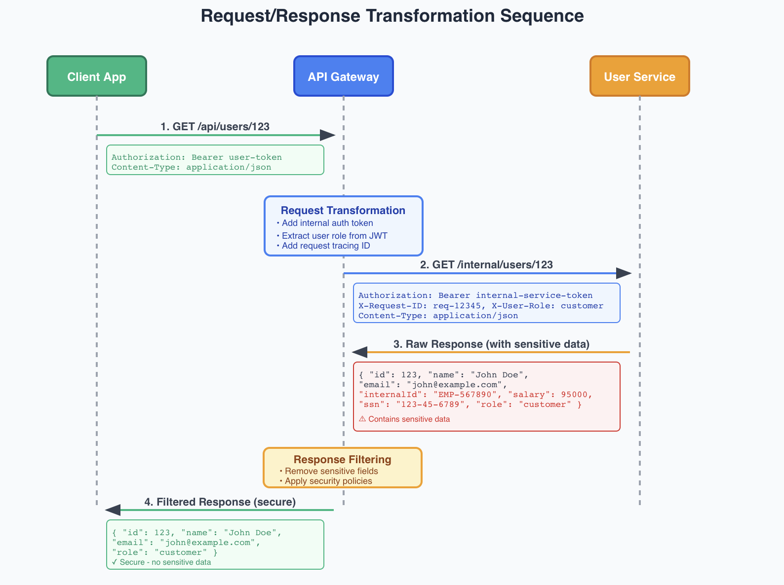

# Notes

  
 
 
 In most microservices architecture, we have multiple services, and clients need to communicate with these services. Clients would need to know the addresses of all microservices and handle different protocols and data formats. This creates tight coupling between clients and services, making the system harder to maintain and evolve. API Gateway is a solution to this problem by providing a single entry point for all client requests.
 
   

  An API Gateway is a server that acts as an entry point to a microservices architecture. It sits between clients and backend services, handling all incoming requests and routing them to the appropriate microservices. Think of it as a reverse proxy with additional capabilities specifically designed for API management.

## Why Do We Need an API Gateway?

In a microservices architecture, clients need to communicate with multiple services. Without an API Gateway, clients would need to:

- Know the addresses of all microservices
- Handle different protocols and data formats
- Implement authentication and authorization for each service
- Manage rate limiting and monitoring independently
- Deal with cross-cutting concerns like logging and security

This creates tight coupling between clients and services, making the system harder to maintain and evolve

  
    

The API Gateway can modify requests and responses as they flow through it, acting as a translator between what clients send/expect and what backend services require/return.

Modify requests and responses as they pass through the gateway:

- Add authentication headers
- Transform response formats
- Aggregate data from multiple services
- Filter sensitive information

## 5. Protocol Translation
Convert between different protocols and data formats:

- HTTP to gRPC
- REST to GraphQL
- JSON to XML
- WebSocket connections

Example: HTTP to gRPC Translation

Many backend services use gRPC for high-performance internal communication, but clients expect simple HTTP REST APIs:

This allows:

- Backend services to use efficient gRPC for internal communication
- Clients to use familiar HTTP REST APIs
- Teams to choose optimal protocols without affecting client experience

   
    

API gateway is commonly drawn as a single catch-all entity that is responsible for routing requests to the appropriate microservices while handing the authentication and authorization as well as rate limiting and monitoring.