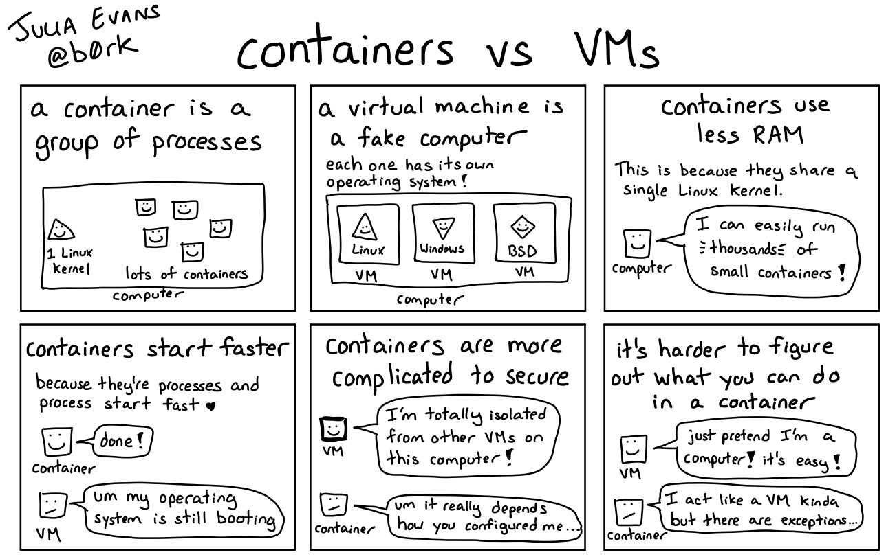
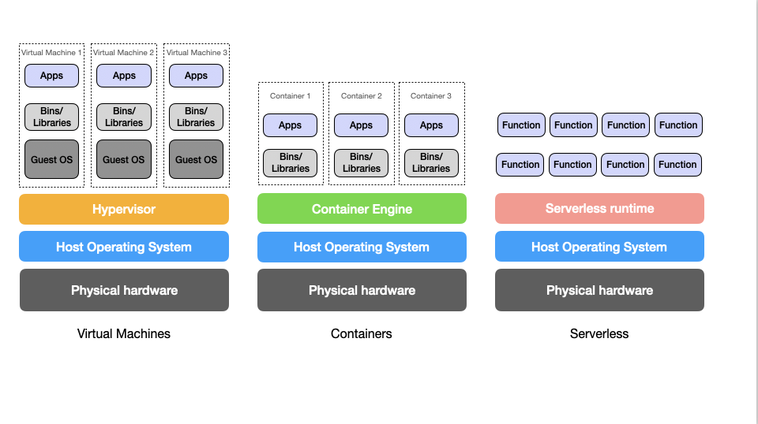

# Evolution of Computing Environments

The computing environment has undergone a significant transformation over the years, evolving from physical servers to serverless computing. This evolution has been marked by continuous innovation and improvements in efficiency. This article will delve deeper into the evolution of the computing environment, discussing the pros and cons of each key development - physical servers, virtual machines, containers, and serverless computing.

## Physical Servers

Physical servers are the bedrock of the computing environment. Colloquially known as 'running on the metal', they are tangible pieces of hardware that host an operating system, applications, and data. A physical server is a powerful computer engineered to manage, store, send, and process data, 24 hours a day, seven days a week.

### Pros
- Control: With a physical server, you have complete control over your hardware and software. This control extends to the type of hardware used, the specific software installed, and the way the system is configured and maintained.
- Performance: Physical servers can deliver high performance as resources are not shared with other applications.
### Cons
- Cost: They are expensive to purchase, maintain, and upgrade. The costs include not only the initial purchase price but also ongoing maintenance and energy costs.
- Scalability: Scaling up involves significant time and resources as it requires purchasing and setting up additional hardware.
#### When to Use Physical Servers
Physical servers are best suited for tasks requiring high-performance computing and complete control over the environment. For example, large enterprises running complex, resource-intensive applications such as big data analytics or high-performance computing (HPC) tasks, may opt for physical servers.

## Virtual Machines (VMs)
Virtual Machines (VMs) are an emulation of a computer system. They run on physical servers but act as separate computers, each with its own operating system and applications. This allows multiple VMs to run simultaneously on a single physical server, each potentially running a different operating system and applications.

### Pros
- Isolation: Each VM operates independently. If one crashes, it doesn’t affect the others.
- Efficiency: VMs allow for better utilization of server resources.
### Cons
- Performance: VMs can be slower than physical servers because they need to translate requests between the host and guest operating systems.
- Resource Intensive: Each VM runs a full copy of an operating system, leading to a significant consumption of resources.
#### When to Use Virtual Machines
Virtual machines are ideal when you need to run multiple isolated systems on a single physical server. For example, in a development environment where different operating systems or versions of software need to be tested.

## Containers
Containers are a lightweight alternative to VMs. They encapsulate an application and its dependencies into a single, self-contained unit that can run anywhere. Unlike VMs, containers do not need a full operating system to run. Instead, they share the host system’s OS kernel, making them more lightweight and faster to start than VMs.

### Pros
- Portability: Containers are designed to run consistently across different computing environments.
- Efficiency: Containers share the host system’s OS kernel, making them more lightweight than VMs.
### Cons
- Isolation: Containers on the same host share the same OS kernel, which can lead to security vulnerabilities.
- Complexity: Managing containers can be complex, requiring orchestration tools like Kubernetes.
#### When to Use Containers
Containers are perfect for deploying microservices, as they are lightweight and provide a consistent environment across different platforms. They are also ideal for applications that need to be quickly scaled up or down, such as web applications with variable traffic.

### Containers vs VMs
VMs include the application, necessary binaries and libraries, and an entire guest operating system (OS), all running on a virtual hardware layer. Containers include the application and its dependencies, but share the kernel of the host operating system. VMs are more suitable for applications that need full isolation with a full OS, or for applications that require specific OS environments. Containers are more efficient, faster, and more scalable, making them ideal for microservices and cloud-native applications. Here's a comic strip illustrating the differences:

## Serverless
Serverless computing is a cloud-computing execution model where the cloud provider dynamically manages the allocation of machine resources. With serverless computing, developers can focus on their code, and the cloud provider takes care of the underlying infrastructure.

### Pros
- Cost-effective: You only pay for the actual processing time, which can result in cost savings for sporadic or event-driven workloads.
- Scalability: Serverless computing can automatically scale to meet application demands, making it ideal for workloads with unpredictable traffic patterns.
### Cons
- Cold Start: There can be a delay when a function is executed after being idle for some time, known as a "cold start". This can impact performance.
- Control: You have less control over the environment compared to the other models. This includes the underlying infrastructure and the runtime environment.
#### When to Use Serverless
Serverless is excellent for event-driven applications and quick prototyping, as it abstracts away the infrastructure management tasks. It is ideal for applications with unpredictable demand, such as APIs, data processing tasks, or IoT applications.

The choice between physical servers, VMs, containers, and serverless computing depends on the specific needs of your application. Here's a comparison

### Comparison of Compute Models

| Feature | Physical Servers | Virtual Machines (VMs) | Containers | Serverless |
| :--- | :--- | :--- | :--- | :--- |
| **Definition** | Colloquially known as 'running on the metal', these are tangible pieces of hardware that host an operating system, applications, and data. | An emulation of a computer system that runs on a physical server but acts like a separate computer with its own OS and applications. | A lightweight alternative to VMs that encapsulates an application and its dependencies into a single, self-contained unit. | A cloud-computing execution model where the cloud provider dynamically manages the allocation of machine resources. |
| **Pros** | Complete control, high performance. | Isolation, better utilization of resources. | Portability, efficiency. | Cost-effective, automatically scalable. |
| **Cons** | High cost, scalability issues. | Slower performance, resource-intensive. | Security vulnerabilities, management complexity. | Cold start issues, less control. |
| **Ideal Use Case** | High-performance computing tasks, environments requiring complete control. | Running multiple isolated systems on a single server, testing different OS versions. | Deploying microservices, applications needing quick scale. | Event-driven applications, quick prototyping, unpredictable demand. |

---

### Understanding the Architecture

To visualize how these differ in terms of the "Software Stack," look at how much of the system you (the developer) have to manage:

#### 1. Physical Server (Bare Metal)
You own the whole house. You are responsible for the foundation (hardware), the walls (OS), and the furniture (Apps). It is the fastest because there is no "middleman."

#### 2. Virtual Machines (VMs)
A "Hypervisor" splits one physical server into multiple houses. Each house has its own Guest OS. This is great for isolation but slow because each OS takes up a lot of RAM and CPU just to "exist."

#### 3. Containers (Docker)
Instead of a whole house, you have an apartment building. Everyone shares the same foundation (Host OS Kernel) but has their own private room. This makes them **start in seconds** compared to VMs which take minutes to boot.

#### 4. Serverless (AWS Lambda / Google Cloud Functions)
You don't even see the building. You just order "room service." You upload your code (the function), and the cloud provider handles everything else. You only pay for the **milliseconds** your code is running.

---

### Summary for System Design Interviews
* **Scale:** Use Containers (Kubernetes) for complex, high-traffic systems.
* **Cost:** Use Serverless for tasks that happen occasionally (like sending a "Welcome" email).
* **Isolation:** Use VMs if you need to run legacy software that requires a specific old version of Windows or Linux.

