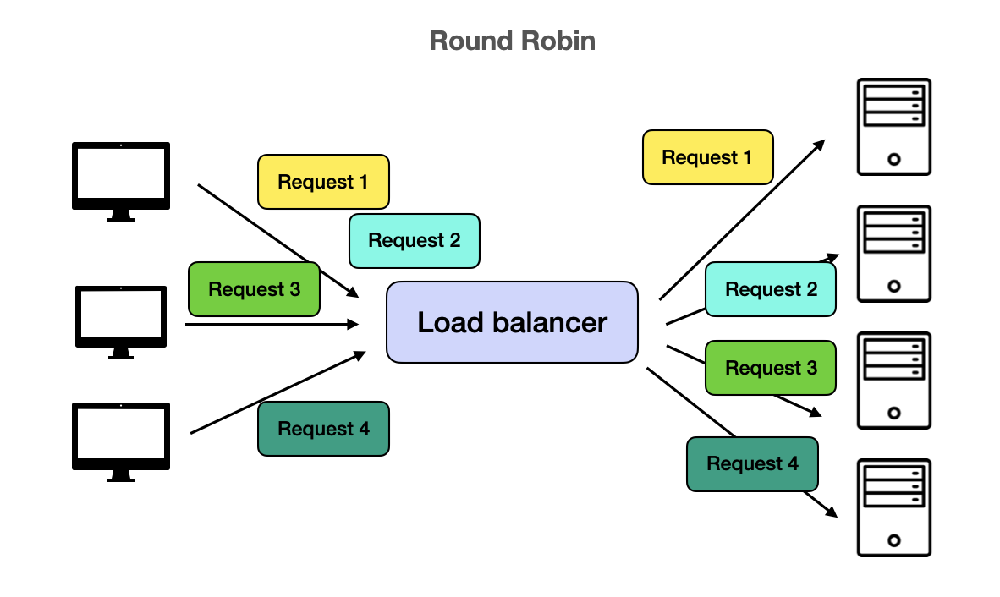
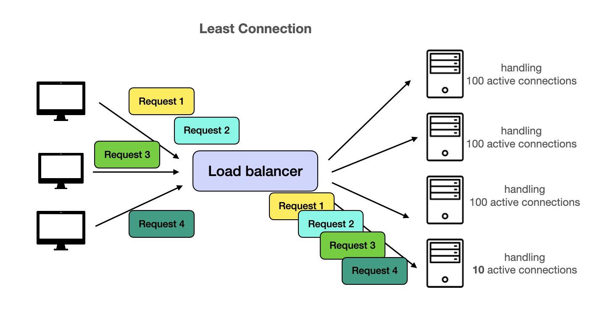
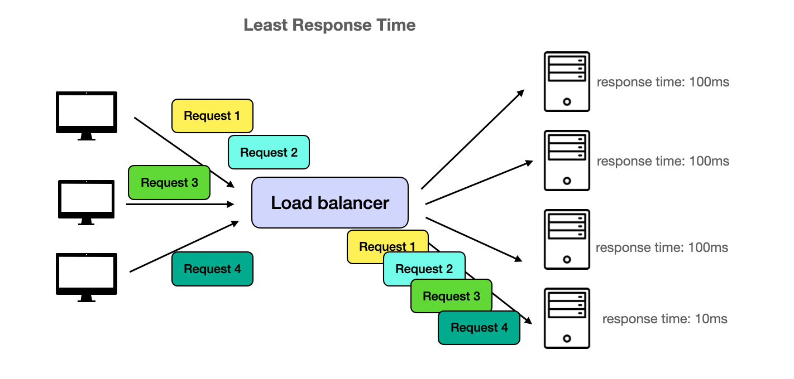
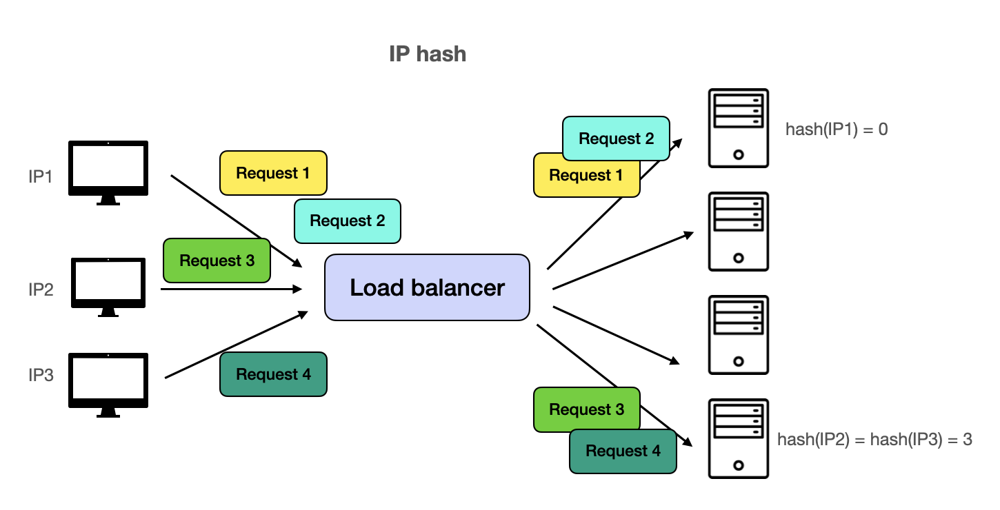

# Notes
        

## Load balancer
Load balancers are devices or software that act as a reverse proxy, distributing client requests across multiple servers based on predetermined algorithms. This distribution process aims to optimize resource utilization, minimize response time, and avoid overloading a single server.

### Load Balancing Algorithms
There are various load balancing algorithms, including:

### Round Robin: Requests are distributed sequentially to available servers.

### Least Connections: Requests are routed to the server with the fewest active connections.

### Least Response Time: Requests are directed to the server with the lowest response time.

### IP Hash: Requests are distributed based on the client's IP address, ensuring that a specific client is always routed to the same server.

On top of these, there are also

- Weighted Round Robin: Like Round Robin, except server loads are based on their compute capacity.
- URL Hash: Like IP hash, except the URL in the request is used. This is useful when we want to optimize each server for a set of URLs. For example, cache may be stored on the servers themselves and we can maximize cache hit rate using URL hash load balancing.

Load balancers play a critical role in ensuring high availability, fault tolerance, and scalability in large-scale applications. They can be implemented as hardware appliances, virtual appliances, or software solutions. Next, let's take a look at the most popular software load balancer, Nginx.

### NGINX
NGINX is a powerful, open-source web server, reverse proxy server, and load balancer that has gained popularity due to its performance, reliability, and flexibility. It can handle a large number of concurrent connections while maintaining low memory and CPU usage, making it a popular choice for high-traffic websites and applications.

