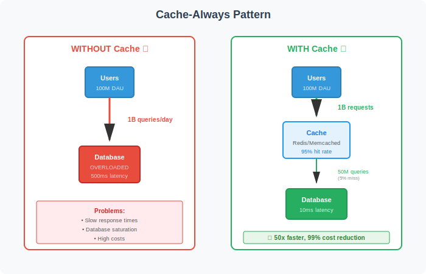

# Cache
Database optimization improves query performance through indexing and sharding. But even optimized databases cannot handle 100 million daily active users reading directly. The cache-first pattern solves this by placing fast storage between users and databases and checking cache before querying the database.

Reading from a database takes milliseconds. Reading from cache takes microseconds. At scale, this difference determines whether a system survives traffic spikes or collapses under load.

A cache and a database serve different purposes and operate in fundamentally different ways, especially at scale:

## Purpose:

- A database is designed for reliable, persistent storage and complex querying of data. It supports transactions, consistency, and can handle updates, inserts, and deletes.
- A cache is designed for speed. It temporarily stores frequently accessed or pre-computed data in memory, allowing for extremely fast retrieval.
## Performance:

- Databases are optimized for durability and correctness, but accessing data from disk or even SSD is much slower than accessing data from memory.
- Caches keep data in RAM, enabling them to serve requests in microseconds, which is orders of magnitude faster than most databases.
## Query Complexity:

- Databases can handle complex queries, aggregations, and joins.
- Caches typically store the results of those complex queries or pre-computed data, so they can return the answer instantly without recomputation.
## Scalability:

- Databases can become a bottleneck under heavy read load, especially with complex queries.
- Caches absorb most of the read traffic, drastically reducing the number of queries that reach the database.
## Cost:

- Databases are expensive to scale, especially for high query-per-second workloads.
- Caches are much cheaper to scale for read-heavy workloads, as they can handle millions of requests per second at a fraction of the cost.

In summary, caches are used to offload repetitive, read-heavy workloads from databases by serving frequently requested data much faster and more cheaply

--

## Why Cache Aggressively
In-memory caches like Redis or Memcached retrieve data hundreds of times faster than database queries. A product page that loads in 50ms with cache would take 500ms querying the database directly. Users notice the delay. Conversion rates drop.

Caches also protect databases from overload. A viral news article generates 100,000 requests per second. Without caching, those requests hit the database. The database saturates. Query times spike from 10ms to 2 seconds. The entire system slows down. With caching, the first request fetches from the database and stores in cache. The next 99,999 requests hit cache. The database serves one query instead of 100,000.

Cost optimization follows performance. Databases charge per read operation. A popular API endpoint serving 10 million requests per day costs real money at database pricing. Caching those responses drops the cost by 99%. The database handles 100,000 cache misses instead of 10 million reads.

## Scale Requirements
At 100 million daily active users, direct database reads become impossible. Consider a social media feed. Each user loads their feed 10 times per day. That's 1 billion feed requests. Each feed aggregates posts from 500 friends. Without caching, the database executes 1 billion complex aggregation queries. No database survives this.

With caching, the system pre-computes feeds or caches query results. Most requests hit cache. Database load drops to manageable levels. The cache absorbs traffic spikes during peak hours. When a celebrity posts and their 10 million followers refresh feeds, cache serves the content without touching the database.

The numbers make caching mandatory. A database cluster handling 50,000 queries per second costs hundreds of thousands annually. A cache cluster handling 5 million requests per second costs a fraction of that. The cache hit rate determines total system cost.

        

## When Not to Cache
Real-time sensor data streaming at high frequency should not cache. Industrial automation systems reading sensors 1,000 times per second need current values. Cache adds latency without benefit. Push-based systems work better.

Financial market data updating multiple times per second rarely benefits from caching. Traders need the latest price. Caching for even 100ms shows stale data. Direct database reads or streaming updates suit this use case better.

Robotics and industrial control systems require immediate response. Caching introduces delays that affect safety and precision. These specialized domains operate outside typical web service patterns.

For web services, APIs, and user-facing applications serving millions of users, caching is mandatory. The performance gain and cost reduction justify the complexity.

## When "Only DB" is enough:
Low Traffic: Personal blogs, internal company tools, or apps with < 50,000 daily active users.

Write-Heavy Apps: If your data changes every second (like a stock price ticker), a cache might actually slow you down because you'd constantly have to delete and rewrite the cached version.

Small Datasets: If your entire database fits in the RAM of your DB server, the DB engine will naturally "cache" the data in its own buffer pool anyway.

## When to Add a Cache (The "Trigger Points")
In system design interviews or real engineering, you move to a cache when you hit one of these three walls:

### A. The Latency Wall (The "Speed" Limit)
Even a "fast" database query takes time because of the overhead of the SQL engine.

The DB Limit: A complex JOIN query might take 50ms - 200ms.

The Cache Trigger: If your product requirement says the page must load in under 100ms total, you don't have time for a 50ms DB query. You cache the result so it returns in < 2ms.

### B. The Connection Wall (The "User" Limit)
Databases have a strictly limited number of "slots" for people to talk to them at once.

The DB Limit: Most DBs struggle after 1,000 - 2,000 concurrent connections.

The Cache Trigger: If you have 50,000 people hitting your "Home Page" at once, you cannot give them all a DB connection. You serve the page from a cache, which can handle 100,000+ connections on a single tiny server.

### C. The Cost Wall (The "Budget" Limit)
Scaling a database is expensive.

The DB Limit: To double your DB's performance, you might have to pay $2,000/month more for a massive instance or complex "Read Replicas."

The Cache Trigger: You can add a small Redis cache for $50/month that handles 80% of those queries, saving you thousands in database licensing and hardware costs.

# Why Caching is Mandatory at 100M User Scale

For a system supporting **100 million users**, a cache is no longer an "optional" optimization—it is a **core architectural requirement**. At this scale (similar to Netflix, LinkedIn, or Pinterest), a database-only architecture would physically collapse under the load.

---

## 1. The Numbers: Requests Per Second (RPS)
If 100 million users use your app, even if only 1% are active at any given second, you are looking at **1 million concurrent users**.

* **The DB Limit:** A single, high-end database typically maxes out at **10k to 20k Read Queries Per Second (QPS)**.
* **The Cache Power:** A distributed cache like Redis can handle **millions of operations per second** with sub-millisecond latency because it operates entirely in RAM.

## 2. Global Latency (The Speed of Light)
100 million users are likely spread across the globe (e.g., New York, London, Tokyo).

* **Without a Cache:** A user in Tokyo has to send a request all the way to your primary database in Virginia. The round-trip time (network latency) alone can be **200ms - 300ms**, regardless of how fast your DB is.
* **With a Cache (CDN/Edge):** You place a cache in a Tokyo data center. The user gets their data in **<10ms**. At this scale, user retention depends on speed; you can't beat the speed of light without a distributed cache.

## 3. The "Hot Key" Problem
With 100M users, some data is "hotter" than others. For example, if a celebrity with 10M followers posts a message:

* **The DB Issue:** Millions of followers' apps will query the *exact same row* in your database at once. Even with 100 database replicas, the one replica holding that specific row will be overwhelmed.
* **The Cache Solution:** You cache that one post. Since caches are designed to serve the same key millions of times without breaking a sweat, the database never even sees the traffic.

## 4. Operational "Breathing Room"
At 100M users, your database needs to focus on **Writes** (users signing up, posting, buying). 

* **The Shield:** Caching **90% of the reads** (profiles, settings, public posts) gives your database the "breathing room" to handle critical, complex write transactions that a cache cannot perform.

---

### Scaling Roadmap: When to add the Cache

| Scale | Strategy |
| :--- | :--- |
| **0 - 100k Users** | Only DB is usually fine. Use basic indexes. |
| **100k - 1M Users** | Add a **Cache** for the most expensive/frequent queries. |
| **1M - 10M Users** | Use **Read Replicas** + Cache for all "hot" data. |
| **10M - 100M Users** | **Always Cache first.** Move to **Sharded Databases** and **Global CDNs**. |

---

### Summary: Survival vs. Speed
For 100M users, you don't just use a cache to be "fast"; you use it to **survive**. If your cache goes down at this scale, it causes a **"Cascading Failure"**: the database attempts to take the full 100M-user load, hits 100% CPU immediately, and crashes within seconds.

**Would you like to know about "Cache Warming"—how we prepare the cache before those 100M users even arrive?**

## Interview Application
When designing a system for 100 million users, suggest caching immediately. Explain that direct database reads cannot scale to this level. Mention specific cache placement: cache feeds, cache API responses, cache session data.

Discuss cache invalidation strategy. For a social network, mention that posts cache with short TTL because they change as users add likes and comments. Profile data caches longer because it changes less frequently. Show awareness that different data has different caching needs.

Mention cache-aside pattern by default. Application checks cache, falls back to database on miss, and populates cache. This gives control over what to cache and when to invalidate. Note that other patterns exist but cache-aside fits most scenarios.

Discuss cache hit rate. A 95% hit rate means only 5% of requests hit the database. With 10 million requests per day, that's 500,000 database queries instead of 10 million. Quantifying the improvement demonstrates understanding of the pattern's value.

