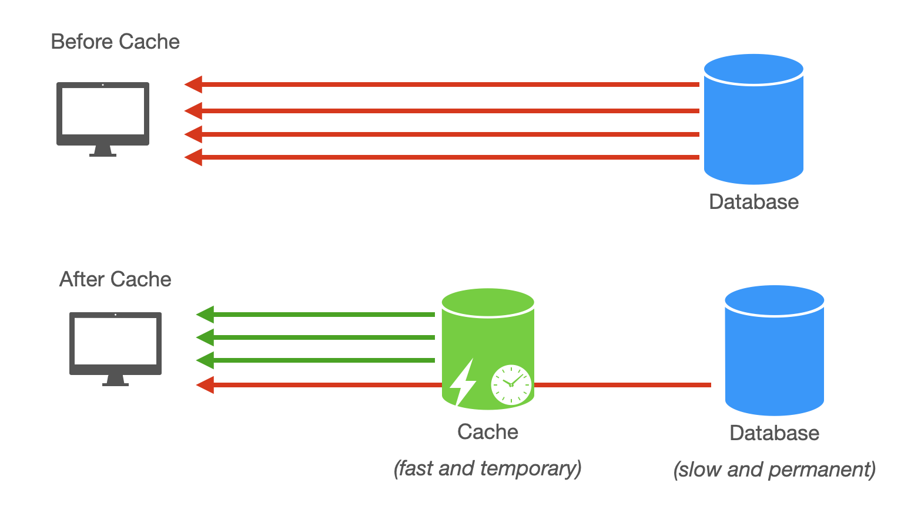

# Cache

 user loads their profile page. The database query takes 50ms. Two seconds later, another user loads the same profile. The database runs the identical query again. Millions of users generate millions of duplicate queries. Each query reads from disk. Disk is slow. Memory is 50 times faster. Caching stores frequently accessed data in memory to eliminate redundant disk reads.

## Why Memory Beats Disk
Understanding caching requires understanding storage hierarchy performance. Reading from main memory takes 100 nanoseconds. Reading from disk takes 8,000,000 nanoseconds for a seek plus 20,000,000 nanoseconds to read 1MB sequentially. Memory is more than 50 times faster than disk for typical database operations.

In computer architecture, L1 (Level 1) and L2 (Level 2) are levels of CPU Cache—ultra-fast, small memory banks built directly into or very near the processor. They exist because main memory (RAM) is too slow to keep up with the blistering speed of a modern CPU
### CPU Cache Hierarchy: L1 vs. L2

In computer architecture, the hierarchy is designed to bridge the massive speed gap between the CPU and Main Memory (RAM).

| Feature | L1 Cache (Level 1) | L2 Cache (Level 2) |
| :--- | :--- | :--- |
| **Primary Goal** | **Speed.** Provides data at the same rate as the CPU cycle. | **Capacity.** Acts as a larger buffer between L1 and RAM. |
| **Location** | Integrated directly inside each CPU Core. | Usually on the CPU chip, either per-core or shared. |
| **Latency** | ~0.5 - 1.0 nanoseconds (Fastest). | ~4 - 7 nanoseconds (Mid-speed). |
| **Typical Size** | 32 KB to 128 KB. | 256 KB to 1 MB. |
| **Structure** | Split into **L1i** (Instructions) and **L1d** (Data). | Unified (stores both instructions and data). |

---

### Why the Hierarchy Exists

#### 1. The Speed Gap
If a CPU core is like a chef, **L1** is the cutting board (right in front of them), **L2** is the kitchen counter (a step away), and **RAM** is the grocery store across town. The CPU would spend most of its time waiting if it had to go to the "store" for every single ingredient.

#### 2. Cost vs. Speed Trade-off
* **SRAM (used in L1/L2):** Extremely fast but expensive and physically large (requires 6 transistors per bit).
* **DRAM (used in RAM):** Cheaper and denser but significantly slower.

---

### System Design Implications: "Cache Locality"

In a System Design or high-performance coding interview, understanding L1/L2 is vital for **Data Locality**:

* **Spatial Locality:** When the CPU fetches data, it doesn't just grab 1 byte; it grabs a "Cache Line" (usually 64 bytes). If you use an **Array**, the next items are already in L1/L2 because they were part of that 64-byte block.
* **Temporal Locality:** The CPU assumes that if you used a piece of data once, you will use it again soon, so it keeps it in L1.

---

### Summary for Interviews

1. **L1 is for the "Now":** It holds the instructions currently being executed.
2. **L2 is for the "Soon":** It holds the data likely to be needed in the next few cycles.
3. **Cache Misses:** If the data isn't in L1 or L2, the CPU "stalls" (waits), which kills performance. This is why **sequential access patterns** are preferred over random access patterns (like Linked Lists).

### L1 Cache: The "Immediate" Memory
L1 is the fastest and smallest memory in the entire computer. It is located directly inside each CPU core.

Speed: Operates at the same speed as the CPU core (typically 1–4 clock cycles).

Size: Very small, usually between 32KB to 128KB per core.

Specialization: It is almost always split into two parts:

    L1i (Instruction): Stores the actual code/commands the CPU needs to run.

    L1d (Data): Stores the variables and numbers being used in calculations.

### L2 Cache: The "Mid-Tier" Buffer
L2 is the secondary cache. If the CPU can't find the data in L1 (a "cache miss"), it checks L2.

Speed: Slower than L1 but still significantly faster than RAM (typically 10–15 clock cycles).

Size: Larger than L1, usually ranging from 256KB to 1MB per core.

Role: It acts as a "feeder" for L1, holding data that the CPU might need in the very near future.

###  Why Not Just Have One Big Cache?

You might wonder: "If L1 is so fast, why not make it 16GB and get rid of RAM?"

Physical Distance: For a cache to be fast, it must be physically tiny and close to the execution units. As you make a cache larger, it becomes physically bigger, meaning the signal takes longer to travel—slowing it down.

Cost: Caches are made of SRAM (Static RAM), which uses about 6 transistors per bit. RAM is made of DRAM (Dynamic RAM), which uses 1 transistor. SRAM is incredibly expensive and takes up massive space on the silicon chip.

### Memory Hierarchy Comparison Table

| Feature | L1 Cache | L2 Cache | RAM (DRAM) |
| :--- | :--- | :--- | :--- |
| **Location** | Inside the Core | On the CPU Die | Separate Module (DIMM) |
| **Latency** | ~0.5 - 1 nanosecond | ~4 - 7 nanoseconds | ~60 - 100+ nanoseconds |
| **Typical Size** | 64 KB | 512 KB - 1 MB | 8 GB - 64 GB |
| **Priority** | **Highest** (Check first) | **Middle** (Check second) | **Last Resort** (Check last) |

---

### Contextualizing the Speed Gap

To understand why this hierarchy matters in System Design, visualize the "distance" the CPU has to travel to get data. If 1 CPU cycle were 1 second:

* **L1 Cache:** Like reaching for a tool on your **desk** (1–4 seconds).
* **L2 Cache:** Like walking to a **bookshelf** in the same room (10–15 seconds).
* **RAM:** Like walking to a **warehouse** in a different city (4–8 minutes).

### Technical Note: The "Stall"
When a CPU experiences a "Cache Miss" (data is not in L1 or L2) and has to go to RAM, it effectively sits idle for hundreds of cycles. This is called a **Pipeline Stall**. In high-performance systems, we optimize code for **Data Locality** specifically to avoid these stalls.

Caching improves query response time dramatically. Reading from memory delivers results in microseconds instead of milliseconds. Users see faster page loads and quicker interactions. The difference between 10ms and 100ms response time compounds across every query in a page load.

Caching relieves pressure on the database. Read-write separation distributes read load across replicas, but caching eliminates many reads entirely. Reducing read requests from web servers to the database means the database can support more web servers. A database handling 5,000 queries per second might struggle to scale further. A cache handling 95% of reads drops database load to 250 queries per second, allowing 10x more web servers.

Caching increases system capacity. Web servers retrieve data from fast cache memory instead of waiting on disk I/O. This allows each server to handle more concurrent requests. The same hardware serves more users when the bottleneck shifts from disk to memory.

## Caching Beyond Memory
Caching applies at multiple levels. This article focuses on in-memory caching for web services, but the concept appears throughout systems.

Browser caching stores static assets like images, CSS, and JavaScript files on the user's device. The browser caches these files based on HTTP headers sent by the server. Subsequent page loads skip downloading unchanged files, improving load times without hitting the server.

Content Delivery Networks cache content geographically close to users. A CDN like Cloudflare or Akamai stores copies of static assets on servers worldwide. A user in Tokyo fetches images from a Tokyo data center instead of a server in Virginia. This reduces latency from 150ms to 10ms. CDNs work best for static assets and large files like videos that change infrequently.

In-memory caching for web services uses systems like Redis or Memcached. This is the focus for system design interviews and the remainder of this article.

## Caching Challenges
Phil Karlton famously said there are only two hard things in computer science: cache invalidation and naming things. Cache consistency is the core challenge. When data updates in the database, the cached copy becomes stale. Multiple users accessing the same data might see different versions. One user updates a product price. Another user still sees the old price from cache. Without proper invalidation, stale data persists indefinitely.

Expiry and eviction require careful tuning. Caches operate in limited memory. You must decide when items expire to prevent serving stale data. You must choose an eviction strategy for when cache fills up. Should the system remove the least recently used items? The least frequently used? Items closest to expiry? Each strategy has trade-offs.

Fault tolerance matters because cache failures lose data. Caches live in memory. A server crash wipes the cache. The system must fall back to the database when cache fails. This increases latency and database load until the cache rebuilds. The system must handle this gracefully without cascading failures.

## Caching Patterns Overview
The following articles explore specific patterns for addressing these challenges.

 Reading patterns determine how data enters the cache. Cache-aside loads data on demand when a cache miss occurs. Read-through makes the cache responsible for fetching from the database.

Writing patterns determine when updates reach the cache. Write-through updates cache and database simultaneously. Write-back writes to cache first and persists to database later. Write-around bypasses cache and writes directly to the database.

Eviction patterns decide what gets removed when cache fills. Least Recently Used discards items not accessed recently. Time-to-live removes items after a fixed duration. Choosing the right pattern depends on your access patterns and consistency requirements.

