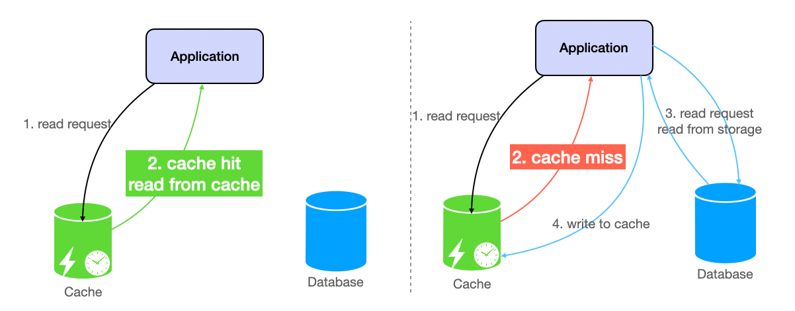
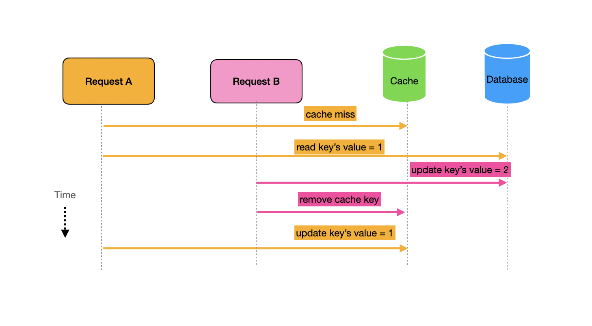
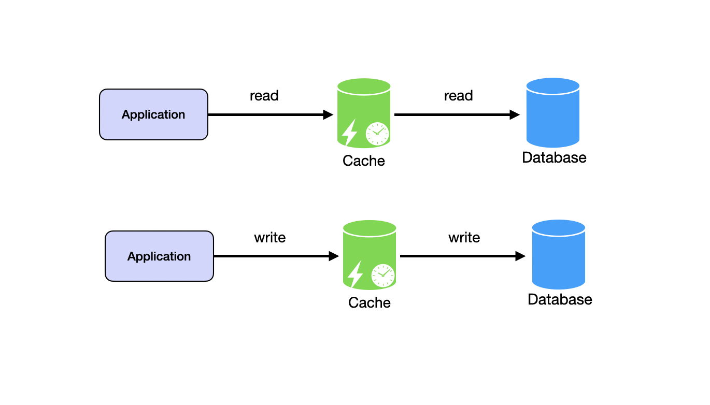
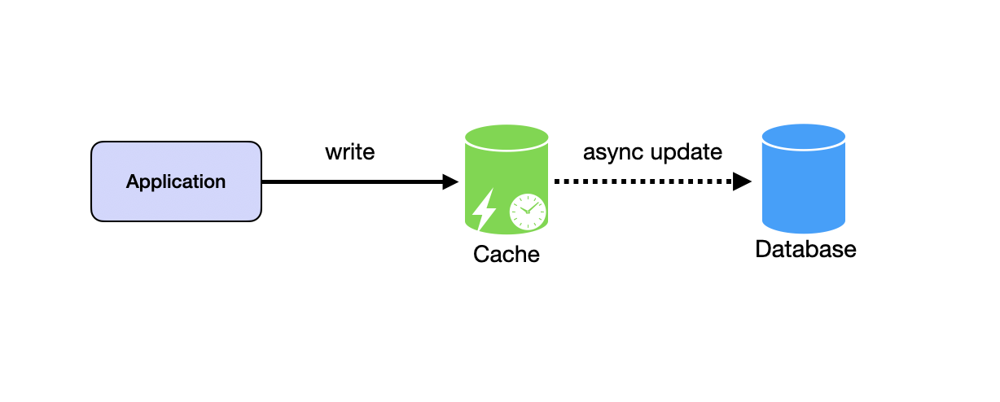

# Cache

 

 
## Side-Cache (Cache-Aside)
Side-cache, also called cache-aside or lazy loading, makes the application responsible for cache management. The cache sits alongside the database without actively managing data. The application checks the cache first, reads from the database on cache miss, and updates the cache with the result.

On read, the application checks the cache for the key. If the key exists, return the value. If the key does not exist, read from the database, store the result in cache, and return the value. This is lazy loading. Data enters the cache only when requested.

On write, the application updates the database and removes the corresponding key from cache. The next read will fetch fresh data from the database and populate the cache. This is cache invalidation.

Inconsistency can occur with concurrent operations. A read request experiences a cache miss and starts fetching from the database. Before it finishes, a write request updates the database and invalidates the cache. The read completes and writes stale data to cache. The cache now contains outdated data that persists until the next write or eviction.

Side-cache works best for read-heavy workloads with infrequent writes. Each write invalidates the cache. Frequent writes cause constant cache misses and reduce effectiveness. The pattern is simple to implement and widely used with Redis and Memcached.
 
   
  
  
  ## Read-Through and Write-Through

An application updates a user profile in the database. Another request reads the profile from cache before the cache invalidates. The user sees stale data. Cache-aside requires the application to handle cache misses and race conditions that cause inconsistent state.

Read-through and write-through caching solve this problem by making the cache responsible for database interaction. The application interacts only with the cache. The cache handles all database operations. Because read-through and write-through often work together, we call them read-write-through caches.

Read-Write-through caching is a caching pattern where data is written to the cache and the primary data source (e.g., a database) simultaneously. In this pattern, when new data is created or existing data is updated, the cache is updated in parallel with the primary data source to ensure consistency between the cache and the primary data source.

  Read-through and write-through make the cache responsible for database interaction. The application talks only to the cache. The cache retrieves data from the database on cache miss. The cache writes data to the database when the application updates.

  
 On read, the application requests data from the cache. If the data exists in cache, return it. If not, the cache fetches from the database, stores the result, and returns it. The application does not know whether data came from cache or database.

On write, the application writes to the cache. The cache synchronously updates the database. Only after the database confirms the write does the cache confirm success to the application. This ensures cache and database stay consistent.

This pattern simplifies application logic. The application sees a single data source. The cache handles all database interaction. This works well when read and write patterns are similar. If writes greatly exceed reads, every write goes to cache unnecessarily. The cache fills with write-once data that never gets read.

AWS DAX (DynamoDB Accelerator) implements this pattern for DynamoDB. 

### How It Works

Read-->In a read-through cache, the application requests data from the cache. If the data is not in the cache, the cache retrieves it from the database and returns it to the application.

Write-->The client sends a write request to the cache. The cache stores the data and simultaneously writes to the database. The write operation is not complete until both the cache and database have been successfully updated. Once the cache confirms the database update, it returns a success response to the client.

Cache misses can still occur with this pattern. The difference is that the cache queries the database on miss rather than the client handling it as in cache-aside.

### Trade-offs
Write-through ensures stronger consistency between cache and database. The cache updates in tandem with the database, reducing the chance of serving stale data. Both systems stay synchronized on every write.

Write performance is slower than other caching strategies. Writes must complete on both cache and database before returning success. This synchronous operation adds latency compared to cache-aside where writes only touch the database.

### Use Cases
Financial transaction systems require consistency across all systems. A banking application processes account transfers. Account balances update in cache and database simultaneously. Both systems reflect the new balance immediately. Users see consistent data whether they query cache or database.

Inventory management in retail tracks levels that change frequently. An e-commerce platform processes thousands of orders per minute. Inventory counts update in cache and database on each transaction. This prevents overselling. When a product sells out, all subsequent requests see zero inventory immediately.

Write-through fits these cases because strong consistency is required. Immediate synchronization prevents serving stale data. Fast reads from cache still benefit performance without hitting the database constantly. The small delay in write performance is acceptable to avoid the risk of data inconsistency.

### Comparison: Cache-aside vs. Write-through Caching

| Attribute | Cache-aside (Lazy Loading) | Write-through |
| :--- | :--- | :--- |
| **Data Loading** | Data is loaded into the cache only when requested and not found (cache miss). | Data is written to both the cache and the primary data source simultaneously. |
| **Data Consistency** | Harder to maintain. The cache can become stale if the database is updated directly. | **Strong.** Ensures the cache and database are always in sync after a write. |
| **Write Performance** | **Fast.** Writes only hit the database. The cache is typically just invalidated (deleted). | **Slower.** Every write must wait for both the cache AND the database to confirm. |
| **Read Performance** | Potential "Cache Miss" penalty for the first person to request new data. | **Very Fast.** Data is already "warmed" in the cache immediately after it's created. |
| **Stale Data** | Higher risk. Usually solved by setting a **Time-To-Live (TTL)**. | Minimal risk. The cache is updated in tandem with the primary data source. |
| **Space Utilization** | **Efficient.** Only frequently requested data stays in the cache. | **Less efficient.** Stores all written data, even if it is never read again. |

---

### Visualizing the Workflow

#### 1. When to use Cache-aside
This is the most common general-purpose strategy. Use it for **Read-heavy** workloads where you can tolerate some data staleness (e.g., User profiles, Product catalogs). It is resilient; if the cache fails, the app still works by going to the DB.

#### 2. When to use Write-through
Use this when **Data Integrity** is non-negotiable (e.g., Banking balances, Inventory counts). Because it populates the cache during the write, the very first read is always a hit, but you pay for this with higher latency on every `PUT` or `POST` request.

---

### Pro-Tip for the Interview
"In a real-world high-scale system, **Write-through** is often paired with **Read-through**. This creates a 'Unified Data Access Layer' where the application code doesn't even know the database exists—it only talks to the Cache API."
  
   

## Write-Back (Write-Behind)
Write-back improves write performance by making database writes asynchronous. The application writes to cache. The cache acknowledges immediately. The cache queues the data and syncs to the database later in the background.

This is faster than write-through because the application does not wait for database confirmation. But it introduces eventual consistency. The cache and database are temporarily out of sync. If the cache crashes before syncing, queued writes are lost.

Write-back works for high-performance write-heavy workloads where occasional data loss is acceptable. Session data, clickstream analytics, and metrics collection can tolerate some loss. Financial transactions and user-generated content cannot.

Redis can implement write-back with custom application logic that batches writes to the database periodically or on flush.

### How It Works
Read-->Reads are handled similar to read-through cache where the client is not typically aware of where the data ultimately resides; it just issues a read and receives the requested item.

Write-->When the application issues a write, the item is initially stored in the cache. The cache acknowledges the write immediately and returns a success response to the application. The data has not yet been stored in the database.

Behind the scenes, the cache executes a background process that periodically flushes writes from in-memory cache to the database. This might run on a schedule or when certain conditions are met like exceeding a memory threshold or after a specified delay. Once the data is successfully written to the database, the cache completes the write-back cycle.

### Trade-offs
Write-back improves write performance dramatically. Writes are acknowledged as soon as they hit the cache. The application does not wait for the database to confirm the write. This reduces write latency and significantly improves overall system throughput for write-heavy workloads.

Systems handling large volumes of writes benefit from asynchronous flushing. During high write periods, the cache handles writes and flushes to the database later. This prevents database overload during traffic spikes.

The risk of data loss is significant. The cache acknowledges writes before persisting to the database. This creates a window of vulnerability. A sudden cache failure, node crash, or data corruption results in loss of uncommitted data. Increasing cache replicas mitigates this risk but also increases complexity and cost.

### When to Use Write-back Caching
Write-back caching is a good fit for systems that have a high volume of writes and can tolerate some level of temporal data inconsistency.

### Choosing a Pattern
Match patterns to your workload requirements. Side-cache works for read-heavy systems where simplicity matters. The application controls cache behavior explicitly. Read-through and write-through simplify application code and maintain consistency at the cost of synchronous writes. Write-back maximizes write performance but accepts eventual consistency and potential data loss.

Consider consistency needs. Side-cache can serve stale data during race conditions. Write-through maintains strict consistency. Write-back accepts temporary inconsistency. Consider performance needs. Side-cache and read-through optimize reads. Write-back optimizes writes. Write-through balances both but is slower on writes.

Most systems use side-cache for its simplicity and flexibility. Add write-through for critical data requiring consistency. Use write-back only when write performance is critical and you can tolerate data loss.

### Advanced Caching Strategies: Side, Through, and Back

Choosing a caching strategy involves balancing **latency**, **consistency**, and **system load**. 

| Characteristic | Cache-Aside (Lazy Load) | Read-Write-Through | Write-Behind (Write-Back) |
| :--- | :--- | :--- | :--- |
| **Primary Use Cases** | Common for read-heavy workloads; simple integration. | Read-heavy workloads where **strong consistency** is critical. | **Write-heavy** workloads; reducing write latency and DB load. |
| **Mechanism** | App checks cache; if miss, reads from DB and populates cache. | Cache is queried first; if miss, cache retrieves from DB. Writes update both simultaneously. | Writes hit cache and are acknowledged; then asynchronously flushed to DB. |
| **Consistency** | App-managed; data can become stale without regular updates. | **Strong consistency**; cache and DB stay in sync during writes. | **Eventual consistency**; cache is "ahead" of the DB until flushed. |
| **Write Latency** | Higher; writes go directly to the DB. | Slightly increased; updates both cache and DB synchronously. | **Lowest**; acknowledged immediately upon hitting the cache. |
| **Data Loss Risk** | Low; writes always hit the persistent store. | Low; writes are persisted synchronously. | **Higher**; if cache fails before flushing, data is lost. |
| **Complexity** | Lower; simple application logic. | Moderate; requires a cache layer that manages DB logic. | Higher; requires design for flushes and failure recovery. |
| **System Load** | Potential spikes on cache misses and direct writes. | Steady load; synchronized fetches and updates. | **Reduced/Batched**; multiple writes can be coalesced. |

---

### Visualizing the Data Flow

#### 1. Cache-Aside (Lazy Loading)
The most resilient pattern. If the cache dies, the system remains functional (though slower). It is "Lazy" because data only enters the cache when someone actually asks for it.

#### 2. Read-Write-Through
Ideal for simplifying application code. The application treats the cache as the "Main" data store, and the cache controller handles the DB. This ensures that the cache is never "empty" or "stale" for frequently updated items.

#### 3. Write-Behind (Write-Back)
This is how high-performance databases and file systems work. By "coalescing" writes (combining five updates to the same row into one single DB write), you drastically reduce the Input/Output Operations Per Second (IOPS) on your database.

---

### Quick Summary for Interviews

* **Cache-Aside:** Simple and effective for read-heavy workloads with infrequent writes.
* **Read-Write-Through:** Ideal for applications prioritizing **consistency** and implementation simplicity.
* **Write-Back:** Best for **high-performance**, write-heavy workloads where eventual consistency is acceptable.