# Notes

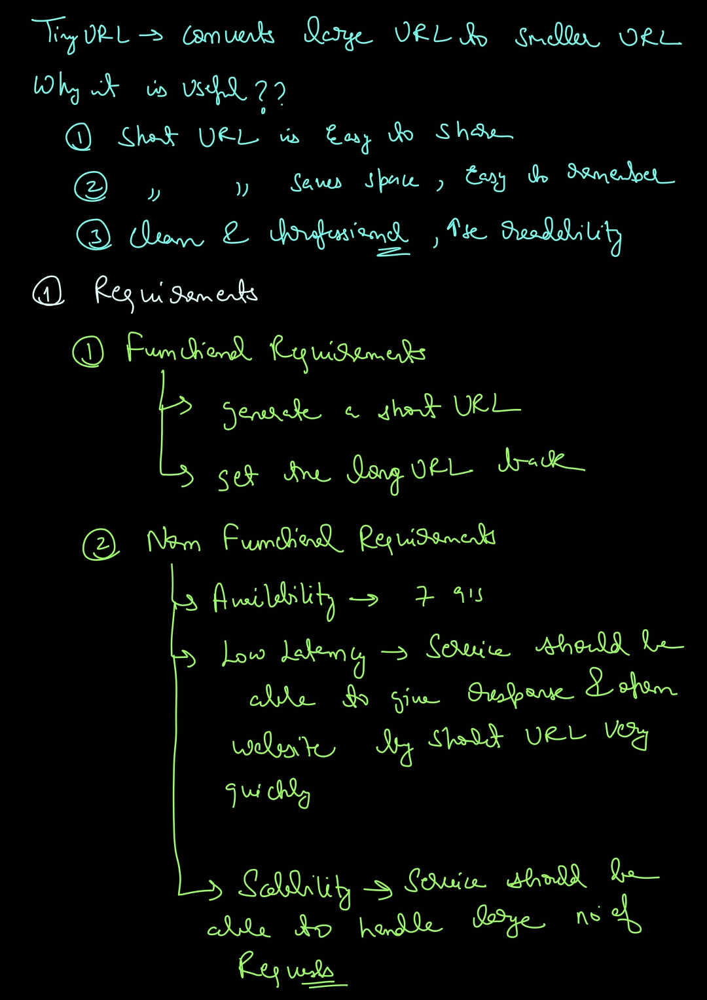

## Non-Functional Requirements
We extract adjectives and descriptive phrases from the problem statement to identify quality constraints:

- "unique" alias → System must guarantee no collisions
- "millions of URLs" + "high traffic" → System must handle large scale
- "efficiently" + "near real-time" → System must respond quickly
- "persistent" → System must not lose data
- "handle high traffic" → System must remain operational under load

Each adjective becomes a non-functional requirement that constrains our design choices.

- High Availability: The service should ensure that all URLs are accessible 24/7, with minimal downtime, so users can reliably reach their destinations. (Derived from 'high traffic')
- Low Latency: URL redirections should occur almost instantly, ideally in under a few milliseconds, to provide a seamless experience for users. (Derived from 'near real-time' and 'efficiently')
- High Durability: Shortened URLs should be stored reliably so they persist over time, even across server failures, ensuring long-term accessibility. (Derived from 'persistent')
- Uniqueness: Each shortened URL must map to exactly one original URL across all users. (Derived from 'unique')
- Security: The service must prevent malicious links from being created and protect user data, implementing safeguards against spam, abuse, and unauthorized access to sensitive information.

## Out of Scope

- Authentication and Authorization for users (e.g., who can create URLs or access certain analytics).
- Expiration or deletion of URLs by users.
- Advanced analytics beyond click counts (e.g., geographic tracking or device types).

 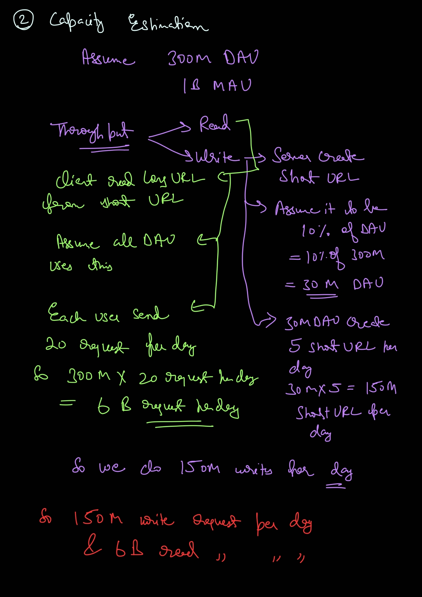 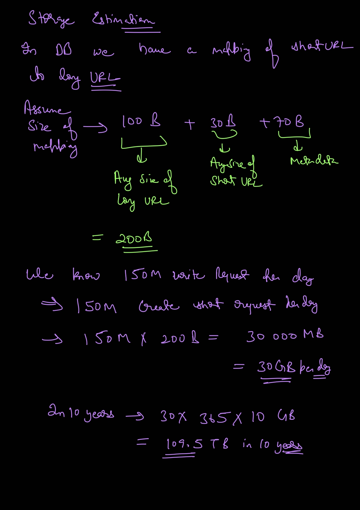 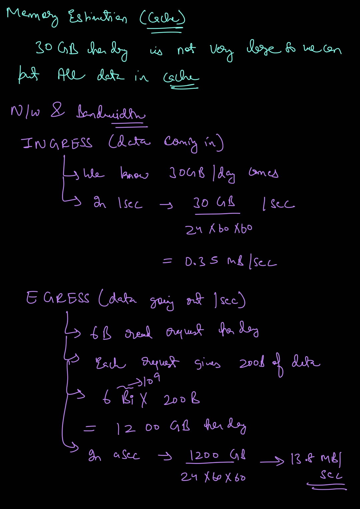 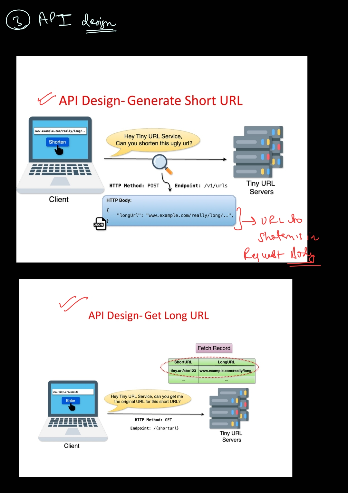 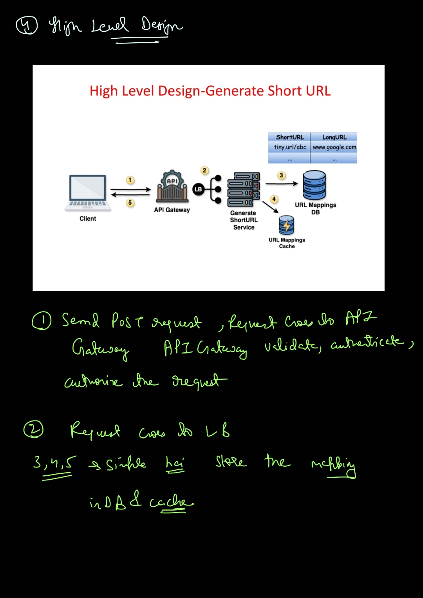 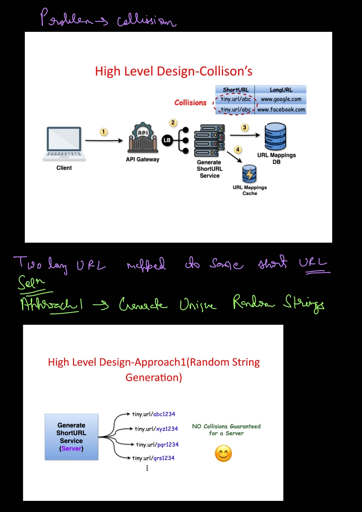 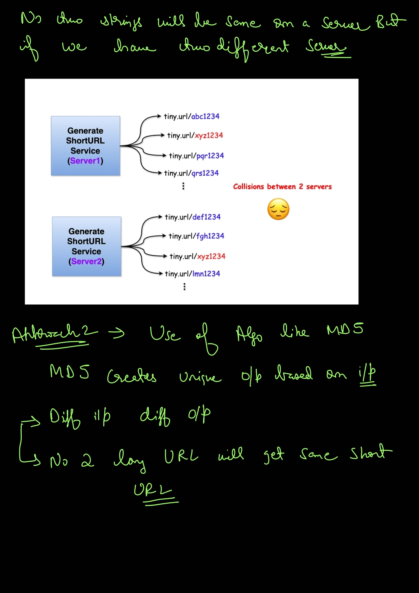 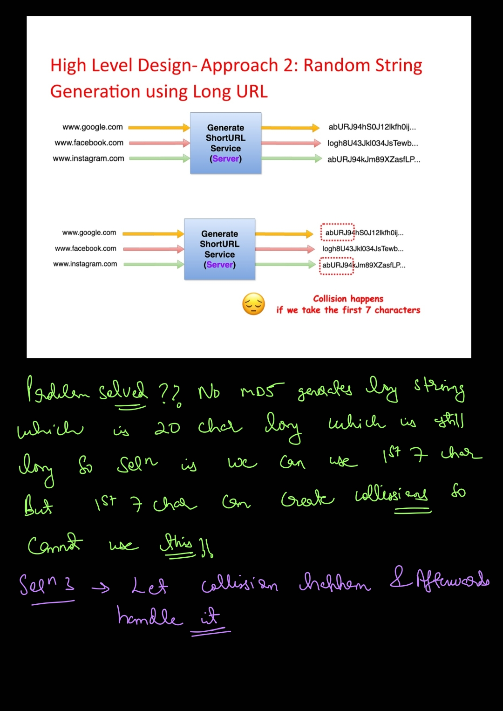 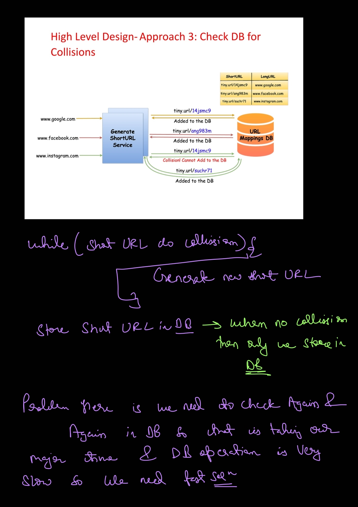 
 
 ### Apache ZooKeeper: The Distributed Coordinator

**Apache ZooKeeper** is a centralized service for maintaining configuration information, naming, providing distributed synchronization, and group services. In a distributed system, it acts as the "Source of Truth" to keep all nodes in sync.

---

### 1. Key Features & Functions

| Feature | Description |
| :--- | :--- |
| **Leader Election** | Automatically elects a "Master" node. If the leader fails, ZooKeeper detects it and coordinates the election of a new one. |
| **Configuration Mgmt** | Centralized storage for config files. Updates are "pushed" to all nodes in real-time. |
| **Service Discovery** | Acts as a registry where services can register their IP/Port so other services can find them. |
| **Distributed Locking** | Provides primitives to implement "Locks" so two nodes don't modify the same resource at once. |
| **Health Monitoring** | Uses heartbeats to track which servers are alive. If a heartbeat stops, the node is marked as "Dead." |

---

### 2. The Data Model: ZNodes
ZooKeeper stores data in a hierarchical tree structure (like a file system). Each "folder" or "file" is called a **ZNode**.

* **Persistent ZNodes:** Stay in the system until explicitly deleted (used for config data).
* **Ephemeral ZNodes:** Automatically deleted when the client that created them disconnects (used for leader election and health checks).
* **Sequential ZNodes:** ZooKeeper automatically appends a 10-digit sequence number to the name (used for ordering tasks).

---

### 3. How Leader Election Works (The Logic)
1. Every node tries to create an **Ephemeral Sequential ZNode** in a folder called `/election`.
2. ZooKeeper assigns each node a unique sequence number (e.g., `node-001`, `node-002`).
3. The node with the **smallest sequence number** becomes the **Leader**.
4. All other nodes "Watch" the znode immediately before them. If `node-001` disappears, `node-002` becomes the new leader.

---

### 4. Comparison: ZooKeeper vs. Alternatives

| Aspect | ZooKeeper | etcd (Kubernetes) | KRaft (New Kafka) |
| :--- | :--- | :--- | :--- |
| **Maturity** | Very Mature (Battle-tested) | Modern / Cloud-native | New (Internal to Kafka) |
| **Language** | Java | Go | Java/Scala |
| **Complexity** | High (Requires "Ensemble") | Lightweight | Integrated (No extra servers) |
| **Protocol** | ZAB (Zookeeper Atomic Broadcast) | Raft | Raft |

---

### 5. Why is it "Fast"?
ZooKeeper is optimized for **Read-heavy** workloads. 
* It keeps all its data in **RAM** (In-Memory).
* Write operations are slower because they require a "Quorum" (majority agreement) between ZooKeeper servers before they are finalized.
 
 
 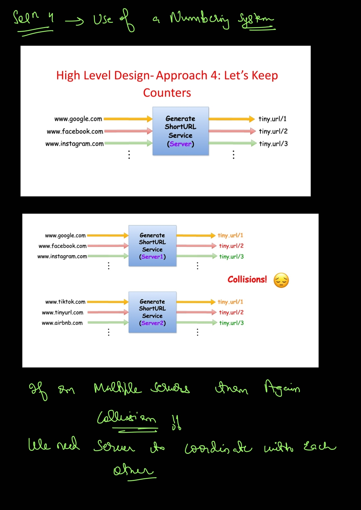 
 
 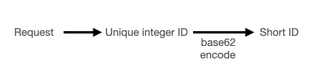

## What are the two properties we need for the IDs?
Mid-Level
The two properties we need for the IDs are:

- Global Uniqueness: It has to be globally unique across our system. We obviously do not want two long URLs to map the same the short URL.
- Shortness: It has to be "short". This is a relative concept. The URL shorteners used in production are around 5-8 characters long. For example, https://shorturl.at/xLMPr, https://t.ly/ecgGp and https://tinyurl.com/e9enh3uz.

The basic idea behind URL generation involves creating a unique integer ID for each URL, followed by encoding that ID into a shorter, human-readable format. Let's discuss each one in detail.

 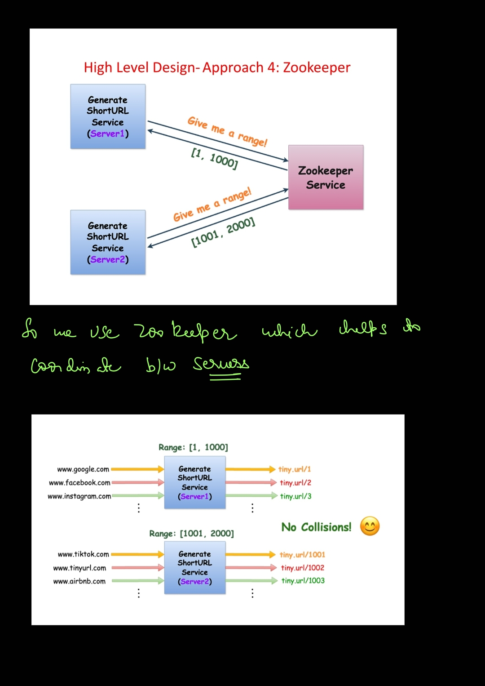 
 
 ## How can we generate unique IDs for each URL?

There are several options for generating unique integer IDs:

Note that when we say "integer" in programming and computer science, we typically mean a whole number that can be represented in different number systems. For example, 123456 in decimal is 123456 in decimal, 123456 in hexadecimal is 0x1e240, and 123456 in binary is 0b1111000100100000.

##  Machine ID + Sequence Number (Chosen Solution)

Method: Uses a Machine (or Shard) ID and an incrementing sequence number. Each machine is assigned a unique prefix (Machine ID), and it increments its sequence number for each URL generated.

Example: If Machine ID is A1 and Sequence Number is 0001, the ID could be A10001.

Benefits: We can control the length by adjusting the size of the Machine ID and sequence number, allowing us to scale by adding more shards (machines) with unique prefixes. This ensures unique IDs without long, complex strings.

>Note:ZooKeeper is the standard tool used to implement this exact solution in distributed systems.

In a URL shortener (like Bitly or TinyURL), you cannot have two machines using the same "Machine ID," and you certainly don't want two machines generating the same "Sequence Number." ZooKeeper acts as the central coordinator to ensure these remain unique.

### How ZooKeeper helps with Machine IDs
When you have a cluster of 100 servers generating URLs, each server needs a unique "Machine ID" (e.g., 0 to 99) to avoid collisions.

1. Dynamic ID Assignment: Instead of hardcoding "Machine 1" into a config file, a new server starts up and asks ZooKeeper: "What is the next available ID?"

2. Ephemeral Sequential ZNodes: The server creates an Ephemeral Sequential ZNode (e.g., /nodes/id-).

3. Result: If ZooKeeper creates /nodes/id-0000000042, the server knows its unique Machine ID is 42. If that server crashes, the node disappears, and ID 42 can be reused by a new replacement server.

### How ZooKeeper helps with Sequence Numbers (Range Allocation)
Incrementing a database for every single URL is too slow. To keep latency low, we use ZooKeeper to manage Range Allocation (also called the "Token Bucket" or "Range-Based" approach).

- Range Reservation: A machine contacts ZooKeeper and "reserves" a block of IDs (e.g., 1,000 to 2,000).

- Local Incrementing: The machine stores this range in its local RAM. For the next 1,000 URLs, it just increments a local counter ($1001, 1002...$). This is incredibly fast (sub-millisecond).

- Renewal: Once the machine hits 2,000, it goes back to ZooKeeper to ask for the next available range ($2,001$ to $3,000$).

### Why this is the "Chosen Solution" for Interviews
In a System Design interview, this is the most balanced approach because:

- No Single Point of Failure: Even if ZooKeeper goes down for a minute, the machines can still generate IDs using their currently reserved local ranges.

- High Performance: Most "work" (incrementing) happens in the server's RAM, not over the network.

- Scalability: To handle more traffic, you just add more machines. ZooKeeper will automatically give them new Machine IDs and Ranges.

 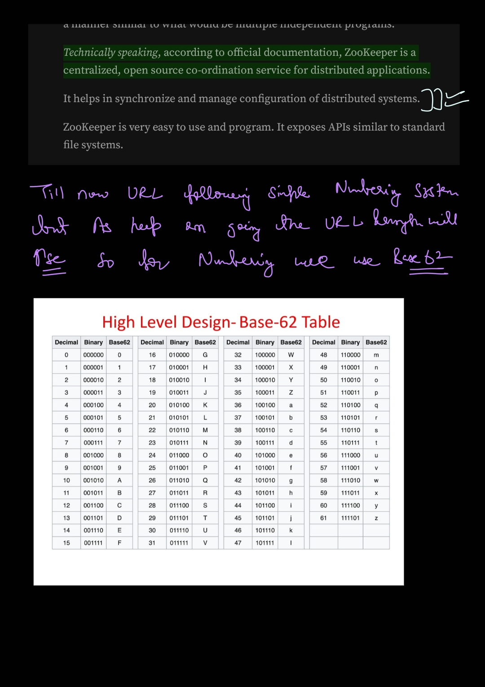 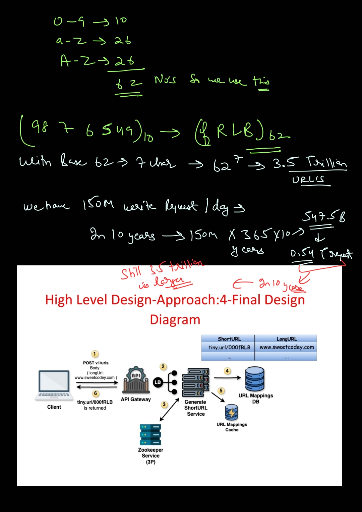 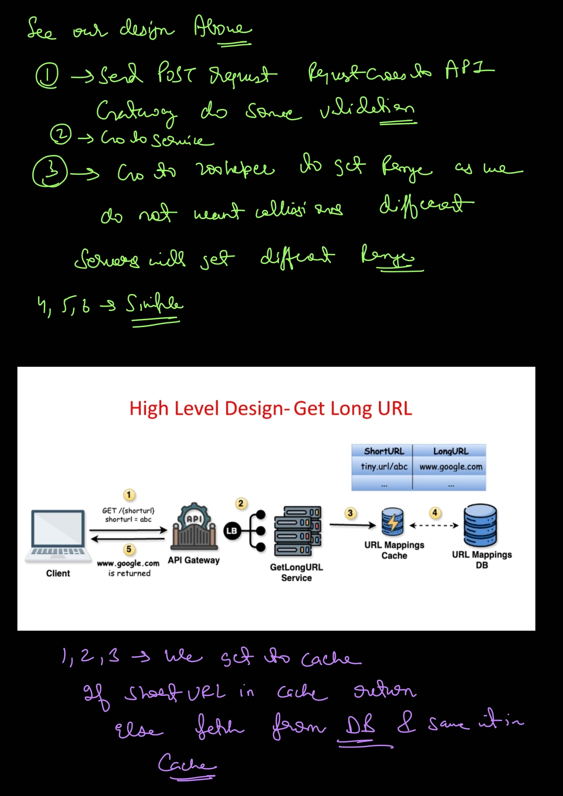 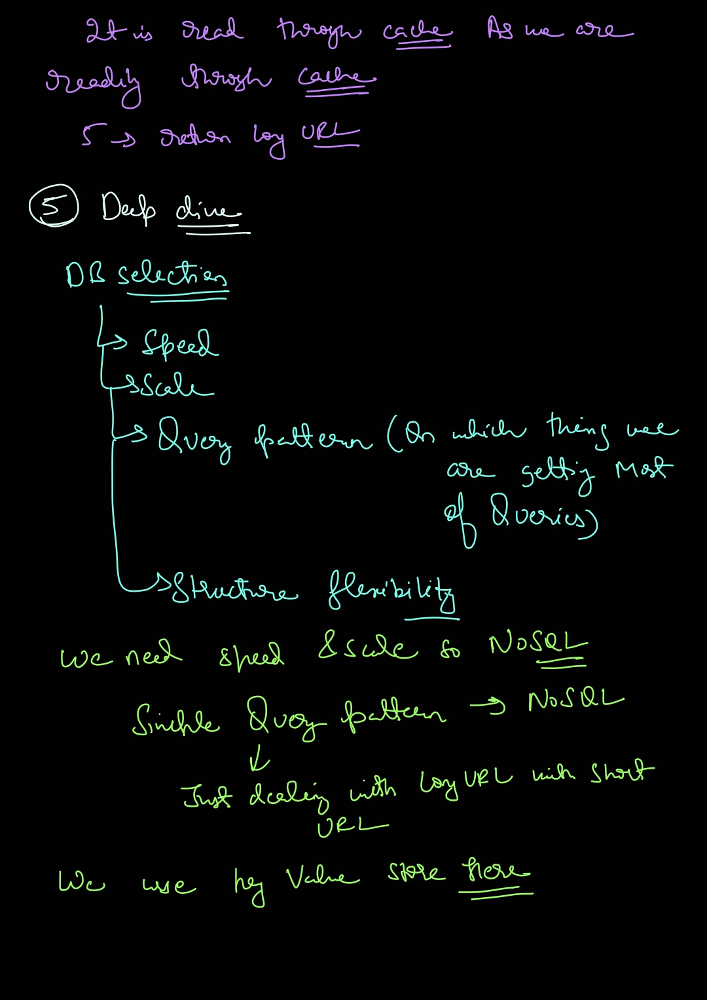 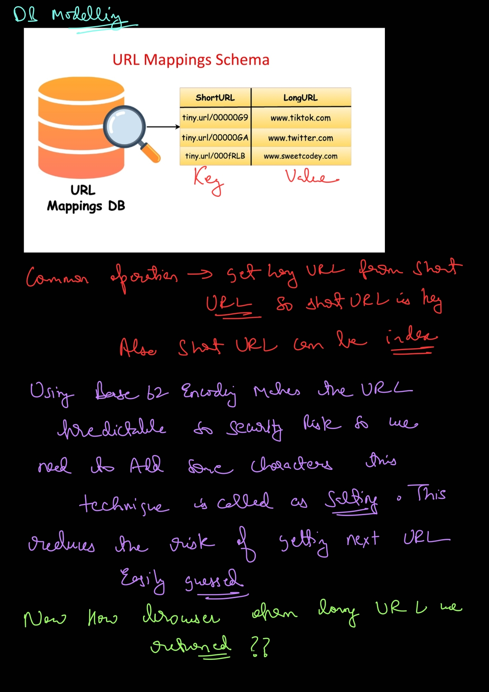 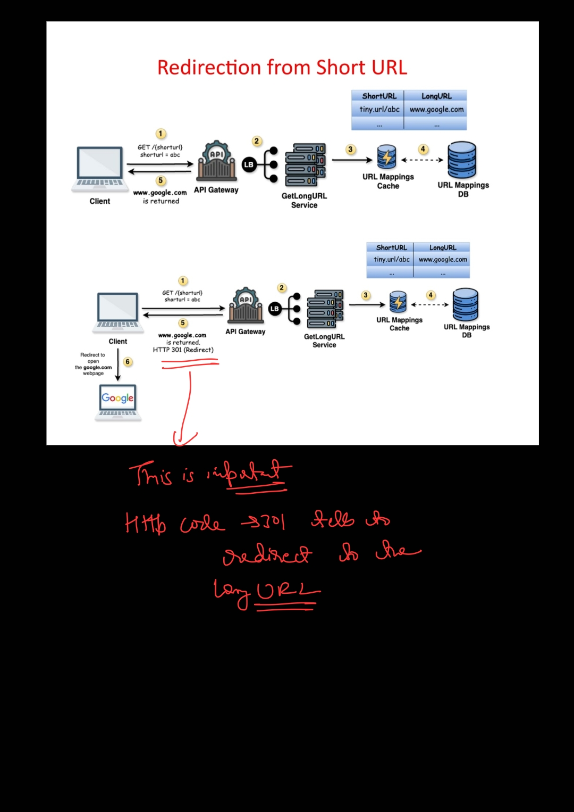

 ## Alaytics also added then 

  Link Analytics
The system should be able to track the number of times each shortened URL is accessed to provide insights into link usage.

To track the number of accesses for each shortened URL, we introduce an Analytics Service that counts and stores access events in real time. This setup provides useful insights into link usage patterns and is designed to scale for high traffic.

1. API Gateway: Routes GET requests to both the URL Redirection Handler (for redirection) and the Analytics Service (for tracking access).

2. Analytics Service: Tracks each URL access by incrementing a counter associated with the short URL. This service logs access events and can be optimized by using a lightweight in-memory counter before periodically updating the database.

3. In-Memory Database: For high-speed access counting, we use an in-memory data store like Redis to cache the counters for each short URL. This enables real-time tracking and reduces the load on the main database.

4. Database: Periodically, the Analytics Service flushes the in-memory counters to the main database to ensure persistent storage of access counts.

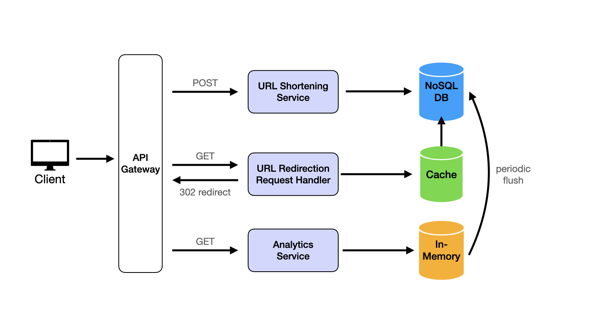

This architecture enables efficient, real-time analytics collection, combining the speed of in-memory storage with the durability of a database.

## How can we scale the system to handle high traffic?

To support high traffic and ensure scalability, we implement a sharding strategy that distributes data and load across multiple machines. Sharding allows us to scale horizontally, so as traffic increases, we can add more machines without reconfiguring the entire system.

### Scaling with Sharding
With ID generation in place, the next step is to scale the system. Request handlers can be easily scaled as they function as independent HTTP servers. However, scaling the ID generator requires a bit more consideration.

### Machine ID (Prefix) as Shard Key
To horizontally scale the system, we need to shard the service. We already have a solution from the previous section: using 1 character for the machine ID. This "prefix" serves as the shard key for our ID Generator service. By sharding the database and ID Generator using the same shard key, each machine corresponds to exactly one database shard. This is a common design pattern. The approach ensures that write paths are completely independent and concurrent so we can scale the entire system by adding more servers without affecting existing ones.

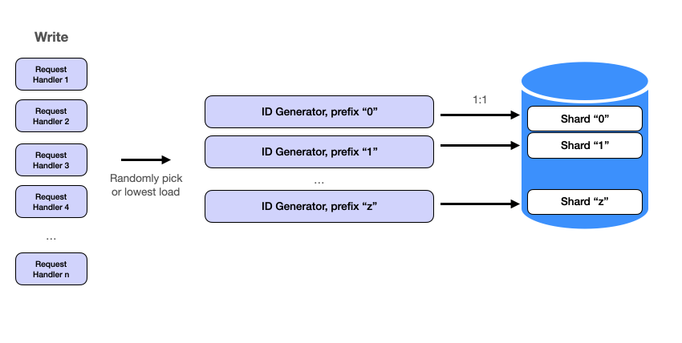

The primary benefits of this approach:

Scalability: Adding more machines to the system is straightforward. Each new machine is assigned a unique prefix, allowing it to generate IDs and write to its own shard without impacting the existing setup. This allows the system to handle increased load seamlessly.

Concurrency: Independent write paths mean that multiple machines can perform write operations simultaneously without conflicting with each other. This parallelism enhances the system's overall throughput and efficiency.

Additionally, we also get some nice side benefits.

Isolation: Each machine and its corresponding database shard operate independently, minimizing the risk of system-wide failures. If one machine or shard encounters an issue, it does not affect the others, ensuring higher system reliability.

Simplicity in Data Management: With each machine handling a distinct shard, data management becomes simpler. Maintenance tasks such as backups, indexing, and scaling can be performed on individual shards without disrupting the entire system.

For the read request, if there is a cache miss, we can use the prefix in the short url to find the proper database shard to find the data. For example, if the short url is a82c7w, the request handler would go to shard a to find the long url. We could go even further to shard the cache using the same shard key if it becomes necessary

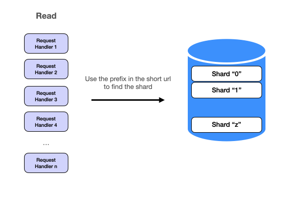

## Scaling Request Handlers and ID Generator Independently
One question you may ask is why not make request handlers and ID generators 1:1 as well?

In general, the Request Handlers would likely need more machines compared to the URL Generation Service. This is due to the nature of their roles and the specific workloads they handle.

Request Handler Load:

- Primarily I/O bound (handling HTTP requests, checking cache, holding open sockets).
- May require more instances to handle high concurrency and low latency.

URL Generation Service Load:

- More CPU and I/O bound (generating IDs, writing to the database).
- May require fewer instances if each instance can handle a higher number of generation tasks efficiently.

In general, the Request Handlers would likely need more machines compared to the URL Generation Service. This is due to the nature of their roles and the specific workloads they handle. This is why we scale them differently. The request handlers can randomly pick an ID Generator machine to evenly distribute the load or pick the one with the lowest load if we want to use the more complex logic.

Database Considerations

- For storage, a database like Cassdra or DynamoDB is ideal, as these databases are designed to support horizontal scaling and partitioning.
- The database schema remains simple, with fields for short_url, original_url, and created_at. The short_url field includes the Machine ID as the shard key, making lookups efficient within each shard.
- Replication and Durability: To ensure data durability and high availability, database replication can be enabled across shards. Each shard can have replicas on different machines, reducing the risk of data loss if a single machine fails.

## What about pre-generate unique IDs in bulk?
One potential issue with the current design of generating IDs on demand is that it could become a bottleneck under high load. we need to generate a unique ID for each new URL as requests come in and save it to the database. The high load could overwhelm the database.

This is where we want to consider pre-generating a batch of IDs periodically or when the system starts up, and then hand them out as needed.

The advantages are:

- This has the advantage of being able to handle a sudden influx of requests.

- We also have lower latency since we don't need to generate an ID from scratch when a request comes in (although this is a small overhead).

The downside is that:

- It's more complex to implement as we need to manage the batch of IDs and ensure that we don't run out and have to generate more IDs when the batch is exhausted. This is extra infrastructure to maintain.

- We could end up generating more IDs than we need which could lead to inefficiencies and wasted resources.

### System Design Interview: URL Shortener Level Comparison

| Dimension | Mid-Level (L4) | Senior (L5) | Staff (L6) |
| :--- | :--- | :--- | :--- |
| **ID Generation** | Explain uniqueness and shortness requirements; suggest one valid approach. | Compare hash vs UUID vs Snowflake vs Machine ID approaches with tradeoffs. | Design ID coordination across regions; handle clock skew and machine failures. |
| **Encoding Strategy** | Explain **Base62 encoding** and calculate ID space ($62^6 \approx 56B$). | Discuss Base16/62/64 tradeoffs; explain why special characters matter in URLs. | Consider encoding implications for analytics, debugging, and URL patterns. |
| **Scaling Strategy** | Understand sharding concept and why it enables horizontal scaling. | Design shard key strategy; explain write path independence and read routing. | Handle shard rebalancing, hot shards, and **consistent hashing** alternatives. |
| **Caching & Performance** | Include cache layer in design; explain **read-through** pattern. | Calculate cache hit ratios; design cache invalidation strategy. | Design multi-tier caching; handle **cache stampede** and **thundering herd**. |

---

### Pro-Tip: Navigating the Levels

#### 1. For the L4 Candidate (Implementation focus)
Focus on the "Happy Path." You should be able to draw a standard architecture and explain why you chose **Base62** (using `[a-z, A-Z, 0-9]` ensures the URL is short and safe for browsers).

#### 2. For the L5 Candidate (Trade-off focus)
Interviewer expects you to weigh options. For example: *"UUIDs are 128-bit and too long for a short URL, while a simple SQL auto-increment creates a single point of failure. Therefore, I'll use a **Range-based ID generator** with ZooKeeper."*

#### 3. For the L6 Candidate (Complexity focus)
You must address "Worst Case" scenarios. How do you prevent a **Cache Stampede** when a famous celebrity tweets a shortened link? (Answer: Use **Jitter** or **Promise/Request Coalescing**). How do you handle a data center going offline? (Answer: Multi-region active-active setup with **Global Server Load Balancing (GSLB)**).

---

