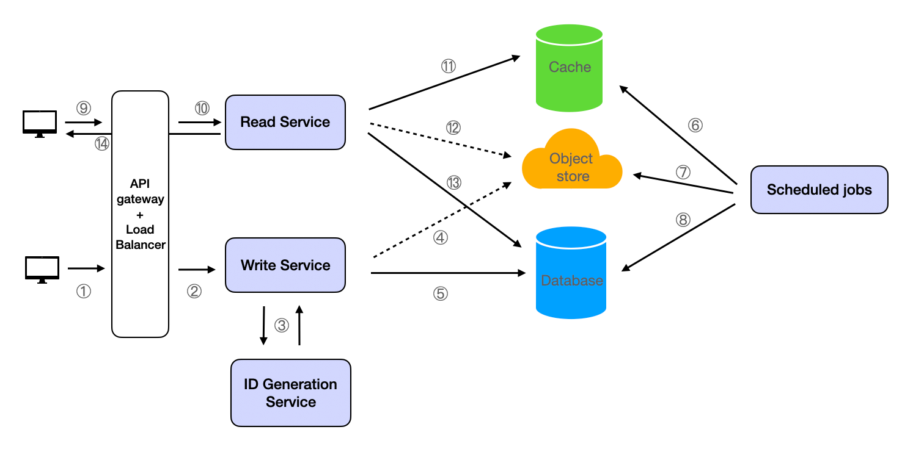
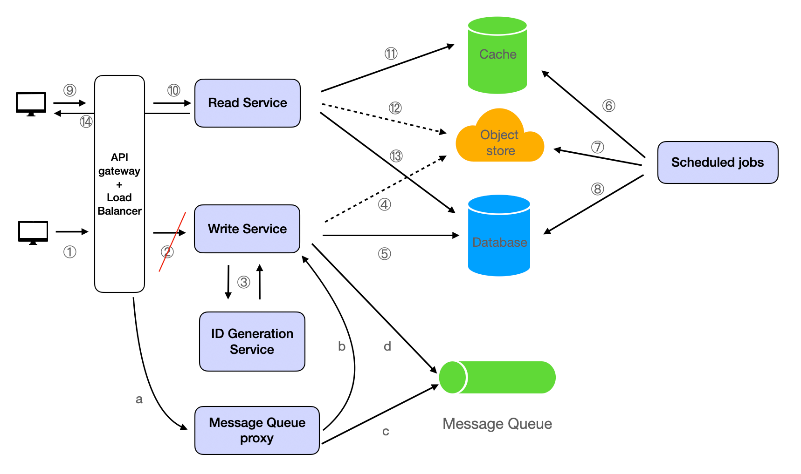

# PasteBin

## Functional Requirements
- Store text: Allows users to input and save text.
- Share text: Enables users to share the stored text with others. The system should generate a unique URL for each piece of stored text, which can be shared with others for viewing.

### Non-Functional Requirements
Scale requirements:

- 1M Daily Active Users
- Read:write ratio = 10:1
- Data retention for 3 months
Other requirements:

- Low latency
- High durability
- Security

## Resource Estimation
Estimating the QPS (Queries per second), we can assume that each user performs 10 read operations and 1 write operation per day. So, there are 10M (1M * 10) read operations and 1M write operations per day. A day has 86400 seconds (24 * 60 * 60). This gives us a read QPS of approximately 116 (10M / 86400) and a write QPS of approximately 12 (1M / 86400).

The storage requirements can be estimated based on the average size of the text data. Assuming an average text size of 10KB, the system would need to store approximately 10GB (1M * 10KB) of data per day. Given the data retention requirement of 3 months, the total storage requirement would be approximately 900GB (90 * 10GB).

## API Endpoint Design
The system would have two main API endpoints:

- POST /paste: This endpoint would accept a text data and return a unique URL for the stored text.Considering the processing capacity of the system and to avoid malicious uploads, it is necessary to impose restrictions, such as limiting the data volume of a single upload to no more than 1MB. Request Body:
```json
{
  "text": "The text to be stored."
}
```
Response:
```json
{
  "status": "success",
  "url": "https://pastebin.example/paste/{id} (The url for the stored text.)"
}
```
or when failing,
```json
{
  "status": "error",
  "message": "Upload failed. The data volume of a single upload should not exceed 1MB."
}
```
- GET /{id}: This endpoint would accept a unique ID and return the corresponding text data.
```json
{
  "status": "success",
  "text": "The stored text."
}
```
## High-Level Design

The system would consist of several components including a load balancer, application servers, a database cluster, a cache layer, and an object store service.



The load balancer would distribute incoming requests to the application servers. The application servers would handle the business logic and interact with the database, object store, and cache. The object store stores the text uploaded by users, while the database is used to store the metadata of the text (generated id, upload time). 

The cache would store frequently accessed data to improve read performance. The Read service will first query from the cache. If it cannot find the result, it will query from the object store and write the queried result into the cache.


### Write Path
The client sends an HTTP request to the POST /paste interface to upload text;

The load balancer distributes the request to a specific server;

The Write service calls the ID Generation service to generate a unique id for the user-uploaded text;

The Write service saves the text to the Object store;

The Write service writes the metadata into the Database;
Scheduled jobs

Regularly query data that has been created for more than 3 months from the database, and then delete it from the database, object store, and cache.

### Read Path
The client sends an HTTP request to the GET /{id} interface;

The load balancer distributes the request to a specific server;

The Read service retrieves the information of {id} from the cache, if it is retrieved, it is returned to the client; when it does not exist in the cache, it queries the metadata from the database, then retrieves the text from the Object store, stores the retrieved data into the Cache and returns the response.


## Detailed Design(Deep Dive)

### Data Store

Database Type

Since there's no need to search the text data uploaded by users, our choice is to save the user-uploaded text to an Object Store (e.g., AWS S3, etc.). The database is solely used to store the text's metadata. Both SQL and NoSQL would be appropriate as there are no complex relationships to store. However, one must consider the capacity to accommodate 1 million new data entries daily. These entries must be stored for 90 days, culminating in a total of 90 million data entries. This is not insignificant in terms of volume. Therefore, a distributed NoSQL database, such as Cassandra, would be a suitable choice for this system.

Data Schema

The data schema would be simple, as follows:
```json
{
  "id": "generated_id",
  "create_time": 1690426397491 // timestamp,
}
```
Use generated_id to name and access on the object store.

### Database Partitioning
The database would be partitioned by the unique ID to distribute the data evenly across the database nodes. This is known as horizontal partitioning or sharding.

Why we partition by IDs:

IDs are unique, independent between pastes and there is a high cardinality. This approach ensures that the data is evenly distributed across different partitions, thereby mitigating the issue of data skew.

How it's partitioned:

The most common method of partitioning by ID is through a technique called consistent hashing. In consistent hashing, each record is assigned to a node by using a hash function on the record's ID. The result is a number that corresponds to one of the nodes in the system.

### Database Replication
If using cloud object store service and cloud database, be sure to enable backup. If deploying services on your own server (not recommended), note that the database and object store should be replicated for high availability and durability. Each write operation would be replicated to at least 3 nodes.

### Data Retention and Cleanup
Scheduled jobs are used to clean up expired data. Old data that is older than 3 months will be deleted from the database, object store, and cache to free up storage.

## Cache
A cache like Redis would be used to store frequently accessed data. When the read service cannot find data from the cache but can find it from the database, it will save it to the cache. To use the cache efficiently, we can specify an expiration time for the cache.

### Cache Loading Pattern and Eviction Policy
Regarding the Cache Loading Pattern, the design draft above uses the Lazy Loading pattern because it is more efficient in terms of cache space usage. As for the Cache Eviction Policy, we can use the LRU policy because it is simple and effective. It ensures that the data that is most likely to be accessed in the near future remains in the cache.

## Analytics
The system would collect metrics such as the number of active users, the read and write QPS, and the cache hit rate. These metrics would be used to monitor the system performance and identify potential bottlenecks. Additionally, for cache, monitor the usage of the cache and timely increase the capacity of the cache system to avoid performance degradation caused by Cache Eviction


### How do we handle the situation where the system receives a large number of write requests in a short period of time?
We can use a message queue to buffer the write requests. The Write Service can consume the requests from the queue at its own pace. This can help to smooth out traffic spikes and prevent the system from being overwhelmed.



We have introduced a Message Queue Proxy and Message Queue. The steps are illustrated in the diagram: 

a. The load balancer receives the request and forwards it to the message queue proxy.

 b. c. The Message Queue Proxy sets a request frequency range. When the request frequency is within this range (e.g., QPS <= 50), it forwards the request to the Write Service for processing. If the frequency exceeds this range, it saves the request to the Message Queue. 
 
 d. The Write Service checks whether there are pending requests on the Message Queue. If there are, it consumes the request until it is processed completely.

### How do we ensure data consistency between the database, object store, and cache?
We can use a write-through cache strategy. When a write request comes in, the Write Service writes the data to the database and the object store first. Once the write is successful, it then updates the cache. For the read request, the Read Service first checks the cache. If the data is not in the cache, it retrieves the data from the database and the object store, and then updates the cache.

### How do we ensure the security of the stored text data?
We can use encryption to protect the stored text data. The text data is encrypted before it is stored in the object store. Only the users who have the correct decryption key can view the original text.

### How do we handle the situation where a user wants to delete their stored text?
We can provide a delete API endpoint. When a delete request comes in, the system deletes the data from the database, object store, and cache.

### How do we ensure the high availability of the system?
We can use a load balancer to distribute the incoming requests to multiple application servers. The database and the object store are replicated across multiple nodes. If one node fails, the system can still serve requests from the other nodes.

### How to implement rate limiting?
Rate limiting can be implemented at several levels in the system:

Load Balancer Level: Many modern load balancers support rate limiting out of the box. This can be a simple and effective way to prevent abuse.

Application Level: The application servers can also implement rate limiting. This can be done using a token bucket or leaky bucket algorithm. Each user is assigned a certain number of tokens, which represent the number of requests they can make; these tokens are replenished at a fixed rate. If a user tries to make a request but has no tokens left, the request would be denied.

Middleware Level: Rate limiting can also be implemented as a middleware in the application server. This middleware would check the rate limit before processing the request. If the rate limit is exceeded, the middleware would return an error response.

Database Level: The database can also enforce rate limits. This can be done by tracking the number of requests made by each user and denying requests that exceed the limit.

In the context of the Pastebin system, rate limiting could be implemented at the application level. The system could track the number of requests made by each user (identified by their IP address or user ID) over a certain time period. If a user exceeds the limit, their requests would be denied until enough time has passed.


### How to implement allowing users to customize the deletion time of their pastes?
To enable users to customize the deletion time of their pastes, we can add an optional expiry_date field to the POST /paste API. This field would represent the date and time when the paste should be deleted. If the user does not provide this field, the system would use the default retention period of 3 months.

Here is how the updated POST /paste API might look:

Request Body:

```json

{
  "text": "The text to be stored.",
  "expiry_date": "2022-12-31T23:59:59Z" // Optional. The date and time when the paste should be deleted.
}
```
Response:
```json
{
  "status": "success",
  "url": "https://pastebin.example/paste/{id}" // The url for the stored text.
}
```
or when failing,
```json
{
  "status": "error",
  "message": "Upload failed. The data volume of a single upload should not exceed 1MB."
}
```

The expiry_date would be stored in the database along with the other metadata for the paste. The scheduled job that deletes old pastes would need to be updated to also delete pastes that have reached their expiry_date.


### How to implement allowing users optionally be able to pick a custom alias for their paste.
To let users optionally choose a custom alias for their paste, we can modify the POST /paste API to accept an optional alias field. This alias, if provided, should be unique. Here's how we can implement this:

Modify the POST /paste API to accept an optional alias field:
```json
{
  "text": "The text to be stored.",
  "alias": "optional-custom-alias"
}
```
When processing the request, the Write service should first check if the alias field is provided. If it is, the service should check the database to see if the alias already exists. If it does, the service should return an error message indicating that the alias is already in use. If the alias does not exist, the service should use it as the unique ID for the paste.

If the alias field is not provided, the Write service should generate a unique ID as usual.

The rest of the process remains the same. The unique ID (whether it's an auto-generated ID or a custom alias) is used to store and retrieve the paste.

This approach allows users to provide a custom alias for their paste while ensuring that all IDs are unique. However, it does add some complexity to the system, as the service now needs to handle potential alias conflicts.


